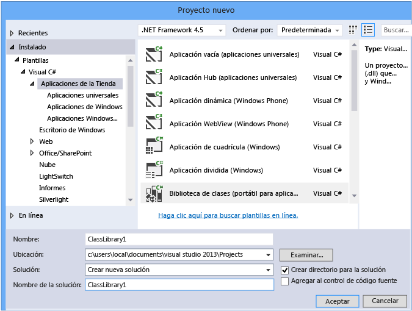
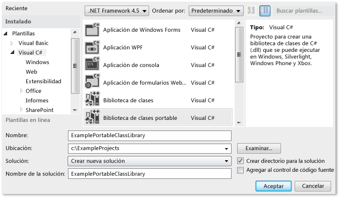
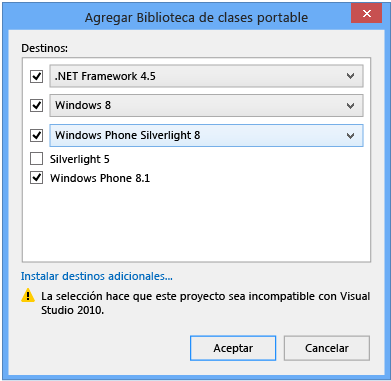
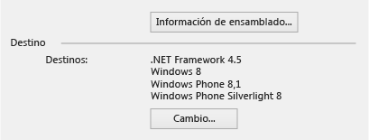
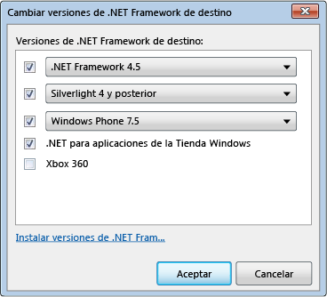
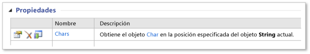
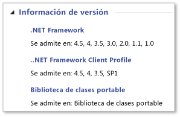

# <a name="cross-platform-development-with-the-portable-class-library"></a>Desarrollo multiplataforma con la Biblioteca de clases portable
El tipo de proyecto Biblioteca de clases portable de .NET Framework incluido en Visual Studio sirve para crear aplicaciones multiplataforma y bibliotecas para Microsoft de forma rápida y sencilla.  

[!INCLUDE[standard](../../../includes/pcl-to-standard.md)]

 Las bibliotecas de clases portables reducen el tiempo y el coste empleados en desarrollar y probar código. Use este tipo de proyecto para escribir y compilar ensamblados de .NET Framework portables; a continuación, haga referencia a esos ensamblados desde aplicaciones diseñadas para varias plataformas como, por ejemplo, Windows y Windows Phone.  
  
 Puede cambiar de plataforma incluso después de haber creado un proyecto de Biblioteca de clases portable en Visual Studio y de haber empezado a desarrollarlo. Visual Studio compilará la biblioteca con los ensamblados nuevos, con lo que podrá identificar los cambios que necesita hacer en el código.  
  
 En este artículo se trata el desarrollo de aplicaciones en Visual Studio; no obstante, Microsoft también proporciona ensamblados de referencia de la Biblioteca de clases portable que pueden usarse para desarrollar aplicaciones y bibliotecas con otras herramientas como, por ejemplo, Xamarin. Estas aplicaciones y bibliotecas pueden usarse en cualquier runtime basado en .NET Framework en plataformas no pertenecientes a Microsoft. Para obtener más información acerca de los ensamblados de referencia, vea la entrada de blog [clase biblioteca Portable (PCL) ya está disponible en todas las plataformas](https://blogs.msdn.com/b/dotnet/archive/2013/10/14/portable-class-library-pcl-now-available-on-all-platforms.aspx). Para descargar los ensamblados, vea [ensamblados de referencia de biblioteca Portable de Microsoft .NET](https://www.microsoft.com/download/details.aspx?id=40727) en Microsoft Download Center. Para obtener más información sobre cómo usar los ensamblados con Xamarin, consulte la entrada de blog [PCL y bibliotecas de NuGet de .NET ahora habilitadas para Xamarin](https://blogs.msdn.com/b/dotnet/archive/2013/11/13/pcl-and-net-nuget-libraries-are-now-enabled-for-xamarin.aspx).  
  
 Visual Studio incluye plantillas que sirven para desarrollar con la Biblioteca de clases portable. En función de qué versión de Visual Studio se use, las plantillas y los menús disponibles pueden ser diferentes de los descritos en este artículo.  
  
> [!WARNING]
>  Visual Studio 2013 Update 2 incluye actualizaciones para las plantillas de biblioteca de clases Portable. Si tiene una versión anterior de Visual Studio y Visual Studio 2013 instalado en el mismo equipo y, a continuación, instalar la actualización 2, los cambios realizados en el **.NET Framework de destino** opciones se aplicarán a ambas versiones de Visual Studio.  
  
 En este tema:  
  
 [Compatibilidad de Visual Studio](#vs_support)  
 [Creación de un proyecto de biblioteca de clases Portable](#create_pcl)  
 [Opciones de destino](#platforms)  
 [Cambiar los destinos](#change_targets)  
 [Características admitidas](#features)  
 [Tipos y miembros compatibles](#members)  
 [Diferencias de API en la biblioteca de clases Portable](#API_diff)  
 [Uso de la biblioteca de clases Portable](#using)  
  
<a name="vs_support"></a>   
## <a name="visual-studio-support"></a>Compatibilidad de Visual Studio  
 La compatibilidad de Visual Studio con la Biblioteca de clases portable depende de la versión de Visual Studio que se use. En algunos casos tendrá todo lo que necesita y en otros necesitará instalar elementos adicionales, tal como se muestra en la tabla siguiente.  
  
|SKU de Visual Studio|Compatibilidad para crear una Biblioteca de clases portable|  
|-----------------------|---------------------------------------------------|  
|Visual Studio 2010, Professional, Premium o Ultimate|Sí, cuando se instala el [herramientas de biblioteca Portable](https://marketplace.visualstudio.com/items?itemName=BCLTeam.PortableLibraryTools2).|  
|Versiones de Visual Studio Express 2010|No.|  
|Visual Studio 2012 Professional, Premium o Ultimate|Sí. Para obtener soporte técnico de Windows Phone 8.0, instale el [Windows Phone SDK 8.0](https://www.microsoft.com/download/details.aspx?id=35471).|  
|Versiones de Visual Studio Express 2012|No.|  
|Visual Studio 2013 Professional, Premium o Ultimate|Sí. Para obtener soporte técnico de Windows Phone 8.1, instale el [versión más reciente de Visual Studio 2013](https://visualstudio.microsoft.com/vs/older-downloads/).|  
|Visual Studio Community 2013 para Windows|Sí, cuando se instala el [versión más reciente de Visual Studio Community 2013](https://visualstudio.microsoft.com/vs/older-downloads/), que incluye Update 2.|  
  
<a name="create_pcl"></a>   
## <a name="creating-a-portable-class-library-project"></a>Crear un proyecto de Biblioteca de clases portable  
 Para crear una Biblioteca de clases portable, use una de las plantillas proporcionadas en Visual Studio. Cree un nuevo proyecto y en el **nuevo proyecto** cuadro de diálogo **plantillas**, seleccione el idioma de destino (C# o Visual Basic) y, a continuación, seleccione una de las plataformas de destino. En el paso siguiente puede seleccionar más plataformas.  
  
 En Visual Studio 2013 Update 2, puede elegir el **biblioteca de clases (Portable)** plantilla para el lenguaje elegido y plataforma para crear una biblioteca de clases Portable. Verá esta plantilla para las plataformas siguientes:  
  
-   Aplicaciones de la Tienda  
  
-   Escritorio de Windows  
  
-   Silverlight  
  
 Si desea crear una biblioteca que tienen como destino Windows Phone 8.1 y Windows 8.1 en C#, puede elegir **Store apps**y, a continuación, elija **biblioteca de clases (Portable para aplicaciones universales)**.  
  
   
  
 Esta plantilla selecciona automáticamente Windows 8.1 y Windows Phone 8.1 como destino. Si crea una biblioteca destinada solo a Windows Phone 8.1 o Windows 8.1, puede cambiar y agregar plataformas de destino posteriormente.  
  
 Si usa Visual Studio 2012 o Visual Studio 2013 sin Update 2, cree un nuevo proyecto y elija el **biblioteca de clases Portable** plantilla en Visual C# o Visual Basic.  
  
   
  
 El **Agregar biblioteca de clases Portable** aparece el cuadro de diálogo, y puede seleccionar plataformas adicionales. El cuadro de diálogo emitirá advertencias sobre compatibilidad en función de los destinos que seleccione.  
  
   
Cuadro de diálogo Agregar biblioteca de clases portable en Visual Studio 2013 Update 2  
  
 Con independencia de si usa Visual Studio 2012 o Visual Studio 2013, puede seleccionar las plataformas cuando cree un proyecto de Biblioteca de clases portable, o bien puede usar las propiedades del proyecto para modificar las plataformas de destino después de haber creado el proyecto.  
  
<a name="platforms"></a>   
## <a name="target-options"></a>Opciones de destino  
 Al crear un proyecto de Biblioteca de clases portable, se puede elegir el sistema operativo y la versión de .NET Framework de destino. Si usa Visual Studio 2013 y ha instalado la actualización 2 o posterior, puede elegir el **biblioteca de clases (Portable para aplicaciones universales)** plantilla para crear una biblioteca de clases Portable destinada a Windows 8.1 y Windows Phone 8.1. En la tabla siguiente se muestran los destinos disponibles en función de la versión de Visual Studio que se use.  
  
|Opción de destino|Visual Studio 2012|Visual Studio 2013|Visual Studio 2013 Update 2 o una versión posterior|  
|-|-|-|-|  
|.NET Framework|-.NET framework 4 y versiones posteriores<br /><br /> -.NET framework 4.0.3 y versiones posteriores<br /><br /> -.NET framework 4.5|-.NET framework 4 y versiones posteriores<br /><br /> -.NET framework 4.0.3 y versiones posteriores<br /><br /> -.NET framework 4.5 y versiones posteriores<br /><br /> -.NET framework 4.5.1|-.NET framework 4<br /><br /> -.NET framework 4.0.3<br /><br /> -.NET framework 4.5<br /><br /> -.NET framework 4.5.1|  
|Windows Phone|-Windows Phone 7 y versiones posteriores<br /><br /> -Windows Phone 7.5 y versiones posteriores<br /><br /> -Windows Phone 8|-Windows Phone 8|-Windows Phone Silverlight 8<br /><br /> -Windows Phone Silverlight 8.1<br /><br /> Para compatibilidad de Windows Runtime y XAML, elija:<br /><br /> -Windows Phone 8.1|  
|Tienda Windows|-.NET para aplicaciones de Windows Store|-Windows Store Apps (Windows 8) y versiones posteriores<br /><br /> -Windows Store Apps (Windows 8.1)|-Windows 8<br /><br /> -Windows 8.1|  
|-Silverlight|-Silverlight 4 y versiones posteriores<br /><br /> -Silverlight 5|-Silverlight 5|-Silverlight 5|  
|Xbox|-Xbox 360|N/D|N/D|  
  
<a name="change_targets"></a>   
## <a name="changing-targets"></a>Cambiar los destinos  
 Si se elige una plantilla de Biblioteca de clases portable, las plataformas predeterminadas se seleccionan automáticamente, pero estos valores predeterminados variarán en función de la versión de Visual Studio que esté instalada y de los destinos que se hayan seleccionado previamente. Las plataformas se pueden cambiar en el momento de crear la Biblioteca de clases portable o después de haber iniciado el desarrollo de una Biblioteca de clases portable.  
  
 Si desea cambiar los destinos después de crear el proyecto, en **el Explorador de soluciones**, abra el menú contextual para el proyecto de biblioteca de clases Portable (no la solución) y, a continuación, elija **propiedades** . En la página de propiedades del proyecto, el **biblioteca** pestaña muestra las plataformas que actualmente dirige el proyecto.  
  
   
Página de propiedades de la Biblioteca de clases portable en Visual Studio 2013 Update 2  
  
 Para agregar o quitar destinos, elija el **cambio** botón y, a continuación, active y desactive las casillas correspondientes.  
  
 Al modificar los destinos, las API que tiene a su disposición para desarrollar el proyecto cambiarán para corresponderse con las opciones seleccionadas. Visual Studio notifica los errores y las advertencias que pueden producirse como resultado del cambio de destinos.  
  
 Si desea evaluar la portabilidad de los ensamblados antes de realizar cambios en Visual Studio, puede usar el [.NET Portability Analyzer](https://visualstudiogallery.msdn.microsoft.com/1177943e-cfb7-4822-a8a6-e56c7905292b).  
  
 El menú de opciones varía en función de la versión de Visual Studio que se use.  
  
   
Cuadro de diálogo para el cambio de destinos en Visual Studio 2012  
  
<a name="features"></a>   
## <a name="supported-features"></a>Características compatibles  
 En la tabla siguiente se muestran las características que se admiten en las plataformas y las versiones disponibles. En algunos casos Microsoft ha agregado compatibilidad con la versión de un paquete de NuGet, y así se ha indicado. Para obtener más información acerca de los paquetes de NuGet para .NET Framework, vea [.NET Framework y versiones fuera de banda](../../../docs/framework/get-started/the-net-framework-and-out-of-band-releases.md).  
  
|Característica|.NET Framework|.NET Framework|.NET Framework|Tienda Windows|Tienda Windows|Tienda de Windows Phone|Windows Phone Silverlight|Windows Phone Silverlight|Windows Phone Silverlight|Silverlight|Silverlight|Xbox 360|  
|-------------|--------------------|--------------------|--------------------|-------------------|-------------------|-------------------------|-------------------------------|-------------------------------|-------------------------------|-----------------|-----------------|--------------|  
||**4**|**4.0.3**|**4.5**|**8**|**8.1**|**8.1**|**7.5**|**8**|**8.1**|**4**|**5**||  
|Bibliotecas básicas|✓|✓|✓|✓|✓|✓|✓|✓|✓|✓|✓|✓|  
|Compatibilidad con Async|➊|➊|✓|✓|✓|✓|➊|➊|✓|➊|➊||  
|Compresión|||✓|✓|✓|✓||➋|➋||||  
|Anotaciones de datos||✓|✓|✓|✓|||||✓|✓||  
|Palabra clave dynamic|✓|✓|✓|✓|✓|||||✓|✓||  
|HTTPClient|➌|➌|✓|✓|✓|✓|➌|➌|➌|➌|➌||  
|IQueryable|✓|✓|✓|✓|✓|✓|✓|✓|✓|✓|✓||  
|Language-Integrated Query (LINQ)|✓|✓|✓|✓|✓|✓|✓|✓|✓|✓|✓||  
|Managed Extensibility Network (MEF)|✓|✓|✓|✓|✓|||||✓|✓||  
|Network Class Library (NCL)|✓|✓|✓|✓|✓|✓|✓|✓|✓|✓|✓||  
|Serialización (contrato de datos, XML y JSON)|✓|✓|✓|✓|✓|✓|✓|✓|✓|✓|✓||  
|System.Numerics|✓|✓|✓|✓|✓|||||✓|✓||  
|Modelos de vista (MVVM)|||✓|✓|✓|✓|✓|✓|✓|✓|✓||  
|Windows Communication Foundation (WCF)|✓|✓|✓|✓|✓||✓|✓|✓|✓|✓||  
|API de Windows en tiempo de ejecución|||||✓|✓|||||||  
|Windows.UI.XAML|||||✓|✓|||||||  
|XLINQ||✓|✓|✓|✓|✓|✓|✓|✓|✓|✓|✓|  
  
 Requiere ➊ [Microsoft Async](https://www.nuget.org/packages/Microsoft.Bcl.Async/) paquete  
 Requiere ➋ [Microsoft Compression](https://www.nuget.org/packages/Microsoft.Bcl.Compression) paquete  
 Requiere ➌ [Microsoft HTTP Client Libraries](https://www.nuget.org/packages/Microsoft.Net.Http) paquete  
  
> [!WARNING]
>  Puede encontrar errores al hacer referencia a la [Microsoft Compression](https://www.nuget.org/packages/Microsoft.Bcl.Compression) y [Microsoft HTTP Client Libraries](https://www.nuget.org/packages/Microsoft.Net.Http) paquetes desde una biblioteca portable usada por una aplicación de Windows Phone Silverlight 8.1. Para obtener más información, consulte [compatibilidad de plataformas y los últimos cambios para las aplicaciones de Windows Phone Silverlight 8.1](https://docs.microsoft.com/previous-versions/windows/apps/dn642084(v=vs.105)).  
  
<a name="members"></a>   
## <a name="supported-types-and-members"></a>Tipos y miembros compatibles  
 Los tipos y miembros disponibles en los proyectos de Biblioteca de clases portable están limitados por varios factores de compatibilidad:  
  
-   Deben compartirse en los destinos seleccionados.  
  
-   Deben comportarse de manera similar en todos esos destinos.  
  
-   No deben ser candidatos para desuso.  
  
-   Deben tener sentido en un entorno portable, especialmente cuando los miembros auxiliares no son portátiles.  
  
 Por ejemplo, la Biblioteca de clases portable contiene tipos relacionados con la interfaz de usuario solo cuando el destino es Windows 8.1 y Windows Phone 8.1. También puede encontrar limitaciones si elige como destino plataformas (como Xbox, .NET Framework 4 y Windows Phone 7) que se publicaron antes de la introducción de la Biblioteca de clases portable. .NET Framework publica paquetes a través de NuGet que mejoran la compatibilidad de la Biblioteca de clases portable con algunas de estas plataformas antiguas. Para obtener más información y una lista de paquetes de NuGet, consulte [.NET Framework y versiones fuera de banda](../../../docs/framework/get-started/the-net-framework-and-out-of-band-releases.md).  
  
 Si un miembro es compatible con la Biblioteca de clases portable y con los destinos seleccionados, aparecerá en su proyecto en IntelliSense. Además, el icono de la biblioteca de clases Portable  aparece en las tablas de miembros, en el [biblioteca de clases de .NET Framework](https://msdn.microsoft.com/library/mt472912.aspx) junto a los miembros admitidos. Por ejemplo, la tabla de miembros siguiente muestra que la propiedad <xref:System.String.Chars%2A> de la clase <xref:System.String> es compatible con la Biblioteca de clases portable:  
  
   
Icono de la Biblioteca de clases portable  
  
 También puede buscar en el **información de versión** sección de un tema de referencia de una nota que indica que un tipo o miembro se admite en el proyecto de biblioteca de clases Portable:  
  
   
Ejemplo de información de versiones  
  
 No obstante, recuerde que una API puede ser compatible con la Biblioteca de clases portable, pero si esa API se puede usar dependerá de los destinos que se seleccionen.  
  
<a name="API_diff"></a>   
## <a name="api-differences-in-the-portable-class-library"></a>Diferencias de API en la Biblioteca de clases portable  
 Para que los ensamblados de la Biblioteca de clases portable sean compatibles en todas las plataformas admitidas, algunos miembros se han modificado ligeramente en la Biblioteca de clases portable.  
  
<a name="using"></a>   
## <a name="using-the-portable-class-library"></a>Usar la Biblioteca de clases portable  
 Después de compilar el proyecto de Biblioteca de clases portable, haga referencia a él desde otros proyectos. Puede hacer referencia al proyecto o a ensamblados específicos que contengan las clases a las que desea obtener acceso.  
  
 Para ejecutar una aplicación que haga referencia a un ensamblado de Biblioteca de clases portable, debe estar instalada en el equipo la versión requerida (o una versión posterior) de las plataformas de destino. Visual Studio contiene todos los marcos necesarios para poder ejecutar la aplicación sin modificaciones adicionales en el equipo que utilizó para desarrollar la aplicación.  
  
### <a name="deploying-a-windows-store-or-windows-phone-app"></a>Implementar una aplicación de la Tienda Windows o de Windows Phone  
 Cuando cree una aplicación de la Tienda Windows o de Windows Phone que haga referencia a un ensamblado de Biblioteca de clases portable, no necesitará realizar pasos adicionales, ya que el paquete de la aplicación incluye todo lo necesario para implementar la aplicación.  
  
### <a name="deploying-a-net-framework-app"></a>Implementar una aplicación de .NET Framework  
 Cuando implemente una aplicación de .NET Framework que haga referencia a un ensamblado de Biblioteca de clases portable, especifique una dependencia en la versión correcta de .NET Framework. Al especificar esta dependencia, se asegura de que la versión requerida se instala con la aplicación. Si elige como destino .NET Framework 4 o versiones posteriores, el equipo debe tener .NET Framework 4 con una [actualizar](https://www.microsoft.com/download/details.aspx?id=3556), actualización 4.0.3 para .NET Framework 4 o .NET Framework 4.5 instalado.  
  
-   Para crear una dependencia con implementación ClickOnce: en **el Explorador de soluciones**, elija el nodo del proyecto para el proyecto que desea publicar. (Este es el proyecto que hace referencia al proyecto de Biblioteca de clases portable). En la barra de menús, elija **proyecto**, **propiedades**y, a continuación, elija el **publicar** ficha. En el **publicar** página, elija **requisitos previos**. Seleccione la versión requerida de .NET Framework (o la actualización de .NET Framework 4) como requisito previo.  
  
-   Para crear una dependencia con un proyecto de instalación: en **el Explorador de soluciones**, elija el proyecto de instalación. En la barra de menús, elija **proyecto**, **propiedades**, **requisitos previos**. Seleccione la versión de .NET Framework necesaria como requisito previo.  
  
 Para obtener más información sobre cómo implementar aplicaciones de .NET Framework, vea [Deployment Guide for Developers](../../../docs/framework/deployment/deployment-guide-for-developers.md).  
  
### <a name="deploying-a-silverlight-based-app"></a>Implementar una aplicación basada en Silverlight  
 Cuando implemente una aplicación basada en Silverlight que haga referencia a un ensamblado de Biblioteca de clases portable, deberá asegurarse de que la versión de runtime mínima necesaria para la aplicación coincide con la versión de destino. Si desea que el destino sea Silverlight 4, la versión debe ser 4.0.60129.0 o posterior. Al establecer la versión incluya `<param name="minRuntimeVersion" value="4.0.60129.0" />` en la página web que hospeda la aplicación basada en Silverlight, como sigue:  
  
```xaml  
<div id="silverlightControlHost">  
    <object data="data:application/x-silverlight-2,"   
           type="application/x-silverlight-2" width="100%" height="100%">  
    <param name="source" value="ClientBin/SilverlightApplication.xap"/>  
    <param name="onError" value="onSilverlightError" />  
    <param name="background" value="white" />  
    <param name="minRuntimeVersion" value="4.0.60129.0" />  
    <param name="autoUpgrade" value="true" />  
    <a href="https://www.microsoft.com/getsilverlight/get-started/install/"   
             style="text-decoration:none">  
        
    </a>  
  </object>  
   <iframe id="_sl_historyFrame"   
              style="visibility:hidden;height:0px;width:0px;border:0px">  
   </iframe>  
</div>  
```  
  
## <a name="see-also"></a>Vea también

- [Uso de la Biblioteca de clases portable con MVVM](../../../docs/standard/cross-platform/using-portable-class-library-with-model-view-view-model.md)  
- [Recursos de aplicación para bibliotecas destinadas a varias plataformas](../../../docs/standard/cross-platform/app-resources-for-libraries-that-target-multiple-platforms.md)  
- [Analizador de portabilidad de .NET](https://visualstudiogallery.msdn.microsoft.com/1177943e-cfb7-4822-a8a6-e56c7905292b)  
- [Compatibilidad de .NET Framework con las aplicaciones de la Tienda Windows y Windows Runtime](../../../docs/standard/cross-platform/support-for-windows-store-apps-and-windows-runtime.md)  
- [Implementación](../../../docs/framework/deployment/net-framework-applications.md)
