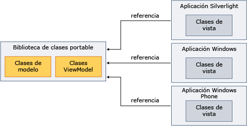

# Usar la Biblioteca de clases portable con Model-View-View Model
Puede usar .NET Framework [biblioteca de clases Portable](../../../docs/standard/cross-platform/cross-platform-development-with-the-portable-class-library.md) para implementar el patrón Model-View-View Model (MVVM) y compartir los ensamblados en varias plataformas.  

[!INCLUDE[standard](../../../includes/pcl-to-standard.md)]

 MVVM es un patrón de aplicación que aísla la interfaz de usuario de la lógica empresarial subyacente. Puede implementar el modelo y ver las clases de modelo en un [!INCLUDE[net_portable](../../../includes/net-portable-md.md)] proyecto [!INCLUDE[vs_dev11_long](../../../includes/vs-dev11-long-md.md)]y, a continuación, crear vistas personalizadas para distintas plataformas. Este enfoque le permite escribir los datos de modelo y lógica de negocios de una sola vez y usar ese código a partir de .NET Framework, Silverlight y Windows Phone, y [!INCLUDE[win8_appname_long](../../../includes/win8-appname-long-md.md)] las aplicaciones, como se muestra en la siguiente ilustración.  
  
   
  
 En este tema no proporciona información general sobre el patrón MVVM. Sólo proporciona información sobre cómo usar [!INCLUDE[net_portable](../../../includes/net-portable-md.md)] para implementar MVVM. Para obtener más información acerca de MVVM, consulte el [inicio rápido de MVVM](https://msdn.microsoft.com/library/gg430869(v=PandP.40).aspx).  
  
## Clases que admiten MVVM  
 Cuando el destino es el [!INCLUDE[net_v45](../../../includes/net-v45-md.md)], [!INCLUDE[net_win8_profile](../../../includes/net-win8-profile-md.md)], Silverlight o Windows Phone 7.5 para su [!INCLUDE[net_portable](../../../includes/net-portable-md.md)] proyecto, existen las siguientes clases para implementar el patrón MVVM:  
  
-   Clase <xref:System.Collections.ObjectModel.ObservableCollection%601?displayProperty=nameWithType>  
  
-   Clase <xref:System.Collections.ObjectModel.ReadOnlyObservableCollection%601?displayProperty=nameWithType>  
  
-   Clase <xref:System.Collections.Specialized.INotifyCollectionChanged?displayProperty=nameWithType>  
  
-   Clase <xref:System.Collections.Specialized.NotifyCollectionChangedAction?displayProperty=nameWithType>  
  
-   Clase <xref:System.Collections.Specialized.NotifyCollectionChangedEventArgs?displayProperty=nameWithType>  
  
-   Clase <xref:System.Collections.Specialized.NotifyCollectionChangedEventHandler?displayProperty=nameWithType>  
  
-   Clase <xref:System.ComponentModel.DataErrorsChangedEventArgs?displayProperty=nameWithType>  
  
-   Clase <xref:System.ComponentModel.INotifyDataErrorInfo?displayProperty=nameWithType>  
  
-   Clase <xref:System.ComponentModel.INotifyPropertyChanged?displayProperty=nameWithType>  
  
-   Clase <xref:System.Windows.Input.ICommand?displayProperty=nameWithType>  
  
-   Todas las clases en el <xref:System.ComponentModel.DataAnnotations?displayProperty=nameWithType> espacio de nombres  
  
## Implementar MVVM  
 Para implementar MVVM, normalmente crea el modelo y el modelo de vista en un [!INCLUDE[net_portable](../../../includes/net-portable-md.md)] proyecto, porque un [!INCLUDE[net_portable](../../../includes/net-portable-md.md)] proyecto no puede hacer referencia a un proyecto no portable. El modelo y el modelo de vista pueden estar en el mismo proyecto o en proyectos independientes. Si utiliza proyectos independientes, agregue una referencia desde el proyecto de modelo de vista al proyecto de modelo.  
  
 Después de compilar el modelo y ver los proyectos de modelos, hacer referencia a esos ensamblados en la aplicación que contiene la vista. Si la vista interactúa con el modelo de vista, solo debe hacer referencia al ensamblado que contiene el modelo de vista.  
  
### Modelo  
 El ejemplo siguiente muestra una clase de modelo simplificado que podría residir en un [!INCLUDE[net_portable](../../../includes/net-portable-md.md)] proyecto.  
  
 [!code-csharp[PortableClassLibraryMVVM#1](../../../samples/snippets/csharp/VS_Snippets_CLR/portableclasslibrarymvvm/cs/customer.cs#1)]
 [!code-vb[PortableClassLibraryMVVM#1](../../../samples/snippets/visualbasic/VS_Snippets_CLR/portableclasslibrarymvvm/vb/customer.vb#1)]  
  
 El ejemplo siguiente muestra una manera sencilla para rellenar, recuperar y actualizar los datos en un [!INCLUDE[net_portable](../../../includes/net-portable-md.md)] proyecto. En una aplicación real, puede recuperar los datos de un origen como un servicio de Windows Communication Foundation (WCF).  
  
 [!code-csharp[PortableClassLibraryMVVM#2](../../../samples/snippets/csharp/VS_Snippets_CLR/portableclasslibrarymvvm/cs/customerrepository.cs#2)]
 [!code-vb[PortableClassLibraryMVVM#2](../../../samples/snippets/visualbasic/VS_Snippets_CLR/portableclasslibrarymvvm/vb/customerrepository.vb#2)]  
  
### Modelo de vista  
 Con frecuencia se agrega una clase base para los modelos de vista al implementar el patrón MVVM. El ejemplo siguiente muestra una clase base.  
  
 [!code-csharp[PortableClassLibraryMVVM#3](../../../samples/snippets/csharp/VS_Snippets_CLR/portableclasslibrarymvvm/cs/viewmodelbase.cs#3)]
 [!code-vb[PortableClassLibraryMVVM#3](../../../samples/snippets/visualbasic/VS_Snippets_CLR/portableclasslibrarymvvm/vb/viewmodelbase.vb#3)]  
  
 Una implementación de la <xref:System.Windows.Input.ICommand> interfaz se suele utilizar con el patrón MVVM. En el siguiente ejemplo se muestra una implementación de la interfaz <xref:System.Windows.Input.ICommand>.  
  
 [!code-csharp[PortableClassLibraryMVVM#4](../../../samples/snippets/csharp/VS_Snippets_CLR/portableclasslibrarymvvm/cs/relaycommand.cs#4)]
 [!code-vb[PortableClassLibraryMVVM#4](../../../samples/snippets/visualbasic/VS_Snippets_CLR/portableclasslibrarymvvm/vb/relaycommand.vb#4)]  
  
 El ejemplo siguiente muestra un modelo de vista simplificada.  
  
 [!code-csharp[PortableClassLibraryMVVM#5](../../../samples/snippets/csharp/VS_Snippets_CLR/portableclasslibrarymvvm/cs/mainpageviewmodel.cs#5)]
 [!code-vb[PortableClassLibraryMVVM#5](../../../samples/snippets/visualbasic/VS_Snippets_CLR/portableclasslibrarymvvm/vb/customerviewmodel.vb#5)]  
  
### Ver  
 Desde un [!INCLUDE[net_v45](../../../includes/net-v45-md.md)] app, [!INCLUDE[win8_appname_long](../../../includes/win8-appname-long-md.md)] aplicaciones, aplicaciones basadas en Silverlight o aplicaciones de Windows Phone 7.5, puede hacer referencia al ensamblado que contiene el modelo y ver los proyectos de modelos.  A continuación, crea una vista que interactúa con el modelo de vista. El ejemplo siguiente muestra una aplicación de Windows Presentation Foundation (WPF) simplificada que recupera y actualiza los datos desde el modelo de vista. Puede crear vistas similares en Silverlight, Windows Phone, o [!INCLUDE[win8_appname_long](../../../includes/win8-appname-long-md.md)] aplicaciones.  
  
 [!code-xaml[PortableClassLibraryMVVM#6](../../../samples/snippets/csharp/VS_Snippets_CLR/portableclasslibrarymvvm/cs/mainwindow.xaml#6)]  
  
## Vea también

- [Biblioteca de clases portable](../../../docs/standard/cross-platform/cross-platform-development-with-the-portable-class-library.md)
