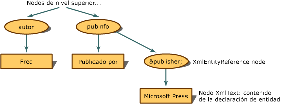

# <a name="entity-references-are-preserved"></a>Se preservan las referencias de entidad
Cuando no se expande toda la referencia de entidad, sino que se conserva, el modelo Document Object Model (DOM) XML compila un nodo **XmlEntityReference** al encontrar una.  
  
 Con el siguiente código XML,  
  
```xml  
<author>Fred</author>  
<pubinfo>Published by &publisher;</pubinfo>  
```  
  
 DOM compila un nodo **XmlEntityReference** cuando encuentra la referencia `&publisher;`. La referencia **XmlEntityReference** contiene nodos secundarios copiados a partir del contenido en la declaración de entidad. El ejemplo de código anterior contiene texto en la declaración de entidad, de forma que se crea un nodo **XmlText** como nodo secundario del nodo de referencia de entidad.  
  
   
Estructura de árbol para referencias de entidad que se preservan  
  
 Los nodos secundarios de la referencia **XmlEntityReference** son copias de todos los nodos secundarios creados a partir del nodo **XmlEntity** al encontrar la declaración de entidad.  
  
> [!NOTE]
> Los nodos copiados de **XmlEntity** no son siempre copias exactas una vez situados bajo el nodo de referencia de entidad. Puede haber espacios de nombres que estén en el ámbito de un nodo de referencia de entidad y que afecten a la configuración final de los nodos secundarios.  
  
 De forma predeterminada, se conservan las entidades generales como `&abc;` y siempre se crean nodos **XmlEntityReference**.  
  
## <a name="see-also"></a>Vea también

- [Document Object Model (DOM) para XML](xml-document-object-model-dom.md)
