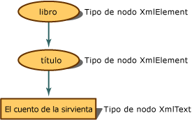

# <a name="mapping-the-object-hierarchy-to-xml-data"></a>Asignar la jerarquía de objetos a datos XML
Cuando un documento XML está en la memoria, la representación conceptual es un árbol. Al programar, hay una jerarquía de objetos para tener acceso a los nodos del árbol. En el ejemplo siguiente se muestra cómo se convierte el contenido XML en nodos.  
  
 A medida que el contenido XML se lee en el modelo de objetos de documento (DOM), las partes se traducen en nodos, que mantienen metadatos adicionales acerca de sí mismos, como su tipo y valores. El tipo de nodo es su objeto y es lo que determina qué acciones pueden realizarse y qué propiedades pueden establecerse o recuperarse.  
  
 Si tiene el siguiente contenido XML simple:  
  
 **Entrada**  
  
```xml  
<book>  
    <title>The Handmaid's Tale</title>  
</book>  
```  
  
 La entrada se representa en la memoria como el siguiente árbol de nodos con la propiedad de tipo de nodo asignada:  
  
   
Representación de árbol de nodo de libro y título  
  
 El elemento `book` se convierte en un objeto **XmlElement**, el siguiente elemento, `title`, también se convierte en un objeto **XmlElement**, mientras que el contenido del elemento se convierte en un objeto **XmlText**. Al observar los métodos y las propiedades del objeto **XmlElement**, estos difieren de los disponibles en un objeto **XmlText**. Por tanto, es fundamental saber en qué tipo de nodo se convierte el marcado XML, puesto que determina las acciones que se pueden realizar.  
  
 En el ejemplo siguiente se leen datos XML y se escribe texto diferente, en función del tipo de nodo. Se usa el siguiente archivo de datos XML como entrada, **items.xml**:  
  
 **Entrada**  
  
```xml  
<?xml version="1.0"?>  
<!-- This is a sample XML document -->  
<!DOCTYPE Items [<!ENTITY number "123">]>  
<Items>  
  <Item>Test with an entity: &number;</Item>  
  <Item>test with a child element <more/> stuff</Item>  
  <Item>test with a CDATA section <![CDATA[<456>]]> def</Item>  
  <Item>Test with a char entity: A</Item>  
  <!-- Fourteen chars in this element.-->  
  <Item>1234567890ABCD</Item>  
</Items>  
```  
  
 En el ejemplo de código siguiente se lee el archivo **items.xml** y se presenta información para cada tipo de nodo.  
  
```vb  
Imports System  
Imports System.IO  
Imports System.Xml  
  
Public Class Sample  
    Private Const filename As String = "items.xml"  
  
    Public Shared Sub Main()  
  
        Dim reader As XmlTextReader = Nothing  
  
        Try  
            ' Load the reader with the data file and
            'ignore all white space nodes.
            reader = New XmlTextReader(filename)  
            reader.WhitespaceHandling = WhitespaceHandling.None  
  
            ' Parse the file and display each of the nodes.  
            While reader.Read()  
                Select Case reader.NodeType  
                    Case XmlNodeType.Element  
                        Console.Write("<{0}>", reader.Name)  
                    Case XmlNodeType.Text  
                        Console.Write(reader.Value)  
                    Case XmlNodeType.CDATA  
                        Console.Write("<![CDATA[{0}]]>", reader.Value)  
                    Case XmlNodeType.ProcessingInstruction  
                        Console.Write("<?{0} {1}?>", reader.Name, reader.Value)  
                    Case XmlNodeType.Comment  
                        Console.Write("<!--{0}-->", reader.Value)  
                    Case XmlNodeType.XmlDeclaration  
                        Console.Write("<?xml version='1.0'?>")  
                    Case XmlNodeType.Document  
                    Case XmlNodeType.DocumentType  
                        Console.Write("<!DOCTYPE {0} [{1}]", reader.Name, reader.Value)  
                    Case XmlNodeType.EntityReference  
                        Console.Write(reader.Name)  
                    Case XmlNodeType.EndElement  
                        Console.Write("</{0}>", reader.Name)  
                End Select  
            End While  
  
        Finally  
            If Not (reader Is Nothing) Then  
                reader.Close()  
            End If  
        End Try  
    End Sub 'Main ' End class  
End Class 'Sample  
```  
  
```csharp  
using System;  
using System.IO;  
using System.Xml;  
  
public class Sample  
{  
    private const String filename = "items.xml";  
  
    public static void Main()  
    {  
        XmlTextReader reader = null;  
  
        try  
        {  
            // Load the reader with the data file and ignore
            // all white space nodes.  
            reader = new XmlTextReader(filename);  
            reader.WhitespaceHandling = WhitespaceHandling.None;  
  
            // Parse the file and display each of the nodes.  
            while (reader.Read())  
            {  
                switch (reader.NodeType)  
                {  
                    case XmlNodeType.Element:  
                        Console.Write("<{0}>", reader.Name);  
                        break;  
                    case XmlNodeType.Text:  
                        Console.Write(reader.Value);  
                        break;  
                    case XmlNodeType.CDATA:  
                        Console.Write("<![CDATA[{0}]]>", reader.Value);  
                        break;  
                    case XmlNodeType.ProcessingInstruction:  
                        Console.Write("<?{0} {1}?>", reader.Name, reader.Value);  
                        break;  
                    case XmlNodeType.Comment:  
                        Console.Write("<!--{0}-->", reader.Value);  
                        break;  
                    case XmlNodeType.XmlDeclaration:  
                        Console.Write("<?xml version='1.0'?>");  
                        break;  
                    case XmlNodeType.Document:  
                        break;  
                    case XmlNodeType.DocumentType:  
                        Console.Write("<!DOCTYPE {0} [{1}]", reader.Name, reader.Value);  
                        break;  
                    case XmlNodeType.EntityReference:  
                        Console.Write(reader.Name);  
                        break;  
                    case XmlNodeType.EndElement:  
                        Console.Write("</{0}>", reader.Name);  
                        break;  
                }  
            }  
        }  
  
        finally  
        {  
            if (reader != null)  
                reader.Close();  
        }  
    }  
} // End class  
```  
  
 La salida del ejemplo revela la asignación de los datos a los tipos de nodo.  
  
 **Salida**  
  
```xml  
<?xml version='1.0'?><!--This is a sample XML document --><!DOCTYPE Items [<!ENTITY number "123">]<Items><Item>Test with an entity: 123</Item><Item>test with a child element <more> stuff</Item><Item>test with a CDATA section <![CDATA[<456>]]> def</Item><Item>Test with a char entity: A</Item><--Fourteen chars in this element.--><Item>1234567890ABCD</Item></Items>
```  
  
 Si se toma una línea de la entrada cada vez y se utiliza la salida generada por el código, se puede utilizar la tabla siguiente para analizar qué prueba de nodo genera qué línea de salida y, por tanto, se puede comprender en qué tipo de nodo se convierten los datos XML.  
  
|Entrada|Salida|Prueba de tipo de nodo|  
|-----------|------------|--------------------|  
|\<?xml version="1.0"?>|\<?xml version='1.0'?>|XmlNodeType.XmlDeclaration|  
|\<!-- This is a sample XML document -->|\<!--This is a sample XML document -->|XmlNodeType.Comment|  
|\<!DOCTYPE Items [\<!ENTITY number "123">]>|\<!DOCTYPE Items [\<!ENTITY number "123">]|XmlNodeType.DocumentType|  
|\<Items>|\<Items>|XmlNodeType.Element|  
|\<Item>|\<Item>|XmlNodeType.Element|  
|Prueba con una entidad: &number;|Prueba con una entidad: 123|XmlNodeType.Text|  
|\</Item>|\</Item>|XmlNodeType.EndElement|  
|\<Item>|\<Item>|XmNodeType.Element|  
|prueba con un elemento secundario|prueba con un elemento secundario|XmlNodeType.Text|  
|\<more>|\<more>|XmlNodeType.Element|  
|stuff|stuff|XmlNodeType.Text|  
|\</Item>|\</Item>|XmlNodeType.EndElement|  
|\<Item>|\<Item>|XmlNodeType.Element|  
|prueba con una sección CDATA|prueba con una sección CDATA|XmlTest.Text|  
|<![CDATA[\<456>]]\>|<![CDATA[\<456>]]\>|XmlTest.CDATA|  
|def|def|XmlNodeType.Text|  
|\</Item>|\</Item>|XmlNodeType.EndElement|  
|\<Item>|\<Item>|XmlNodeType.Element|  
|Prueba con una entidad de carácter: &\#65;|Prueba con una entidad de carácter: A|XmlNodeType.Text|  
|\</Item>|\</Item>|XmlNodeType.EndElement|  
|\<!-- Fourteen chars in this element.-->|\<--Fourteen chars in this element.-->|XmlNodeType.Comment|  
|\<Item>|\<Item>|XmlNodeType.Element|  
|1234567890ABCD|1234567890ABCD|XmlNodeType.Text|  
|\</Item>|\</Item>|XmlNodeType.EndElement|  
|\</Items>|\</Items>|XmlNodeType.EndElement|  
  
 Debe saber qué tipo de nodo se asigna, puesto que controla qué clase de acciones son válidas y qué clase de propiedades se pueden establecer y recuperar.  
  
 La creación de nodos para espacios en blanco se controla al cargar los datos en DOM mediante la marca **PreserveWhitespace**. Para obtener más información, vea [Control de espacios en blanco y de espacios en blanco significativos al cargar DOM](white-space-and-significant-white-space-handling-when-loading-the-dom.md).  
  
 Para agregar nuevos nodos a DOM, vea [Inserción de nodos en un documento XML](inserting-nodes-into-an-xml-document.md). Para quitar nodos de DOM, vea [Cómo quitar nodos, contenido y valores de un documento XML](removing-nodes-content-and-values-from-an-xml-document.md). Para modificar el contenido de nodos en DOM, vea [Modificación de nodos, contenido y valores en un documento XML](modifying-nodes-content-and-values-in-an-xml-document.md).  
  
## <a name="see-also"></a>Vea también

- [Document Object Model (DOM) para XML](xml-document-object-model-dom.md)
