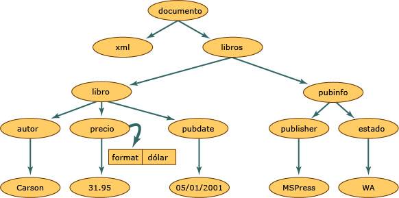

# <a name="xml-document-object-model-dom"></a><span data-ttu-id="d8ccb-102">Modelo de objetos de documento (DOM) XML</span><span class="sxs-lookup"><span data-stu-id="d8ccb-102">XML Document Object Model (DOM)</span></span>

<span data-ttu-id="d8ccb-103">La clase Modelo de objetos de documento XML (DOM) es una representación en la memoria de un documento XML.</span><span class="sxs-lookup"><span data-stu-id="d8ccb-103">The XML Document Object Model (DOM) class is an in-memory representation of an XML document.</span></span> <span data-ttu-id="d8ccb-104">DOM permite leer, manipular y modificar un documento XML mediante programación.</span><span class="sxs-lookup"><span data-stu-id="d8ccb-104">The DOM allows you to programmatically read, manipulate, and modify an XML document.</span></span> <span data-ttu-id="d8ccb-105">La clase **XmlReader** también lee XML, aunque proporciona acceso de solo avance y de solo lectura sin almacenamiento en memoria caché.</span><span class="sxs-lookup"><span data-stu-id="d8ccb-105">The **XmlReader** class also reads XML; however, it provides non-cached, forward-only, read-only access.</span></span> <span data-ttu-id="d8ccb-106">Esto significa que no hay funciones para editar los valores de un atributo o contenido de un elemento, ni la posibilidad de agregar y quitar nodos con **XmlReader**.</span><span class="sxs-lookup"><span data-stu-id="d8ccb-106">This means that there are no capabilities to edit the values of an attribute or content of an element, or the ability to insert and remove nodes with the **XmlReader**.</span></span> <span data-ttu-id="d8ccb-107">La edición es la función principal de DOM.</span><span class="sxs-lookup"><span data-stu-id="d8ccb-107">Editing is the primary function of the DOM.</span></span> <span data-ttu-id="d8ccb-108">Es la forma común y estructurada mediante la que se representan datos XML en la memoria, aunque los datos XML reales se almacenan de forma lineal cuando se encuentran en un archivo o proceden de otro objeto.</span><span class="sxs-lookup"><span data-stu-id="d8ccb-108">It is the common and structured way that XML data is represented in memory, although the actual XML data is stored in a linear fashion when in a file or coming in from another object.</span></span> <span data-ttu-id="d8ccb-109">A continuación se muestran datos XML:</span><span class="sxs-lookup"><span data-stu-id="d8ccb-109">The following is XML data.</span></span>

## <a name="input"></a><span data-ttu-id="d8ccb-110">Entrada</span><span class="sxs-lookup"><span data-stu-id="d8ccb-110">Input</span></span>

```xml
<?xml version="1.0"?>
  <books>
    <book>
        <author>Carson</author>
        <price format="dollar">31.95</price>
        <pubdate>05/01/2001</pubdate>
    </book>
    <pubinfo>
        <publisher>MSPress</publisher>
        <state>WA</state>
    </pubinfo>
  </books>
```

<span data-ttu-id="d8ccb-111">En la ilustración siguiente se muestra cómo se estructura la memoria cuando se leen estos datos XML en la estructura DOM.</span><span class="sxs-lookup"><span data-stu-id="d8ccb-111">The following illustration shows how memory is structured when this XML data is read into the DOM structure.</span></span>

<span data-ttu-id="d8ccb-112"> Estructura de documentos XML</span><span class="sxs-lookup"><span data-stu-id="d8ccb-112"> XML document structure</span></span>

<span data-ttu-id="d8ccb-113">Dentro de la estructura de los documentos XML, cada círculo de esta ilustración representa un nodo, que se denomina objeto **XmlNode**.</span><span class="sxs-lookup"><span data-stu-id="d8ccb-113">Within the XML document structure, each circle in this illustration represents a node, which is called an **XmlNode** object.</span></span> <span data-ttu-id="d8ccb-114">El objeto **XmlNode** es el objeto básico del árbol de DOM.</span><span class="sxs-lookup"><span data-stu-id="d8ccb-114">The **XmlNode** object is the basic object in the DOM tree.</span></span> <span data-ttu-id="d8ccb-115">La clase **XmlDocument**, que extiende la clase **XmlNode**, admite métodos para realizar operaciones en el documento en conjunto (por ejemplo, cargarlo en la memoria o guardar el código XML en un archivo).</span><span class="sxs-lookup"><span data-stu-id="d8ccb-115">The **XmlDocument** class, which extends **XmlNode**, supports methods for performing operations on the document as a whole (for example, loading it into memory or saving the XML to a file.</span></span> <span data-ttu-id="d8ccb-116">Además, la clase **XmlDocument** proporciona un medio para ver y manipular los nodos de todo el documento XML.</span><span class="sxs-lookup"><span data-stu-id="d8ccb-116">In addition, **XmlDocument** provides a means to view and manipulate the nodes in the entire XML document.</span></span> <span data-ttu-id="d8ccb-117">Las clases **XmlNode** y **XmlDocument** han mejorado el rendimiento y la capacidad de uso y disponen de métodos y propiedades para realizar lo siguiente:</span><span class="sxs-lookup"><span data-stu-id="d8ccb-117">Both **XmlNode** and **XmlDocument** have performance and usability enhancements and have methods and properties to:</span></span>

- <span data-ttu-id="d8ccb-118">Obtener acceso y modificar nodos específicos de DOM, como nodos de elemento, de referencia de entidad, etc.</span><span class="sxs-lookup"><span data-stu-id="d8ccb-118">Access and modify nodes specific to the DOM, such as element nodes, entity reference nodes, and so on.</span></span>

- <span data-ttu-id="d8ccb-119">Recuperar nodos completos, además de la información que contiene el nodo, como el texto de un nodo de elemento.</span><span class="sxs-lookup"><span data-stu-id="d8ccb-119">Retrieve entire nodes, in addition to the information the node contains, such as the text in an element node.</span></span>

  > [!NOTE]
  > <span data-ttu-id="d8ccb-120">Si una aplicación no requiere la estructura o las funciones de edición proporcionadas por DOM, las clases **XmlReader** y **XmlWriter** proporcionan acceso a secuencias de XML de solo avance sin almacenamiento en caché.</span><span class="sxs-lookup"><span data-stu-id="d8ccb-120">If an application does not require the structure or editing capabilities provided by the DOM, the **XmlReader** and **XmlWriter** classes provide non-cached, forward-only stream access to XML.</span></span> <span data-ttu-id="d8ccb-121">Para obtener más información, vea <xref:System.Xml.XmlReader> y <xref:System.Xml.XmlWriter>.</span><span class="sxs-lookup"><span data-stu-id="d8ccb-121">For more information, see <xref:System.Xml.XmlReader> and <xref:System.Xml.XmlWriter>.</span></span>

<span data-ttu-id="d8ccb-122">Los objetos **Node** tienen un conjunto de métodos y propiedades, así como características básicas y bien definidas.</span><span class="sxs-lookup"><span data-stu-id="d8ccb-122">**Node** objects have a set of methods and properties, as well as basic and well-defined characteristics.</span></span> <span data-ttu-id="d8ccb-123">Algunas de estas características son:</span><span class="sxs-lookup"><span data-stu-id="d8ccb-123">Some of these characteristics are:</span></span>

- <span data-ttu-id="d8ccb-124">Un nodo tiene un único nodo primario, que se encuentra directamente encima de él.</span><span class="sxs-lookup"><span data-stu-id="d8ccb-124">Nodes have a single parent node, a parent node being a node directly above them.</span></span> <span data-ttu-id="d8ccb-125">Los únicos nodos que no tienen un nodo primario son la raíz del documento, puesto que éste es el nodo de nivel superior y contiene el propio documento y fragmentos de documento.</span><span class="sxs-lookup"><span data-stu-id="d8ccb-125">The only nodes that do not have a parent is the Document root, as it is the top-level node and contains the document itself and document fragments.</span></span>

- <span data-ttu-id="d8ccb-126">La mayor parte de los nodos pueden tener varios nodos secundarios, que son los que están situados inmediatamente debajo de ellos.</span><span class="sxs-lookup"><span data-stu-id="d8ccb-126">Most nodes can have multiple child nodes, which are nodes directly below them.</span></span> <span data-ttu-id="d8ccb-127">A continuación se muestra una lista de tipos de nodo que pueden tener nodos secundarios.</span><span class="sxs-lookup"><span data-stu-id="d8ccb-127">The following is a list of node types that can have child nodes.</span></span>

  - <span data-ttu-id="d8ccb-128">**Document**</span><span class="sxs-lookup"><span data-stu-id="d8ccb-128">**Document**</span></span>

  - <span data-ttu-id="d8ccb-129">**DocumentFragment**</span><span class="sxs-lookup"><span data-stu-id="d8ccb-129">**DocumentFragment**</span></span>

  - <span data-ttu-id="d8ccb-130">**EntityReference**</span><span class="sxs-lookup"><span data-stu-id="d8ccb-130">**EntityReference**</span></span>

  - <span data-ttu-id="d8ccb-131">**Element**</span><span class="sxs-lookup"><span data-stu-id="d8ccb-131">**Element**</span></span>

  - <span data-ttu-id="d8ccb-132">**Attribute**</span><span class="sxs-lookup"><span data-stu-id="d8ccb-132">**Attribute**</span></span>

  <span data-ttu-id="d8ccb-133">Los nodos **XmlDeclaration**, **Notation**, **Entity**, **CDATASection**, **Text**, **Comment**, **ProcessingInstruction** y **DocumentType** no tienen nodos secundarios.</span><span class="sxs-lookup"><span data-stu-id="d8ccb-133">The **XmlDeclaration**, **Notation**, **Entity**, **CDATASection**, **Text**, **Comment**, **ProcessingInstruction**, and **DocumentType** nodes do not have child nodes.</span></span>

- <span data-ttu-id="d8ccb-134">Los nodos que se encuentran en el mismo nivel, representados en el diagrama por los nodos **book** y **pubinfo**, son nodos relacionados.</span><span class="sxs-lookup"><span data-stu-id="d8ccb-134">Nodes that are at the same level, represented in the diagram by the **book** and **pubinfo** nodes, are siblings.</span></span>

<span data-ttu-id="d8ccb-135">La forma de controlar los atributos es una característica de DOM.</span><span class="sxs-lookup"><span data-stu-id="d8ccb-135">One characteristic of the DOM is how it handles attributes.</span></span> <span data-ttu-id="d8ccb-136">Los atributos no son nodos que forman parte de las relaciones entre los nodos primarios y secundarios y entre nodos relacionados.</span><span class="sxs-lookup"><span data-stu-id="d8ccb-136">Attributes are not nodes that are part of the parent, child, and sibling relationships.</span></span> <span data-ttu-id="d8ccb-137">Los atributos se consideran una propiedad del nodo de elemento y están formados por un par nombre-valor.</span><span class="sxs-lookup"><span data-stu-id="d8ccb-137">Attributes are considered a property of the element node and are made up of a name and a value pair.</span></span> <span data-ttu-id="d8ccb-138">Por ejemplo, si tiene datos XML formados por `format="dollar`" asociados con el elemento `price`, la palabra `format` es el nombre, y el valor del atributo `format` es `dollar`.</span><span class="sxs-lookup"><span data-stu-id="d8ccb-138">For example, if you have XML data consisting of `format="dollar`" associated with the element `price`, the word `format` is the name, and the value of the `format` attribute is `dollar`.</span></span> <span data-ttu-id="d8ccb-139">Para recuperar el atributo `format="dollar"` del nodo **price**, se llama al método **GetAttribute** cuando el cursor se encuentra en el nodo de elemento `price`.</span><span class="sxs-lookup"><span data-stu-id="d8ccb-139">To retrieve the `format="dollar"` attribute of the **price** node, you call the **GetAttribute** method when the cursor is located at the `price` element node.</span></span> <span data-ttu-id="d8ccb-140">Para obtener más información, vea [Acceso a atributos en DOM](accessing-attributes-in-the-dom.md).</span><span class="sxs-lookup"><span data-stu-id="d8ccb-140">For more information, see [Accessing Attributes in the DOM](accessing-attributes-in-the-dom.md).</span></span>

<span data-ttu-id="d8ccb-141">Los nodos se crean al leer XML en la memoria.</span><span class="sxs-lookup"><span data-stu-id="d8ccb-141">As XML is read into memory, nodes are created.</span></span> <span data-ttu-id="d8ccb-142">Sin embargo, no todos los nodos son del mismo tipo.</span><span class="sxs-lookup"><span data-stu-id="d8ccb-142">However, not all nodes are the same type.</span></span> <span data-ttu-id="d8ccb-143">Un elemento, en XML, tiene reglas y sintaxis diferentes a las de una instrucción de procesamiento.</span><span class="sxs-lookup"><span data-stu-id="d8ccb-143">An element in XML has different rules and syntax than a processing instruction.</span></span> <span data-ttu-id="d8ccb-144">Por tanto, cuando se leen varios datos, se asigna a cada nodo un tipo.</span><span class="sxs-lookup"><span data-stu-id="d8ccb-144">Therefore, as various data is read, a node type is assigned to each node.</span></span> <span data-ttu-id="d8ccb-145">Este tipo determina las características y funcionalidad del nodo.</span><span class="sxs-lookup"><span data-stu-id="d8ccb-145">This node type determines the characteristics and functionality of the node.</span></span>

<span data-ttu-id="d8ccb-146">Para obtener más información acerca de los tipos de nodo generados en la memoria, vea [Tipos de nodos XML](types-of-xml-nodes.md).</span><span class="sxs-lookup"><span data-stu-id="d8ccb-146">For more information on the types of nodes generated in memory, see [Types of XML Nodes](types-of-xml-nodes.md).</span></span> <span data-ttu-id="d8ccb-147">Para obtener más información acerca de los objetos creados en el árbol de nodos, vea [Asignar la jerarquía de objetos a datos XML](mapping-the-object-hierarchy-to-xml-data.md).</span><span class="sxs-lookup"><span data-stu-id="d8ccb-147">For more information on the objects created in the node tree, see [Mapping the Object Hierarchy to XML Data](mapping-the-object-hierarchy-to-xml-data.md).</span></span>

<span data-ttu-id="d8ccb-148">Microsoft ha extendido las API (Interfaz de programación de aplicaciones) que están disponibles en el nivel 1 y nivel 2 de DOM del W3C (World Wide Web Consortium) para facilitar el trabajo con documentos XML.</span><span class="sxs-lookup"><span data-stu-id="d8ccb-148">Microsoft has extended the APIs that are available in the World Wide Web Consortium (W3C) DOM Level 1 and Level 2 to make it easier to work with an XML document.</span></span> <span data-ttu-id="d8ccb-149">Aunque son totalmente compatibles con las normas del W3C, las clases, métodos y propiedades adicionales añaden funcionalidades que sobrepasan lo que puede realizarse mediante el XML DOM de W3C.</span><span class="sxs-lookup"><span data-stu-id="d8ccb-149">While fully supporting the W3C standards, the additional classes, methods, and properties add functionality beyond what can be done using the W3C XML DOM.</span></span> <span data-ttu-id="d8ccb-150">Las nuevas clases permiten tener acceso a datos relacionales, proporcionan métodos para sincronizar con datos de ADO.NET y exponen simultáneamente datos como XML.</span><span class="sxs-lookup"><span data-stu-id="d8ccb-150">New classes enable you to access relational data, giving you methods for synchronizing with ADO.NET data, simultaneously exposing data as XML.</span></span> <span data-ttu-id="d8ccb-151">Para obtener más información, vea [Sincronizar DataSet con XmlDataDocument](../../../framework/data/adonet/dataset-datatable-dataview/dataset-and-xmldatadocument-synchronization.md).</span><span class="sxs-lookup"><span data-stu-id="d8ccb-151">For more information, see [Synchronizing a DataSet with an XmlDataDocument](../../../framework/data/adonet/dataset-datatable-dataview/dataset-and-xmldatadocument-synchronization.md).</span></span>

<span data-ttu-id="d8ccb-152">DOM resulta más útil para leer datos XML en la memoria y cambiar su estructura, agregar o quitar nodos, o modificar los datos mantenidos en un nodo como en el texto contenido en un elemento.</span><span class="sxs-lookup"><span data-stu-id="d8ccb-152">The DOM is most useful for reading XML data into memory to change its structure, to add or remove nodes, or to modify the data held by a node as in the text contained by an element.</span></span> <span data-ttu-id="d8ccb-153">No obstante, hay otras clases disponibles que son más rápidas que DOM en otros escenarios.</span><span class="sxs-lookup"><span data-stu-id="d8ccb-153">However, other classes are available that are faster than the DOM in other scenarios.</span></span> <span data-ttu-id="d8ccb-154">Para tener un acceso rápido, solo hacia delante y sin almacenamiento en caché a secuencias de XML, utilice **XmlReader** y **XmlWriter**.</span><span class="sxs-lookup"><span data-stu-id="d8ccb-154">For fast, non-cached, forward-only stream access to XML, use the **XmlReader** and **XmlWriter**.</span></span> <span data-ttu-id="d8ccb-155">Si necesita acceso aleatorio con un modelo de cursor y **XPath**, utilice la clase **XPathNavigator**.</span><span class="sxs-lookup"><span data-stu-id="d8ccb-155">If you need random access with a cursor model and **XPath**, use the **XPathNavigator** class.</span></span>

## <a name="see-also"></a><span data-ttu-id="d8ccb-156">Vea también</span><span class="sxs-lookup"><span data-stu-id="d8ccb-156">See also</span></span>

- [<span data-ttu-id="d8ccb-157">Tipos de nodos XML</span><span class="sxs-lookup"><span data-stu-id="d8ccb-157">Types of XML Nodes</span></span>](types-of-xml-nodes.md)
- [<span data-ttu-id="d8ccb-158">Asignación de la jerarquía de objetos a datos XML</span><span class="sxs-lookup"><span data-stu-id="d8ccb-158">Mapping the Object Hierarchy to XML Data</span></span>](mapping-the-object-hierarchy-to-xml-data.md)
