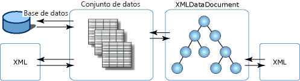

# Integración de XML con datos relacionales y ADO.NETXML Integration with Relational Data and ADO.NET
El **XmlDataDocument** es una clase derivada de la **XmlDocument**y contiene datos XML.The **XmlDataDocument** class is a derived class of the **XmlDocument**, and contains XML data. La ventaja de la **XmlDataDocument** es que proporciona un puente entre los datos relacionales y jerárquicos.The advantage of the **XmlDataDocument** is that it provides a bridge between relational and hierarchical data. Es un **XmlDocument** que se puede enlazar a un **conjunto de datos** y ambas clases pueden sincronizar los cambios realizados en los datos incluidos en las dos clases.It is an **XmlDocument** that can be bound to a **DataSet** and both classes can synchronize changes made to data contained in the two classes. Un **XmlDocument** que está enlazado a un **conjunto de datos** permite a XML integrarse con datos relacionales y no es necesario que los datos estén representados ni XML ni en un formato relacional.An **XmlDocument** that is bound to a **DataSet** allows XML to integrate with relational data, and you do not have to have your data represented as either XML or in a relational format. Se pueden hacer ambas cosas sin necesidad de restringirse a una única representación de los datos.You can do both and not be constrained to a single representation of the data.  
  
 Las ventajas de tener los datos disponibles en dos vistas son las siguientes:The benefits of having data available in two views are:  
  
-   La parte estructurada de un documento XML puede asignarse a un conjunto de datos y ser almacenada, indizada y buscada de forma eficaz.The structured portion of an XML document can be mapped to a dataset, and be efficiently stored, indexed, and searched.  
  
-   Las transformaciones, validación y navegación en los datos XML que están almacenados de forma relacional se pueden realizar eficazmente mediante un modelo de cursor.Transformations, validation, and navigation can be done efficiently through a cursor model over the XML data that is stored relationally. En ocasiones, puede hacerse más eficaz en estructuras relacionales que si el código XML se almacena en un **XmlDocument** modelo.At times, it can be done more efficiently against relational structures than if the XML is stored in an **XmlDocument** model.  
  
-   El **conjunto de datos** puede almacenar una parte del código XML.The **DataSet** can store a portion of the XML. Es decir, se puede usar **XPath** o **XslTransform** para almacenar una **conjunto de datos** sólo aquellos elementos y atributos de interés.That is, you can use **XPath** or **XslTransform** to store to a **DataSet** only those elements and attributes of interest. Desde allí, pueden realizarse cambios en el subconjunto más pequeño y filtrado de datos, con los cambios se propaguen a los datos más grandes en el **XmlDataDocument**.From there, changes can be made to the smaller, filtered subset of data, with the changes propagating to the larger data in the **XmlDataDocument**.  
  
 También puede ejecutar una transformación sobre los datos que se cargaron en el **conjunto de datos** de SQL Server.You can also run a transform over data that was loaded into the **DataSet** from SQL Server. Otra opción consiste en enlazar WinForm de estilo de las clases administradas de .NET Framework y controles de formulario Web Forms a un **conjunto de datos** que se haya llenado de un flujo de entrada XML.Another option is to bind .NET Framework classes-style-managed WinForm and WebForm controls to a **DataSet** that was populated from an XML input stream.  
  
 Además de admitir **XslTransform**, **XmlDataDocument** expone los datos relacionales a **XPath** consultas y validación.In addition to supporting **XslTransform**, an **XmlDataDocument** exposes relational data to **XPath** queries and validation.  Básicamente, todos los servicios XML están disponibles en los datos relacionales; las funciones relacionales, como el enlace de controles, codegen, etc., están disponibles en una proyección estructurada de XML sin comprometer la fidelidad con el lenguaje XML.Basically, all XML services are available over relational data, and relational facilities, such as control binding, codegen, and so on, are available over a structured projection of XML without compromising XML fidelity.  
  
 Dado que **XmlDataDocument** se hereda de un **XmlDocument**, proporciona una implementación de DOM del W3C.Because **XmlDataDocument** is inherited from an **XmlDocument**, it provides an implementation of the W3C DOM. El hecho de que el **XmlDataDocument** está asociado y almacena un subconjunto de sus datos de un **conjunto de datos** no restringe o altera en absoluto su uso como un **XmlDocument** de ninguna manera.The fact that the **XmlDataDocument** is associated with, and stores a subset of its data within, a **DataSet** does not restrict or alter its use as an **XmlDocument** in any way. Código escrito para consumir un **XmlDocument** funciona sin alteraciones en un **XmlDataDocument**.Code written to consume an **XmlDocument** works unaltered against an **XmlDataDocument**. El **conjunto de datos** proporciona la vista relacional de los mismos datos definiendo tablas, columnas, relaciones y restricciones, y constituye un almacén de datos de usuario independiente y en memoria.The **DataSet** provides the relational view of the same data by defining tables, columns, relations, and constraints, and is a stand-alone, in-memory user data store.  
  
 La ilustración siguiente se muestra las distintas asociaciones que los datos XML tienen con el **conjunto de datos** y **XmlDataDocument**.The following illustration shows the different associations that XML data has with the **DataSet** and **XmlDataDocument**.  
  
   
  
 La ilustración muestra que los datos XML pueden cargarse directamente en un **conjunto de datos**, lo que permite la manipulación directa con XML en la forma relacional.The illustration shows that XML data can be loaded directly into a **DataSet**, which allows direct manipulation with XML in the relational manner. O bien, el XML se puede cargar en una clase derivada de DOM, que es el **XmlDataDocument**y posteriormente cargarlo y sincronizarlo con el **conjunto de datos**.Or, the XML can be loaded into a derived class of the DOM, which is the **XmlDataDocument**, and subsequently loaded and synchronized with the **DataSet**. Dado que la **conjunto de datos** y **XmlDataDocument** están sincronizados sobre un único conjunto de datos, los cambios realizados en los datos en un almacén se reflejan automáticamente en el otro almacén.Because the **DataSet** and **XmlDataDocument** are synchronized over a single set of data, changes made to the data in one store are reflected in the other store.  
  
 El **XmlDataDocument** hereda todas las características de edición y navegación de la **XmlDocument**.The **XmlDataDocument** inherits all the editing and navigational features from the **XmlDocument**. Hay veces cuando se usa el **XmlDataDocument** y sus características heredadas, sincronizadas con un **conjunto de datos**, es una opción más apropiada que cargar código XML directamente en el **delconjuntodedatos**.There are times when using the **XmlDataDocument** and its inherited features, synchronized with a **DataSet**, is a more appropriate option than loading XML directly into the **DataSet**. La siguiente tabla muestra los elementos que se va a tener en cuenta al elegir qué método usar para cargar la **conjunto de datos**.The following table shows the items to be considered when choosing which method to use to load the **DataSet**.  
  
|Cuándo cargar XML directamente en un DataSetWhen to load XML directly into a DataSet|Cuándo sincronizar un XmlDataDocument con un DataSetWhen to synchronize an XmlDataDocument with a DataSet|  
|----------------------------------------------|-----------------------------------------------------------|  
|Las consultas de datos en el **conjunto de datos** son más fáciles usando SQL que XPath.Queries of data in the **DataSet** are easier using SQL than XPath.|Se necesitan consultas XPath sobre datos de la **conjunto de datos**.XPath queries are needed over data in the **DataSet**.|  
|Preservar el orden de los elementos en el código fuente XML no es vital.Preservation of element ordering in the source XML is not critical.|Preservar el orden de los elementos en el código fuente XML resulta vital.Preservation of element ordering in the source XML is critical.|  
|No es necesario preservar el espacio en blanco entre los elementos ni el formato del código fuente XML.White space between elements and formatting does not need to be preserved in the source XML.|Preservar el espacio y formato del código fuente XML resulta vital.White space and formatting preservation in the source XML is critical.|  
  
 Si cargar y escribir XML directamente dentro y fuera de un **conjunto de datos** cubre sus necesidades, vea [cargar DataSet desde XML](../../../../docs/framework/data/adonet/dataset-datatable-dataview/loading-a-dataset-from-xml.md) y [escribir un objeto DataSet como datos XML](../../../../docs/framework/data/adonet/dataset-datatable-dataview/writing-dataset-contents-as-xml-data.md).If loading and writing XML directly into and out of a **DataSet** addresses your needs, see [Loading a DataSet from XML](../../../../docs/framework/data/adonet/dataset-datatable-dataview/loading-a-dataset-from-xml.md) and [Writing a DataSet as XML Data](../../../../docs/framework/data/adonet/dataset-datatable-dataview/writing-dataset-contents-as-xml-data.md).  
  
 Si carga el **conjunto de datos** desde una **XmlDataDocument** cubre sus necesidades, vea [sincronizar un DataSet con un documento XML](../../../../docs/framework/data/adonet/dataset-datatable-dataview/dataset-and-xmldatadocument-synchronization.md).If loading the **DataSet** from an **XmlDataDocument** addresses your needs, see [Synchronizing a Datasetwith an XML Document](../../../../docs/framework/data/adonet/dataset-datatable-dataview/dataset-and-xmldatadocument-synchronization.md).  
  
## Vea tambiénSee Also  
 [Usar XML en un conjunto de datosUsing XML in a DataSet](../../../../docs/framework/data/adonet/dataset-datatable-dataview/using-xml-in-a-dataset.md)
