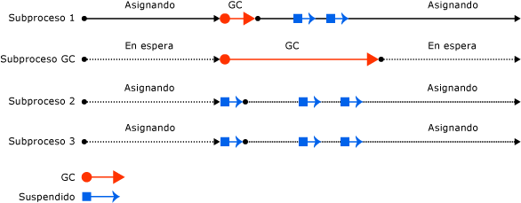

# Recolección de elementos no utilizados en segundo plano

En la recolección de elementos no utilizados (GC) en segundo plano, las generaciones efímeras (0 y 1) se recolectan según sea necesario mientras la recolección de la generación 2 está en curso. La recolección de elementos no utilizados en segundo plano se realiza en uno o más subprocesos dedicados, en función de si se trata de GC en segundo plano o de servidor, y solo se aplica a las recolecciones de la generación 2.

La recolección de elementos no utilizados en segundo plano está habilitada de forma predeterminada. Se puede habilitar o deshabilitar con la opción de configuración [gcConcurrent](../../../docs/framework/configure-apps/file-schema/runtime/gcconcurrent-element.md) o la opción [System.GC.Concurrent](../../core/run-time-config/garbage-collector.md#systemgcconcurrentcomplus_gcconcurrent) en aplicaciones de .NET Core.

> [!NOTE]
> La recolección de elementos no utilizados en segundo plano reemplaza la [recolección simultánea de elementos no utilizados](#concurrent-garbage-collection) en .NET Framework 4 y versiones posteriores. En .NET Framework 4, solo se admite para la recolección de elementos no utilizados de *estación de trabajo*. A partir de .NET Framework 4.5, la recolección de elementos no utilizados en segundo plano está disponible para *estaciones de trabajo* y *servidores*.

Una recolección de las generaciones efímeras durante una recolección de elementos no utilizados en segundo plano se denomina recolección de elementos no utilizados en *primer plano*. Cuando se producen recolecciones de elementos no utilizados en primer plano, se suspenden todos los subprocesos administrados.

Cuando hay en curso una recolección de elementos no utilizados en segundo plano y se han asignado suficientes objetos en la generación 0, el CLR realiza una recolección de elementos no utilizados en primer plano de las generaciones 0 o 1. El subproceso de recolección de elementos no utilizados en segundo plano dedicado realiza comprobaciones en puntos seguros frecuentes para determinar si existe alguna solicitud de recolección de elementos no utilizados en primer plano. Si la hay, la recolección en segundo plano se suspende para que la recolección de elementos no utilizados en primer plano se pueda llevar a cabo. Una vez completada la recolección de elementos no utilizados en primer plano, se reanudan los subprocesos de recolección de elementos no utilizados en segundo plano dedicados y los subprocesos del usuario.

La recolección de elementos no utilizados en segundo plano quita las restricciones de asignación impuestas por la recolección simultánea de elementos no utilizados, porque se pueden producir recolecciones de elementos no utilizados efímeras durante una recolección en segundo plano. La recolección de elementos no utilizados en segundo plano puede eliminar objetos inactivos procedentes de generaciones efímeras. También puede expandir el montón si es necesario durante una recolección de elementos no utilizados de generación 1.

## Recolección de elementos no utilizados de estación de trabajo en segundo plano frente a GC de servidor

A partir de .NET Framework 4,5, la recolección de elementos no utilizados en segundo plano está disponible para la recolección de elementos no utilizados de servidor. La recolección de elementos no utilizados en segundo plano es el modo predeterminado para la recolección de elementos no utilizados de servidor.

La recolección de elementos no utilizados de servidor en segundo plano funciona de forma similar a la recolección de elementos no utilizados de estación de trabajo en segundo plano, pero hay algunas diferencias:

- La recolección de elementos no utilizados de estación de trabajo en segundo plano usa un subproceso dedicado de recolección de elementos no utilizados en segundo plano, mientras que la recolección de elementos no utilizados de servidor en segundo plano utiliza varios subprocesos. Normalmente, hay un subproceso dedicado para cada procesador lógico.

- A diferencia del subproceso de recolección de elementos no utilizados de estación de trabajo en segundo plano, no se agota el tiempo de espera de los subprocesos de recolección de elementos no utilizados de servidor en segundo plano.

En la siguiente ilustración se muestra la recolección de elementos no utilizados de *estación de trabajo* en segundo plano realizada en un subproceso dedicado independiente:

En la siguiente ilustración se muestra la recolección de elementos no utilizados de *servidor* en segundo plano realizada en un subproceso dedicado independiente:

## Recolección de elementos no utilizados simultánea

> [!TIP]
> Esta sección es aplicable a:
>
> - .NET Framework 3.5 y versiones anteriores para la recolección de elementos no utilizados de estación de trabajo
> - .NET Framework 4 y versiones anteriores para la recolección de elementos no utilizados de servidor
>
> La recolección de elementos no utilizados en segundo plano reemplaza a la de elementos no utilizados simultánea en versiones posteriores.

En la recolección de elementos no utilizados de estación de trabajo o de servidor, se puede [habilitar la recolección simultánea de elementos no utilizados](../../../docs/framework/configure-apps/file-schema/runtime/gcconcurrent-element.md), que permite ejecutar subprocesos de manera simultánea con un subproceso dedicado que realiza la recolección de elementos no utilizados durante la mayor parte del tiempo que dura la recolección. Esta opción solo afecta a las recolecciones de elementos no utilizados de la generación 2; las generaciones 0 y 1 no son nunca simultáneas porque finalizan rápidamente.

La recolección de elementos no utilizados simultánea permite mayor capacidad de respuesta de las aplicaciones interactivas, pues minimiza las pausas en una recolección. Los subprocesos administrados pueden continuar ejecutándose la mayoría del tiempo mientras se ejecuta el subproceso de recolección de elementos no utilizados simultánea. Esto da lugar a pausas más cortas mientras se está produciendo una recolección de elementos no utilizados.

La recolección de elementos no utilizados simultánea se realiza en un subproceso dedicado. De forma predeterminada, el CLR ejecuta la recolección de elementos no utilizados de estación de trabajo con la simultaneidad habilitada en equipos de un solo procesador y de varios procesadores.

En la siguiente se muestra la recolección de elementos no utilizados simultánea realizada en un subproceso dedicado independiente.

## Vea también

- [Recolección de elementos no utilizados de estación de trabajo y de servidor](workstation-server-gc.md)
- [Opciones de configuración del entorno de ejecución para la recolección de elementos no utilizados](../../core/run-time-config/garbage-collector.md)
