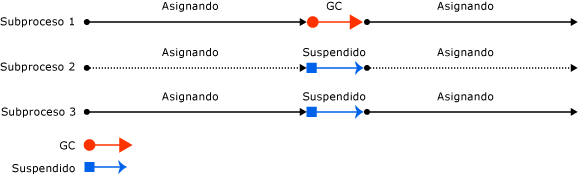

# Fundamentos de la recolección de elementos no utilizadosFundamentals of garbage collection

En el Common Language Runtime (CLR), el recolector de elementos no utilizados (GC) actúa como administrador de memoria automático.In the common language runtime (CLR), the garbage collector (GC) serves as an automatic memory manager. El recolector de elementos no utilizados administra la asignación y liberación de la memoria de una aplicación.The garbage collector manages the allocation and release of memory for an application. Esto significa que los desarrolladores que trabajan con código administrado no tienen que escribir código para realizar tareas de administración de memoria.For developers working with managed code, this means that you don't have to write code to perform memory management tasks. La administración automática de la memoria puede eliminar problemas frecuentes, como olvidar liberar un objeto y causar una pérdida de memoria, o intentar acceder a la memoria de un objeto que ya se ha liberado.Automatic memory management can eliminate common problems, such as forgetting to free an object and causing a memory leak or attempting to access memory for an object that's already been freed.

En este artículo se describen los conceptos básicos de la recolección de elementos no utilizados.This article describes the core concepts of garbage collection.

## VentajasBenefits

El recolector de elementos no utilizados proporciona las siguientes ventajas:The garbage collector provides the following benefits:

- Exime a los desarrolladores de tener que liberar memoria manualmente.Frees developers from having to manually release memory.

- Asigna con eficacia los objetos del montón administrado.Allocates objects on the managed heap efficiently.

- Reclama los objetos que ya no se utilizan, borra la memoria correspondiente y mantiene la memoria disponible para asignaciones futuras.Reclaims objects that are no longer being used, clears their memory, and keeps the memory available for future allocations. Los objetos administrados obtienen automáticamente contenido limpio desde el principio, de modo que sus constructores no tienen que inicializar todos los campos de datos.Managed objects automatically get clean content to start with, so their constructors don't have to initialize every data field.

- Proporciona seguridad de memoria, al asegurarse de que un objeto no pueda utilizar el contenido de otro objeto.Provides memory safety by making sure that an object cannot use the content of another object.

## Fundamentos de memoriaFundamentals of memory

En la lista siguiente se resumen los conceptos importantes de memoria de CLR.The following list summarizes important CLR memory concepts.

- Cada proceso tiene propio espacio de direcciones virtuales independiente.Each process has its own, separate virtual address space. Todos los procesos del equipo comparten la misma memoria física y el archivo de paginación, si hay alguno.All processes on the same computer share the same physical memory and the page file, if there is one.

- De forma predeterminada, en los equipos de 32 bits, cada proceso tiene un espacio de direcciones virtuales en modo usuario de 2 GB.By default, on 32-bit computers, each process has a 2-GB user-mode virtual address space.

- Como desarrollador de aplicaciones, solo trabaja con el espacio de direcciones virtuales y nunca manipula la memoria física directamente.As an application developer, you work only with virtual address space and never manipulate physical memory directly. El recolector de elementos no utilizados asigna y libera memoria virtual en el montón administrado.The garbage collector allocates and frees virtual memory for you on the managed heap.

  Si está escribiendo código nativo, use funciones de Windows para trabajar con el espacio de direcciones virtuales.If you're writing native code, you use Windows functions to work with the virtual address space. Estas funciones asignan y liberan memoria virtual en pilas nativas.These functions allocate and free virtual memory for you on native heaps.

- La memoria virtual puede estar en tres estados:Virtual memory can be in three states:

  | EstadoState | DescripciónDescription |
  |---------|---------|
  | GratuitoFree | El bloque de memoria no tiene ninguna referencia a ella y está disponible para su asignación.The block of memory has no references to it and is available for allocation. |
  | ReservadaReserved | El bloque de memoria está disponible para su uso y no se puede emplear para ninguna otra solicitud de asignación.The block of memory is available for your use and cannot be used for any other allocation request. Sin embargo, no puede almacenar datos en este bloque de memoria hasta que se confirme.However, you cannot store data to this memory block until it is committed. |
  | ConfirmadoCommitted | El bloque de memoria se asigna al almacenamiento físico.The block of memory is assigned to physical storage. |

- El espacio de direcciones virtuales puede llegar a fragmentarse.Virtual address space can get fragmented. Esto significa que hay bloques libres, también conocidos como marcadores, en el espacio de direcciones.This means that there are free blocks, also known as holes, in the address space. Cuando se solicita una asignación de memoria virtual, el administrador de memoria virtual tiene que encontrar un único bloque libre que sea suficientemente grande para satisfacer esa solicitud de asignación.When a virtual memory allocation is requested, the virtual memory manager has to find a single free block that is large enough to satisfy that allocation request. Aunque tenga 2 GB de espacio disponible, una asignación que necesite 2 GB será incorrecta a menos que todo ese espacio disponible esté en un único bloque de direcciones.Even if you have 2 GB of free space, an allocation that requires 2 GB will be unsuccessful unless all of that free space is in a single address block.

- Puede quedarse sin memoria si no hay suficiente espacio de direcciones virtuales para reservar o espacio físico para confirmar.You can run out of memory if there isn't enough virtual address space to reserve or physical space to commit.

  El archivo de paginación se usa aunque haya poca necesidad de memoria física (es decir, demanda de memoria física).The page file is used even if physical memory pressure (that is, demand for physical memory) is low. La primera vez que se necesita memoria física, el sistema operativo debe hacer sitio en ella para almacenar los datos y hace una copia de seguridad en el archivo de paginación de algunos datos que están en la memoria física.The first time that physical memory pressure is high, the operating system must make room in physical memory to store data, and it backs up some of the data that is in physical memory to the page file. Esos datos no se paginan hasta que no se necesitan, por lo que es posible encontrar paginación en situaciones donde haya muy poca necesidad de memoria física.That data is not paged until it's needed, so it's possible to encounter paging in situations where the physical memory pressure is low.
  
### Asignación de memoriaMemory allocation

Cuando se inicializa un nuevo proceso, el motor en tiempo de ejecución reserva una región contigua de espacio de direcciones para el proceso.When you initialize a new process, the runtime reserves a contiguous region of address space for the process. Este espacio de direcciones reservado se denomina montón administrado.This reserved address space is called the managed heap. El montón administrado mantiene un puntero a la dirección a la que se asignará el siguiente objeto del montón.The managed heap maintains a pointer to the address where the next object in the heap will be allocated. Inicialmente, este puntero se establece en la dirección base del montón administrado.Initially, this pointer is set to the managed heap's base address. Todos los tipos de referencia se asignan en el montón administrado.All reference types are allocated on the managed heap. Cuando una aplicación crea el primer tipo de referencia, se le asigna memoria en la dirección base del montón administrado.When an application creates the first reference type, memory is allocated for the type at the base address of the managed heap. Cuando la aplicación crea el siguiente objeto, el recolector de elementos no utilizados le asigna memoria en el espacio de direcciones que sigue inmediatamente al primer objeto.When the application creates the next object, the garbage collector allocates memory for it in the address space immediately following the first object. Siempre que haya espacio de direcciones disponible, el recolector de elementos no utilizados continúa asignando espacio a los objetos nuevos de este modo.As long as address space is available, the garbage collector continues to allocate space for new objects in this manner.

La asignación de memoria desde el montón administrado es más rápida que la asignación de memoria no administrada.Allocating memory from the managed heap is faster than unmanaged memory allocation. Como el tiempo de ejecución asigna memoria a los objetos agregando un valor a un puntero, este método es casi tan rápido como la asignación de memoria desde la pila.Because the runtime allocates memory for an object by adding a value to a pointer, it's almost as fast as allocating memory from the stack. Además, puesto que los nuevos objetos que se asignan consecutivamente se almacenan uno junto a otro en el montón administrado, la aplicación puede acceder rápidamente a los objetos.In addition, because new objects that are allocated consecutively are stored contiguously in the managed heap, an application can access the objects quickly.

### Liberación de memoriaMemory release

El motor de optimización del recolector de elementos no utilizados determina cuál es el mejor momento para realizar una recolección basándose en las asignaciones realizadas.The garbage collector's optimizing engine determines the best time to perform a collection based on the allocations being made. Cuando el recolector de elementos no utilizados lleva a cabo una recolección, libera la memoria de los objetos que ya no usa la aplicación.When the garbage collector performs a collection, it releases the memory for objects that are no longer being used by the application. Determina qué objetos ya no se usan examinando las *raíces* de la aplicación.It determines which objects are no longer being used by examining the application's *roots*. Las raíces de una aplicación incluyen campos estáticos, variables locales en la pila de un subproceso, registros de la CPU, identificadores de recolección de elementos no utilizados y la cola de finalización.An application's roots include static fields, local variables on a thread's stack, CPU registers, GC handles, and the finalize queue. Cada raíz hace referencia a un objeto del montón administrado, o bien se establece en null.Each root either refers to an object on the managed heap or is set to null. El recolector de elementos no utilizados puede solicitar estas raíces al resto del entorno de ejecución.The garbage collector can ask the rest of the runtime for these roots. Con esta lista, el recolector de elementos no utilizados crea un gráfico que contiene todos los objetos que no se pueden alcanzar desde las raíces.Using this list, the garbage collector creates a graph that contains all the objects that are reachable from the roots.

Los objetos que no están en el gráfico no se pueden alcanzar desde las raíces de la aplicación.Objects that are not in the graph are unreachable from the application's roots. El recolector de elementos no utilizados considera elementos no utilizados los objetos inalcanzables y libera la memoria que tienen asignada.The garbage collector considers unreachable objects garbage and releases the memory allocated for them. Durante una recolección, el recolector de elementos no utilizados examina el montón administrado y busca los bloques de espacio de direcciones que ocupan los objetos que no se pueden alcanzar.During a collection, the garbage collector examines the managed heap, looking for the blocks of address space occupied by unreachable objects. Cuando detecta cada uno de los objetos inalcanzables, usa una función de copia de memoria para compactar los objetos alcanzables en la memoria y libera los bloques de espacios de direcciones asignados a los objetos no alcanzables.As it discovers each unreachable object, it uses a memory-copying function to compact the reachable objects in memory, freeing up the blocks of address spaces allocated to unreachable objects. Una vez que se ha compactado la memoria de los objetos alcanzables, el recolector de elementos no utilizados hace las correcciones de puntero necesarias para que las raíces de la aplicación señalen a los objetos en sus nuevas ubicaciones.Once the memory for the reachable objects has been compacted, the garbage collector makes the necessary pointer corrections so that the application's roots point to the objects in their new locations. También sitúa el puntero del montón administrado después del último objeto alcanzable.It also positions the managed heap's pointer after the last reachable object.

La memoria solo se compacta si, durante una recolección, se detecta un número significativo de objetos inalcanzables.Memory is compacted only if a collection discovers a significant number of unreachable objects. Si todos los objetos del montón administrado sobreviven a una recolección, no hay necesidad de comprimir la memoria.If all the objects in the managed heap survive a collection, then there is no need for memory compaction.

Para mejorar el rendimiento, el tiempo de ejecución asigna memoria a los objetos grandes en un montón aparte.To improve performance, the runtime allocates memory for large objects in a separate heap. El recolector de elementos no utilizados libera la memoria para los objetos grandes automáticamente.The garbage collector automatically releases the memory for large objects. Pero, para no mover objetos grandes en la memoria, normalmente dicha memoria no se compacta.However, to avoid moving large objects in memory, this memory is usually not compacted.

## Condiciones para la recolección de elementos no utilizadosConditions for a garbage collection

La recolección de elementos no utilizados se produce cuando se cumple alguna de las siguientes condiciones:Garbage collection occurs when one of the following conditions is true:

- El sistema tiene poca memoria física.The system has low physical memory. Esto detecta cualquier la notificación memoria insuficiente desde el sistema operativo o de poca memoria indicada por el host.This is detected by either the low memory notification from the OS or low memory as indicated by the host.

- La memoria que utilizan los objetos asignados del montón administrado supera un umbral aceptable.The memory that's used by allocated objects on the managed heap surpasses an acceptable threshold. Este umbral se ajusta continuamente a medida que se ejecuta el proceso.This threshold is continuously adjusted as the process runs.

- Se llama al método <xref:System.GC.Collect%2A?displayProperty=nameWithType> .The <xref:System.GC.Collect%2A?displayProperty=nameWithType> method is called. En casi todos casos, no es necesario llamar a este método, porque el recolector de elementos no utilizados se ejecuta continuamente.In almost all cases, you don't have to call this method, because the garbage collector runs continuously. Este método se utiliza principalmente para pruebas y situaciones singulares.This method is primarily used for unique situations and testing.

## Montón administradoThe managed heap

Una vez que el CLR inicializa el recolector de elementos no utilizados, asigna un segmento de memoria para almacenar y administrar objetos.After the garbage collector is initialized by the CLR, it allocates a segment of memory to store and manage objects. Esta memoria se denomina montón administrado, y se diferencia del montón nativo del sistema operativo.This memory is called the managed heap, as opposed to a native heap in the operating system.

Hay un montón administrado para cada proceso administrado.There is a managed heap for each managed process. Todos los subprocesos del proceso asignan memoria a los objetos del mismo montón.All threads in the process allocate memory for objects on the same heap.

Para reservar memoria, el recolector de elementos no utilizados llama a la función [VirtualAlloc](/windows/desktop/api/memoryapi/nf-memoryapi-virtualalloc) de Windows y reserva un segmento de memoria cada vez para las aplicaciones administradas.To reserve memory, the garbage collector calls the Windows [VirtualAlloc](/windows/desktop/api/memoryapi/nf-memoryapi-virtualalloc) function and reserves one segment of memory at a time for managed applications. El recolector de elementos no utilizados también reserva segmentos según sea necesario y vuelve a liberarlos para el sistema operativo (después de borrarlos de todos los objetos) mediante una llamada a la función [VirtualFree](/windows/desktop/api/memoryapi/nf-memoryapi-virtualfree) de Windows.The garbage collector also reserves segments, as needed, and releases segments back to the operating system (after clearing them of any objects) by calling the Windows [VirtualFree](/windows/desktop/api/memoryapi/nf-memoryapi-virtualfree) function.

> [!IMPORTANT]
> El tamaño de los segmentos asignados por el recolector de elementos no utilizados es específico de la implementación y está sujeto a cambios en cualquier momento, incluso en las actualizaciones periódicas.The size of segments allocated by the garbage collector is implementation-specific and is subject to change at any time, including in periodic updates. La aplicación nunca debe realizar suposiciones sobre el tamaño de un sector determinado ni depender de él, y tampoco debe intentar configurar la cantidad de memoria disponible para las asignaciones de segmentos.Your app should never make assumptions about or depend on a particular segment size, nor should it attempt to configure the amount of memory available for segment allocations.

Cuantos menos objetos se asignen al montón, menos trabajo tendrá que hacer el recolector de elementos no utilizados.The fewer objects allocated on the heap, the less work the garbage collector has to do. Al asignar objetos, no use valores redondeados que superen sus necesidades; por ejemplo, no asigne una matriz de 32 bytes si solo necesita 15 bytes.When you allocate objects, don't use rounded-up values that exceed your needs, such as allocating an array of 32 bytes when you need only 15 bytes.

Cuando se desencadena una recolección de elementos no utilizados, el recolector de elementos no utilizados reclama la memoria ocupada por objetos muertos.When a garbage collection is triggered, the garbage collector reclaims the memory that's occupied by dead objects. El proceso de reclamación compacta los objetos activos para moverlos juntos, y el espacio muerto se quita, para reducir el montón.The reclaiming process compacts live objects so that they are moved together, and the dead space is removed, thereby making the heap smaller. De este modo, se asegura de que los objetos que se asignan juntos permanezcan juntos en el montón administrado, a fin de conservar su situación.This ensures that objects that are allocated together stay together on the managed heap to preserve their locality.

La tendencia a la intrusión (frecuencia y duración) de las recolecciones de elementos no utilizados es el resultado del volumen de asignaciones y la cantidad de memoria que sobrevivió en el montón administrado.The intrusiveness (frequency and duration) of garbage collections is the result of the volume of allocations and the amount of survived memory on the managed heap.

El montón considerarse una acumulación de dos montones: el [montón de objetos grandes](large-object-heap.md) y el montón de objetos pequeños.The heap can be considered as the accumulation of two heaps: the [large object heap](large-object-heap.md) and the small object heap. El montón de objetos grandes contiene objetos de 85 000 bytes o más, que normalmente son matrices.The large object heap contains objects that are 85,000 bytes and larger, which are usually arrays. Es raro que un objeto de instancia sea sumamente grande.It's rare for an instance object to be extremely large.

> [!TIP]
> Puede [configurar el tamaño de umbral](../../core/run-time-config/garbage-collector.md#large-object-heap-threshold) para que los objetos se dirijan al montón de objetos grandes.You can [configure the threshold size](../../core/run-time-config/garbage-collector.md#large-object-heap-threshold) for objects to go on the large object heap.

## GeneracionesGenerations

El algoritmo de GC se basa en varias consideraciones:The GC algorithm is based on several considerations:

- Es más rápido compactar la memoria de una parte del montón administrado que la de todo el montón.It's faster to compact the memory for a portion of the managed heap than for the entire managed heap.
- Los objetos más recientes tienen una duración más corta y los objetos antiguos tienen una duración más larga.Newer objects have shorter lifetimes and older objects have longer lifetimes.
- Los objetos más recientes suelen estar relacionados unos con otros y la aplicación accede a ellos más o menos al mismo tiempo.Newer objects tend to be related to each other and accessed by the application around the same time.

La recolección de elementos no utilizados se produce principalmente con la reclamación de objetos de corta duración.Garbage collection primarily occurs with the reclamation of short-lived objects. Para optimizar el rendimiento del recolector de elementos no utilizados, el montón administrado se divide en tres generaciones: 0, 1 y 2, de forma que pueda manipular por separado los objetos de corta duración y los de larga duración.To optimize the performance of the garbage collector, the managed heap is divided into three generations, 0, 1, and 2, so it can handle long-lived and short-lived objects separately. El recolector de elementos no utilizados almacena los nuevos objetos en la generación 0.The garbage collector stores new objects in generation 0. Los objetos creados en las primeras etapas de la duración de la aplicación y que sobreviven a las recolecciones se promueven y se almacenan en las generaciones 1 y 2.Objects created early in the application's lifetime that survive collections are promoted and stored in generations 1 and 2. Como es más rápido compactar una parte del montón administrado que todo el montón, este esquema permite que el recolector de elementos no utilizados libere la memoria en una generación específica en lugar de liberarla para todo el montón administrado cada vez que realiza una recolección.Because it's faster to compact a portion of the managed heap than the entire heap, this scheme allows the garbage collector to release the memory in a specific generation rather than release the memory for the entire managed heap each time it performs a collection.

- **Generación 0**.**Generation 0**. Es la generación más joven y contiene los objetos de corta duración.This is the youngest generation and contains short-lived objects. Un ejemplo de objeto de corta duración es una variable temporal.An example of a short-lived object is a temporary variable. La recolección de elementos no utilizados se produce con mayor frecuencia en esta generación.Garbage collection occurs most frequently in this generation.

  Los objetos recién asignados constituyen una nueva generación de objetos y son colecciones de la generación 0, implícitamente.Newly allocated objects form a new generation of objects and are implicitly generation 0 collections. Sin embargo, si son objetos de gran tamaño, pasan al montón de objetos grandes (LOH), al que en ocasiones se denomina *generación 3*.However, if they are large objects, they go on the large object heap (LOH), which is sometimes referred to as *generation 3*. La generación 3 es una generación física que se recopila de forma lógica como elemento de la generación 2.Generation 3 is a physical generation that's logically collected as part of generation 2.

  La mayoría de los objetos se reclaman para la recolección de elementos no utilizados en la generación 0 y no sobreviven a la generación siguiente.Most objects are reclaimed for garbage collection in generation 0 and don't survive to the next generation.
  
  Si una aplicación trata de crear un objeto cuando la generación 0 está llena, el recolector de elementos no utilizados realiza una recolección en un intento de liberar espacio de direcciones para el objeto.If an application attempts to create a new object when generation 0 is full, the garbage collector performs a collection in an attempt to free address space for the object. Primero examina los objetos de la generación 0 y no todos los objetos del montón administrado.The garbage collector starts by examining the objects in generation 0 rather than all objects in the managed heap. Una recolección de tan sólo la generación 0 a menudo recupera suficiente memoria para que la aplicación pueda continuar creando objetos.A collection of generation 0 alone often reclaims enough memory to enable the application to continue creating new objects.

- **Generación 1****Generation 1**. Esta generación contiene objetos de corta duración y sirve como búfer entre los objetos de corta y larga duración.This generation contains short-lived objects and serves as a buffer between short-lived objects and long-lived objects.

  Una vez que el recolector de elementos no utilizados realiza una recolección de la generación 0, compacta la memoria de los objetos que se pueden alcanzar y los promueve a la generación 1.After the garbage collector performs a collection of generation 0, it compacts the memory for the reachable objects and promotes them to generation 1. Dado que los objetos que sobreviven a las recolecciones suelen tener una duración más larga, es lógico promoverlos a una generación superior.Because objects that survive collections tend to have longer lifetimes, it makes sense to promote them to a higher generation. El recolector de elementos no utilizados no tiene que volver a examinar los objetos de las generaciones 1 y 2 cada vez que realiza una recolección en la generación 0.The garbage collector doesn't have to reexamine the objects in generations 1 and 2 each time it performs a collection of generation 0.
  
  Si una recolección de la generación 0 no recupera memoria suficiente para que la aplicación pueda crear un nuevo objeto, el recolector de elementos no utilizados puede realizar una recolección de la generación 1 y, después, de la generación 2.If a collection of generation 0 does not reclaim enough memory for the application to create a new object, the garbage collector can perform a collection of generation 1, then generation 2. Los objetos de la generación 1 que sobreviven a las recolecciones se promueven a la generación 2.Objects in generation 1 that survive collections are promoted to generation 2.

- **Generación 2****Generation 2**. Esta generación contiene los objetos de larga duración.This generation contains long-lived objects. Un ejemplo de objeto de larga duración es un objeto de una aplicación de servidor que contiene datos estáticos que están activos mientras dura el proceso.An example of a long-lived object is an object in a server application that contains static data that's live for the duration of the process.

  Los objetos de la generación 2 que sobreviven a una recolección se mantienen en esta generación hasta que en una recolección posterior se determina que no se pueden alcanzar.Objects in generation 2 that survive a collection remain in generation 2 until they are determined to be unreachable in a future collection.
  
  Los objetos del montón de objetos grandes (a veces denominado *generación 3*) también se recopilan en la generación 2.Objects on the large object heap (which is sometimes referred to as *generation 3*) are also collected in generation 2.

Las recolecciones de elementos no utilizados se producen en generaciones concretas según lo permitan las condiciones.Garbage collections occur on specific generations as conditions warrant. La recolección de una generación significa recolectar los objetos de esa generación y de todas las generaciones anteriores.Collecting a generation means collecting objects in that generation and all its younger generations. Una recolección de elementos no utilizados de la generación 2 se denomina también recolección de elementos no utilizados completa, porque reclama los objetos de todas las generaciones (es decir, todos los objetos del montón administrado).A generation 2 garbage collection is also known as a full garbage collection, because it reclaims objects in all generations (that is, all objects in the managed heap).

### Supervivencia y promocionesSurvival and promotions

Los objetos que no se reclaman en una recolección de elementos no utilizados se denominan supervivientes y se promueven a la generación siguiente:Objects that are not reclaimed in a garbage collection are known as survivors and are promoted to the next generation:

- Los objetos que sobreviven a una recolección de elementos no utilizados de la generación 0 se promueven a la generación 1.Objects that survive a generation 0 garbage collection are promoted to generation 1.
- Los objetos que sobreviven a una recolección de elementos no utilizados de la generación 1 se promueven a la generación 2.Objects that survive a generation 1 garbage collection are promoted to generation 2.
- Los objetos que sobreviven a una recolección de elementos no utilizados de la generación 2 permanecen en la generación 2.Objects that survive a generation 2 garbage collection remain in generation 2.

Cuando el recolector de elementos no utilizados detecta que la tasa de supervivencia es alta en una generación, aumenta el umbral de asignaciones para esa generación.When the garbage collector detects that the survival rate is high in a generation, it increases the threshold of allocations for that generation. La colección siguiente obtiene un tamaño sustancial de memoria reclamada.The next collection gets a substantial size of reclaimed memory. El CLR equilibra continuamente dos prioridades: no permitir que el espacio de trabajo de una aplicación adquiera un tamaño excesivo al retrasar la recolección de elementos no utilizados y no permitir que la recolección de elementos no utilizados se ejecute con mucha frecuencia.The CLR continually balances two priorities: not letting an application's working set get too large by delaying garbage collection and not letting the garbage collection run too frequently.

### Generaciones y segmentos efímerosEphemeral generations and segments

Dado que los objetos de las generaciones 0 y 1 son de corta duración, estas generaciones se denominan *generaciones efímeras*.Because objects in generations 0 and 1 are short-lived, these generations are known as the *ephemeral generations*.

Las generaciones efímeras se asignan en el segmento de memoria denominado segmento efímero.Ephemeral generations are allocated in the memory segment that's known as the ephemeral segment. Cada nuevo segmento adquirido por el recolector de elementos no utilizados se convierte en el nuevo segmento efímero y contiene los objetos que sobrevivieron a una recolección de elementos no utilizados de la generación 0.Each new segment acquired by the garbage collector becomes the new ephemeral segment and contains the objects that survived a generation 0 garbage collection. El segmento efímero anterior se convierte en el nuevo segmento de la generación 2.The old ephemeral segment becomes the new generation 2 segment.

El tamaño del segmento efímero varía según si un sistema es de 32 bits o de 64 bits y del tipo del recolector de elementos no utilizados que se está ejecutando ([GC de servidor o estación de trabajo](workstation-server-gc.md)).The size of the ephemeral segment varies depending on whether a system is 32-bit or 64-bit and on the type of garbage collector it is running ([workstation or server GC](workstation-server-gc.md)). En la tabla siguiente se muestran los tamaños predeterminados del segmento efímero.The following table shows the default sizes of the ephemeral segment.

|GC de servidor/estación de trabajoWorkstation/server GC|32 bits32-bit|64 bits64-bit|
|-|-------------|-------------|
|Estación de trabajo de catálogo globalWorkstation GC|16 MB16 MB|256 MB256 MB|
|Servidor de catálogo globalServer GC|64 MB64 MB|4 GB4 GB|
|Servidor de catálogo global con > 4 CPU lógicasServer GC with > 4 logical CPUs|32 MB32 MB|2 GB2 GB|
|Servidor de catálogo global con > 8 CPU lógicasServer GC with > 8 logical CPUs|16 MB16 MB|1 GB1 GB|

El segmento efímero puede incluir objetos de la generación 2.The ephemeral segment can include generation 2 objects. Los objetos de la generación 2 pueden utilizar varios segmentos (tantos como necesite el proceso y la memoria permita).Generation 2 objects can use multiple segments (as many as your process requires and memory allows for).

La cantidad de memoria liberada como consecuencia de una recolección de elementos no utilizados efímera se limita al tamaño del segmento efímero.The amount of freed memory from an ephemeral garbage collection is limited to the size of the ephemeral segment. La cantidad de memoria que se libera es proporcional al espacio que ocupaban los objetos muertos.The amount of memory that is freed is proportional to the space that was occupied by the dead objects.

## Lo que sucede durante la recolección de elementos no utilizadosWhat happens during a garbage collection

Una recolección de elementos no utilizados tiene las siguientes fases:A garbage collection has the following phases:

- Una fase de marcado que busca y crea una lista de todos los objetos activos.A marking phase that finds and creates a list of all live objects.

- Una fase de reubicación, que actualiza las referencias a los objetos que se van a compactar.A relocating phase that updates the references to the objects that will be compacted.

- Una fase de compactación, que reclama el espacio ocupado por los objetos muertos y compacta los objetos supervivientes.A compacting phase that reclaims the space occupied by the dead objects and compacts the surviving objects. En la fase de compactación se mueven los objetos que han sobrevivido a una recolección de elementos no utilizados hacia el extremo más antiguo del segmento.The compacting phase moves objects that have survived a garbage collection toward the older end of the segment.

  Debido a que las recolecciones de la generación 2 pueden ocupar varios segmentos, los objetos que se promueven a la generación 2 se pueden mover a un segmento anterior.Because generation 2 collections can occupy multiple segments, objects that are promoted into generation 2 can be moved into an older segment. Los supervivientes de las generaciones 1 y 2 se pueden mover a un segmento diferente, porque se promueven a la generación 2.Both generation 1 and generation 2 survivors can be moved to a different segment, because they are promoted to generation 2.

  Normalmente, el montón de objetos grandes no se compacta, porque al copiar objetos grandes se reduce el rendimiento.Ordinarily, the large object heap (LOH) is not compacted, because copying large objects imposes a performance penalty. Sin embargo, en .NET Core y en .NET Framework 4.5.1 y versiones posteriores, se puede utilizar la propiedad <xref:System.Runtime.GCSettings.LargeObjectHeapCompactionMode%2A?displayProperty=nameWithType> para compactar el montón de objetos grandes a petición.However, in .NET Core and in .NET Framework 4.5.1 and later, you can use the <xref:System.Runtime.GCSettings.LargeObjectHeapCompactionMode%2A?displayProperty=nameWithType> property to compact the large object heap on demand. Además, el montón de objetos grandes se compacta automáticamente cuando se establece un límite máximo mediante la especificación de:In addition, the LOH is automatically compacted when a hard limit is set by specifying either:

  - un límite de memoria en un contenedor.A memory limit on a container.
  - Las opciones de configuración en tiempo de ejecución [GCHeapHardLimit](../../core/run-time-config/garbage-collector.md#heap-limit) o [GCHeapHardLimitPercent](../../core/run-time-config/garbage-collector.md#heap-limit-percent).The [GCHeapHardLimit](../../core/run-time-config/garbage-collector.md#heap-limit) or [GCHeapHardLimitPercent](../../core/run-time-config/garbage-collector.md#heap-limit-percent) run-time configuration options.

El recolector de elementos no utilizados utiliza la siguiente información para determinar si los objetos están activos:The garbage collector uses the following information to determine whether objects are live:

- **Raíces de la pila**.**Stack roots**. Variables de pila proporcionadas por el compilador Just-In-Time (JIT) y el rastreador de pila.Stack variables provided by the just-in-time (JIT) compiler and stack walker. Las optimizaciones de JIT pueden prolongar o acortar regiones de código en las que se notifican variables de pila al recolector de elementos no utilizados.JIT optimizations can lengthen or shorten regions of code within which stack variables are reported to the garbage collector.

- **Identificadores de recolección de elementos no utilizados**.**Garbage collection handles**. Identificadores que señalan a objetos administrados y que se pueden asignar mediante código de usuario o mediante Common Language Runtime.Handles that point to managed objects and that can be allocated by user code or by the common language runtime.

- **Datos estáticos**.**Static data**. Objetos estáticos de dominios de aplicación que podrían hacer referencia a otros objetos.Static objects in application domains that could be referencing other objects. Cada dominio de aplicación realiza el seguimiento de sus objetos estáticos.Each application domain keeps track of its static objects.

Antes de que iniciarse una recolección de elementos no utilizados, todos los subprocesos administrados se suspenden salvo el subproceso que activó la recolección de elementos no utilizados.Before a garbage collection starts, all managed threads are suspended except for the thread that triggered the garbage collection.

En la ilustración siguiente se muestra un subproceso que desencadena una recolección de elementos no utilizados, lo que provoca la suspensión de los demás subprocesos.The following illustration shows a thread that triggers a garbage collection and causes the other threads to be suspended.

## Recursos no administradosUnmanaged resources

En el caso de la mayoría de los objetos creados por la aplicación, puede utilizar la recolección de elementos no utilizados para realizar automáticamente las tareas de administración de memoria.For most of the objects that your application creates, you can rely on garbage collection to automatically perform the necessary memory management tasks. Sin embargo, los recursos no administrados requieren una limpieza explícita.However, unmanaged resources require explicit cleanup. El tipo más habitual de recurso no administrado es un objeto que contiene un recurso del sistema operativo, como un identificador de archivo, identificador de ventana o conexión de red.The most common type of unmanaged resource is an object that wraps an operating system resource, such as a file handle, window handle, or network connection. Aunque el recolector de elementos no utilizados puede realizar el seguimiento del período de duración de un objeto administrado que encapsula un recurso no administrado, no tiene un conocimiento específico de cómo limpiar el recurso.Although the garbage collector is able to track the lifetime of a managed object that encapsulates an unmanaged resource, it doesn't have specific knowledge about how to clean up the resource.

Cuando se crea un objeto que encapsula un recurso no administrado, es recomendable proporcionar el código necesario para limpiar dicho recurso en un método público `Dispose`.When you create an object that encapsulates an unmanaged resource, it's recommended that you provide the necessary code to clean up the unmanaged resource in a public `Dispose` method. Si se proporciona un método `Dispose`, se permite que los usuarios del objeto liberen su memoria de manera explícita cuando hayan terminado de usarlo.By providing a `Dispose` method, you enable users of your object to explicitly free its memory when they are finished with the object. Si se usa un objeto que encapsula un recurso no administrado, asegúrese de llamar a `Dispose` cuando sea necesario.When you use an object that encapsulates an unmanaged resource, make sure to call `Dispose` as necessary.

También debe proporcionar una forma de liberar los recursos no administrados en el caso de que un consumidor de su tipo olvide llamar a `Dispose`.You must also provide a way for your unmanaged resources to be released in case a consumer of your type forgets to call `Dispose`. Puede usar un controlador seguro para encapsular el recurso no administrado o invalidar el método <xref:System.Object.Finalize?displayProperty=nameWithType>.You can either use a safe handle to wrap the unmanaged resource, or override the <xref:System.Object.Finalize?displayProperty=nameWithType> method.

Para obtener más información sobre la limpieza de recursos no administrados, vea [Limpieza de recursos no administrados](unmanaged.md).For more information about cleaning up unmanaged resources, see [Clean up unmanaged resources](unmanaged.md).

## Vea tambiénSee also

- [Recolección de elementos no utilizados de estación de trabajo y de servidorWorkstation and server garbage collection](workstation-server-gc.md)
- [Recolección de elementos no utilizados en segundo planoBackground garbage collection](background-gc.md)
- [Opciones de configuración para la recolección de elementos no utilizadosConfiguration options for GC](../../core/run-time-config/garbage-collector.md)
- [Recolección de elementos no utilizadosGarbage collection](index.md)
