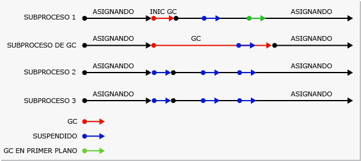
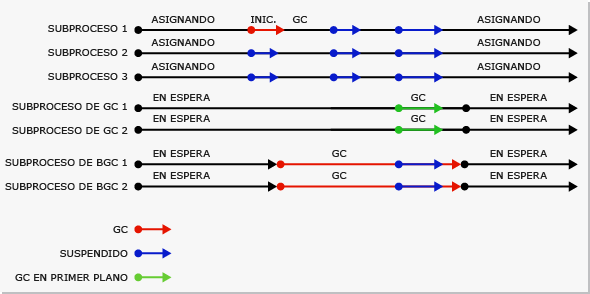

# Fundamentos de la recolección de elementos no utilizadosFundamentals of Garbage Collection
 En el Common Language Runtime (CLR), el recolector de elementos no utilizados actúa como administrador de memoria automático.In the common language runtime (CLR), the garbage collector serves as an automatic memory manager. Proporciona las siguientes ventajas:It provides the following benefits:  
  
-   Permite desarrollar la aplicación sin tener que liberar memoria.Enables you to develop your application without having to free memory.  
  
-   Asigna con eficacia los objetos del montón administrado.Allocates objects on the managed heap efficiently.  
  
-   Reclama los objetos que ya no se utilizan, borra la memoria correspondiente y mantiene la memoria disponible para asignaciones futuras.Reclaims objects that are no longer being used, clears their memory, and keeps the memory available for future allocations. Los objetos administrados obtienen automáticamente contenido limpio desde el principio, de modo que sus constructores no tienen que inicializar todos los campos de datos.Managed objects automatically get clean content to start with, so their constructors do not have to initialize every data field.  
  
-   Proporciona seguridad de memoria, al asegurarse de que un objeto no pueda utilizar el contenido de otro objeto.Provides memory safety by making sure that an object cannot use the content of another object.  
  
 En este tema se describen los conceptos básicos de la recolección de elementos no utilizados.This topic describes the core concepts of garbage collection. Contiene las siguientes secciones:It contains the following sections:  
  
-   [Fundamentos de memoriaFundamentals of memory](#fundamentals_of_memory)  
  
-   [Condiciones para la recolección de elementos no utilizadosConditions for a garbage collection](#conditions_for_a_garbage_collection)  
  
-   [Montón administradoThe managed heap](#the_managed_heap)  
  
-   [GeneracionesGenerations](#generations)  
  
-   [Lo que sucede durante la recolección de elementos no utilizadosWhat happens during a garbage collection](#what_happens_during_a_garbage_collection)  
  
-   [Manipular recursos no administradosManipulating unmanaged resources](#manipulating_unmanaged_resources)  
  
-   [Recolección de elementos no utilizados de estación de trabajo y de servidorWorkstation and server garbage collection](#workstation_and_server_garbage_collection)  
  
-   [Recolección de elementos no utilizados simultáneaConcurrent garbage collection](#concurrent_garbage_collection)  
  
-   [Recolección de elementos no utilizados de estación de trabajo en segundo planoBackground workstation garbage collection](#background_garbage_collection)  
  
-   [Recolección de elementos no utilizados de servidor en segundo planoBackground server garbage collection](#background_server_garbage_collection)  
  
   
## Fundamentos de memoriaFundamentals of memory  
 En la lista siguiente se resumen los conceptos importantes de memoria de CLR.The following list summarizes important CLR memory concepts.  
  
-   Cada proceso tiene propio espacio de direcciones virtuales independiente.Each process has its own, separate virtual address space. Todos los procesos del equipo comparten la misma memoria física y comparten el archivo de paginación si hay alguno.All processes on the same computer share the same physical memory, and share the page file if there is one.  
  
-   De forma predeterminada, en los equipos de 32 bits, cada proceso tiene un espacio de direcciones virtuales en modo usuario de 2 GB.By default, on 32-bit computers, each process has a 2-GB user-mode virtual address space.  
  
-   Como desarrollador de aplicaciones, solo trabaja con el espacio de direcciones virtuales y nunca manipula la memoria física directamente.As an application developer, you work only with virtual address space and never manipulate physical memory directly. El recolector de elementos no utilizados asigna y libera memoria virtual en el montón administrado.The garbage collector allocates and frees virtual memory for you on the managed heap.  
  
     Si está escribiendo código nativo, use funciones de Win32 para trabajar con el espacio de direcciones virtuales.If you are writing native code, you use Win32 functions to work with the virtual address space. Estas funciones asignan y liberan memoria virtual en pilas nativas.These functions allocate and free virtual memory for you on native heaps.  
  
-   La memoria virtual puede estar en tres estados:Virtual memory can be in three states:  
  
    -   Libre.Free. El bloque de memoria no tiene ninguna referencia a ella y está disponible para su asignación.The block of memory has no references to it and is available for allocation.  
  
    -   Reservado.Reserved. El bloque de memoria está disponible para su uso y no se puede emplear para ninguna otra solicitud de asignación.The block of memory is available for your use and cannot be used for any other allocation request. Sin embargo, no puede almacenar datos en este bloque de memoria hasta que se confirme.However, you cannot store data to this memory block until it is committed.  
  
    -   Confirmado.Committed. El bloque de memoria se asigna al almacenamiento físico.The block of memory is assigned to physical storage.  
  
-   El espacio de direcciones virtuales puede llegar a fragmentarse.Virtual address space can get fragmented. Esto significa que hay bloques libres, también conocidos como marcadores, en el espacio de direcciones.This means that there are free blocks, also known as holes, in the address space. Cuando se solicita una asignación de memoria virtual, el administrador de memoria virtual tiene que encontrar un único bloque libre que sea suficientemente grande para satisfacer esa solicitud de asignación.When a virtual memory allocation is requested, the virtual memory manager has to find a single free block that is large enough to satisfy that allocation request. Aunque tenga 2 GB de espacio disponible, la asignación que necesita 2 GB será incorrecta a menos que todo ese espacio disponible esté en un único bloque de direcciones.Even if you have 2 GB of free space, the allocation that requires 2 GB will be unsuccessful unless all of that free space is in a single address block.  
  
-   Puede quedarse sin memoria si no tiene espacio de direcciones virtuales para reservar o espacio físico para confirmar.You can run out of memory if you run out of virtual address space to reserve or physical space to commit.  
  
 El archivo de paginación se usa aunque haya poca necesidad de memoria física (es decir, demanda de memoria física).Your page file is used even if physical memory pressure (that is, demand for physical memory) is low. La primera vez que se necesita mucha memoria física, el sistema operativo debe hacer sitio en la memoria física para almacenar los datos y hace una copia de seguridad en el archivo de paginación de algunos datos que están en la memoria física.The first time your physical memory pressure is high, the operating system must make room in physical memory to store data, and it backs up some of the data that is in physical memory to the page file. Esos datos no se paginan hasta que no se necesitan, por lo que es posible encontrar paginación en situaciones donde haya muy poca necesidad de memoria física.That data is not paged until it is needed, so it is possible to encounter paging in situations where the physical memory pressure is very low. 
 
 [Volver al principioBack to top](#top)  
  
   
## Condiciones para la recolección de elementos no utilizadosConditions for a garbage collection  
 La recolección de elementos no utilizados se produce cuando se cumple alguna de las siguientes condiciones:Garbage collection occurs when one of the following conditions is true:  
  
-   El sistema tiene poca memoria física.The system has low physical memory. Esto detecta cualquier la notificación memoria insuficiente desde el sistema operativo o de poca memoria indicada por el host.This is detected by either the low memory notification from the OS or low memory indicated by the host.
  
-   La memoria que utilizan los objetos asignados del montón administrado supera un umbral aceptable.The memory that is used by allocated objects on the managed heap surpasses an acceptable threshold. Este umbral se ajusta continuamente a medida que se ejecuta el proceso.This threshold is continuously adjusted as the process runs.  
  
-   Se llama al método <xref:System.GC.Collect%2A?displayProperty=nameWithType>.The <xref:System.GC.Collect%2A?displayProperty=nameWithType> method is called. En casi todos casos, no es necesario llamar a este método, porque el recolector de elementos no utilizados se ejecuta continuamente.In almost all cases, you do not have to call this method, because the garbage collector runs continuously. Este método se utiliza principalmente para pruebas y situaciones singulares.This method is primarily used for unique situations and testing.  
  
 [Volver al principioBack to top](#top)  
  
   
## Montón administradoThe managed heap  
 Una vez que el CLR inicializa el recolector de elementos no utilizados, asigna un segmento de memoria para almacenar y administrar objetos.After the garbage collector is initialized by the CLR, it allocates a segment of memory to store and manage objects. Esta memoria se denomina montón administrado, y se diferencia del montón nativo del sistema operativo.This memory is called the managed heap, as opposed to a native heap in the operating system.  
  
 Hay un montón administrado para cada proceso administrado.There is a managed heap for each managed process. Todos los subprocesos del proceso asignan memoria a los objetos del mismo montón.All threads in the process allocate memory for objects on the same heap.  
  
 Para reservar memoria, el recolector de elementos no utilizados llama a la función [VirtualAlloc](https://msdn.microsoft.com/library/aa366887.aspx) de Win32 y reserva un segmento de memoria cada vez para las aplicaciones administradas.To reserve memory, the garbage collector calls the Win32 [VirtualAlloc](https://msdn.microsoft.com/library/aa366887.aspx) function, and reserves one segment of memory at a time for managed applications. El recolector de elementos no utilizados también reserva segmentos según sea necesario y vuelve a liberarlos para el sistema operativo (después de borrarlos de todos los objetos) mediante una llamada a la función [VirtualFree](https://msdn.microsoft.com/library/aa366892.aspx) de Win32.The garbage collector also reserves segments as needed, and releases segments back to the operating system (after clearing them of any objects) by calling the Win32 [VirtualFree](https://msdn.microsoft.com/library/aa366892.aspx) function.  
  
> [!IMPORTANT]
>  El tamaño de los segmentos asignados por el recolector de elementos no utilizados es específico de la implementación y está sujeto a cambios en cualquier momento, incluso en las actualizaciones periódicas.The size of segments allocated by the garbage collector is implementation-specific and is subject to change at any time, including in periodic updates. La aplicación nunca debe realizar suposiciones sobre el tamaño de un sector determinado ni depender de él, y tampoco debe intentar configurar la cantidad de memoria disponible para las asignaciones de segmentos.Your app should never make assumptions about or depend on a particular segment size, nor should it attempt to configure the amount of memory available for segment allocations.  
  
 Cuantos menos objetos se asignen al montón, menos trabajo tendrá que hacer el recolector de elementos no utilizados.The fewer objects allocated on the heap, the less work the garbage collector has to do. Al asignar objetos, no use valores redondeados que superen sus necesidades; por ejemplo, no asigne una matriz de 32 bytes si solo necesita 15 bytes.When you allocate objects, do not use rounded-up values that exceed your needs, such as allocating an array of 32 bytes when you need only 15 bytes.  
  
 Cuando se desencadena una recolección de elementos no utilizados, el recolector de elementos no utilizados reclama la memoria ocupada por objetos muertos.When a garbage collection is triggered, the garbage collector reclaims the memory that is occupied by dead objects. El proceso de reclamación compacta los objetos activos para moverlos juntos, y el espacio muerto se quita, para reducir el montón.The reclaiming process compacts live objects so that they are moved together, and the dead space is removed, thereby making the heap smaller. De este modo, se asegura de que los objetos que se asignan juntos permanezcan juntos en el montón administrado, a fin de conservar su situación.This ensures that objects that are allocated together stay together on the managed heap, to preserve their locality.  
  
 La tendencia a la intrusión (frecuencia y duración) de las recolecciones de elementos no utilizados es el resultado del volumen de asignaciones y la cantidad de memoria que sobrevivió en el montón administrado.The intrusiveness (frequency and duration) of garbage collections is the result of the volume of allocations and the amount of survived memory on the managed heap.  
  
 El montón considerarse una acumulación de dos montones: el montón de objetos grandes y el montón de objetos pequeños.The heap can be considered as the accumulation of two heaps: the large object heap and the small object heap.  
  
 El montón de objetos grandes contiene objetos muy grandes de 85.000 bytes o más.The large object heap contains very large objects that are 85,000 bytes and larger. Los objetos del montón de objetos grandes suelen ser matrices.The objects on the large object heap are usually arrays. Es raro que un objeto de instancia sea sumamente grande.It is rare for an instance object to be extremely large.  
  
 [Volver al principioBack to top](#top)  
  
   
## GeneracionesGenerations  
 El montón se organiza en generaciones, para poder administrar objetos de larga y corta duración.The heap is organized into generations so it can handle long-lived and short-lived objects. La recolección de elementos no utilizados se produce principalmente con la reclamación de objetos de corta duración que suelen ocupar solamente una parte reducida del montón.Garbage collection primarily occurs with the reclamation of short-lived objects that typically occupy only a small part of the heap. Hay tres generaciones de objetos en el montón:There are three generations of objects on the heap:  
  
-   **Generación 0**.**Generation 0**. Es la generación más joven y contiene los objetos de corta duración.This is the youngest generation and contains short-lived objects. Un ejemplo de objeto de corta duración es una variable temporal.An example of a short-lived object is a temporary variable. La recolección de elementos no utilizados se produce con mayor frecuencia en esta generación.Garbage collection occurs most frequently in this generation.  
  
     Los objetos recién asignados constituyen una nueva generación de objetos e implícitamente son recolecciones de generación 0, a menos que sean objetos grandes, en cuyo caso entran en el montón de objetos grandes en una recolección de la generación 2.Newly allocated objects form a new generation of objects and are implicitly generation 0 collections, unless they are large objects, in which case they go on the large object heap in a generation 2 collection.  
  
     La mayoría de los objetos se reclaman para la recolección de elementos no utilizados en la generación 0 y no sobreviven a la generación siguiente.Most objects are reclaimed for garbage collection in generation 0 and do not survive to the next generation.  
  
-   **Generación 1****Generation 1**. Esta generación contiene objetos de corta duración y sirve como búfer entre los objetos de corta y larga duración.This generation contains short-lived objects and serves as a buffer between short-lived objects and long-lived objects.  
  
-   **Generación 2****Generation 2**. Esta generación contiene los objetos de larga duración.This generation contains long-lived objects. Un ejemplo de objeto de larga duración es un objeto de una aplicación de servidor que contiene datos estáticos que están activos mientras dura el proceso.An example of a long-lived object is an object in a server application that contains static data that is live for the duration of the process.  
  
 Las recolecciones de elementos no utilizados se producen en generaciones concretas según lo permitan las condiciones.Garbage collections occur on specific generations as conditions warrant. La recolección de una generación significa recolectar los objetos de esa generación y de todas las generaciones anteriores.Collecting a generation means collecting objects in that generation and all its younger generations. Una recolección de elementos no utilizados de la generación 2 se denomina también recolección de elementos no utilizados completa, porque reclama todos los objetos de todas las generaciones (es decir, todos los objetos del montón administrado).A generation 2 garbage collection is also known as a full garbage collection, because it reclaims all objects in all generations (that is, all objects in the managed heap).  
  
### Supervivencia y promocionesSurvival and promotions  
 Los objetos que no se reclaman en una recolección de elementos no utilizados se denominan supervivientes y se promueven a la generación siguiente.Objects that are not reclaimed in a garbage collection are known as survivors, and are promoted to the next generation. Los objetos que sobreviven a una recolección de elementos no utilizados de la generación 0 se promueven a la generación 1; los que sobreviven a una recolección de elementos no utilizados de la generación 1 se promueven a la generación 2; y los que sobreviven a una recolección de elementos no utilizados de la generación 2 permanecen en esa misma generación.Objects that survive a generation 0 garbage collection are promoted to generation 1; objects that survive a generation 1 garbage collection are promoted to generation 2; and objects that survive a generation 2 garbage collection remain in generation 2.  
  
 Cuando el recolector de elementos no utilizados detecta que la tasa de supervivencia es alta en una generación, aumenta el umbral de asignaciones para esa generación, de modo que la recolección siguiente obtenga un tamaño sustancial de memoria reclamada.When the garbage collector detects that the survival rate is high in a generation, it increases the threshold of allocations for that generation, so the next collection gets a substantial size of reclaimed memory. El CLR equilibra continuamente dos prioridades: no permitir que el espacio de trabajo de una aplicación adquiera un tamaño excesivo y no permitir que la recolección de elementos no utilizados tarde demasiado tiempo.The CLR continually balances two priorities: not letting an application's working set get too big and not letting the garbage collection take too much time.  
  
### Generaciones y segmentos efímerosEphemeral generations and segments  
 Dado que los objetos de las generaciones 0 y 1 son de corta duración, estas generaciones se denominan generaciones efímeras.Because objects in generations 0 and 1 are short-lived, these generations are known as the ephemeral generations.  
  
 Las generaciones efímeras se deben asignar en el segmento de memoria denominado segmento efímero.Ephemeral generations must be allocated in the memory segment that is known as the ephemeral segment. Cada nuevo segmento adquirido por el recolector de elementos no utilizados se convierte en el nuevo segmento efímero y contiene los objetos que sobrevivieron a una recolección de elementos no utilizados de la generación 0.Each new segment acquired by the garbage collector becomes the new ephemeral segment and contains the objects that survived a generation 0 garbage collection. El segmento efímero anterior se convierte en el nuevo segmento de la generación 2.The old ephemeral segment becomes the new generation 2 segment.  
  
 El tamaño del segmento efímero varía según si un sistema es de 32 o de 64 bits y del tipo del recolector de elementos no utilizados que se está ejecutando.The size of the ephemeral segment varies depending on whether a system is 32- or 64-bit, and on the type of garbage collector it is running. En la siguiente tabla se muestran los valores predeterminados.Default values are shown in the following table.  
  
||32 bits32-bit|64 bits64-bit|  
|-|-------------|-------------|  
|Estación de trabajo de catálogo globalWorkstation GC|16 MB16 MB|256 MB256 MB|  
|Servidor de catálogo globalServer GC|64 MB64 MB|4 GB4 GB|  
|Servidor de catálogo global con > 4 CPU lógicasServer GC with > 4 logical CPUs|32 MB32 MB|2 GB2 GB|  
|Servidor de catálogo global con > 8 CPU lógicasServer GC with > 8 logical CPUs|16 MB16 MB|1 GB1 GB|  
  
 El segmento efímero puede incluir objetos de la generación 2.The ephemeral segment can include generation 2 objects. Los objetos de la generación 2 pueden utilizar varios segmentos (tantos como necesite el proceso y la memoria permita).Generation 2 objects can use multiple segments (as many as your process requires and memory allows for).  
  
 La cantidad de memoria liberada como consecuencia de una recolección de elementos no utilizados efímera se limita al tamaño del segmento efímero.The amount of freed memory from an ephemeral garbage collection is limited to the size of the ephemeral segment. La cantidad de memoria que se libera es proporcional al espacio que ocupaban los objetos muertos.The amount of memory that is freed is proportional to the space that was occupied by the dead objects.  
  
 [Volver al principioBack to top](#top)  
  
   
## Lo que sucede durante la recolección de elementos no utilizadosWhat happens during a garbage collection  
 Una recolección de elementos no utilizados tiene las siguientes fases:A garbage collection has the following phases:  
  
-   Una fase de marcado que busca y crea una lista de todos los objetos activos.A marking phase that finds and creates a list of all live objects.  
  
-   Una fase de reubicación, que actualiza las referencias a los objetos que se van a compactar.A relocating phase that updates the references to the objects that will be compacted.  
  
-   Una fase de compactación, que reclama el espacio ocupado por los objetos muertos y compacta los objetos supervivientes.A compacting phase that reclaims the space occupied by the dead objects and compacts the surviving objects. En la fase de compactación se mueven los objetos que han sobrevivido a una recolección de elementos no utilizados hacia el extremo más antiguo del segmento.The compacting phase moves objects that have survived a garbage collection toward the older end of the segment.  
  
     Debido a que las recolecciones de la generación 2 pueden ocupar varios segmentos, los objetos que se promueven a la generación 2 se pueden mover a un segmento anterior.Because generation 2 collections can occupy multiple segments, objects that are promoted into generation 2 can be moved into an older segment. Los supervivientes de las generaciones 1 y 2 se pueden mover a un segmento diferente, porque se promueven a la generación 2.Both generation 1 and generation 2 survivors can be moved to a different segment, because they are promoted to generation 2.  
  
     Normalmente, el montón de objetos grandes no se compacta, porque al copiar objetos grandes se reduce el rendimiento.Ordinarily, the large object heap is not compacted, because copying large objects imposes a performance penalty. Sin embargo, a partir de [!INCLUDE[net_v451](../../../includes/net-v451-md.md)], puede utilizar la propiedad <xref:System.Runtime.GCSettings.LargeObjectHeapCompactionMode%2A?displayProperty=nameWithType> para compactar el montón de objetos grandes a petición.However, starting with the [!INCLUDE[net_v451](../../../includes/net-v451-md.md)], you can use the <xref:System.Runtime.GCSettings.LargeObjectHeapCompactionMode%2A?displayProperty=nameWithType> property to compact the large object heap on demand.  
  
 El recolector de elementos no utilizados utiliza la siguiente información para determinar si los objetos están activos:The garbage collector uses the following information to determine whether objects are live:  
  
-   **Raíces de la pila**.**Stack roots**. Variables de pila proporcionadas por el compilador Just-In-Time (JIT) y el rastreador de pila.Stack variables provided by the just-in-time (JIT) compiler and stack walker.  
  
-   **Identificadores de recolección de elementos no utilizados**.**Garbage collection handles**. Identificadores que señalan a objetos administrados y que se pueden asignar mediante código de usuario o mediante Common Language Runtime.Handles that point to managed objects and that can be allocated by user code or by the common language runtime.  
  
-   **Datos estáticos**.**Static data**. Objetos estáticos de dominios de aplicación que podrían hacer referencia a otros objetos.Static objects in application domains that could be referencing other objects. Cada dominio de aplicación realiza el seguimiento de sus objetos estáticos.Each application domain keeps track of its static objects.  
  
 Antes de que iniciarse una recolección de elementos no utilizados, todos los subprocesos administrados se suspenden salvo el subproceso que activó la recolección de elementos no utilizados.Before a garbage collection starts, all managed threads are suspended except for the thread that triggered the garbage collection.  
  
 En la ilustración siguiente se muestra un subproceso que desencadena una recolección de elementos no utilizados, lo que provoca la suspensión de los demás subprocesos.The following illustration shows a thread that triggers a garbage collection and causes the other threads to be suspended.  
  
   
Subproceso que desencadena una recolección de elementos no utilizadosThread that triggers a garbage collection  
  
 [Volver al principioBack to top](#top)  
  
   
## Manipular recursos no administradosManipulating unmanaged resources  
 Si los objetos administrados hacen referencia a objetos no administrados mediante sus identificadores de archivos nativos, es necesario liberar explícitamente los objetos no administrados, ya que el recolector de elementos no utilizados únicamente realiza el seguimiento de la memoria del montón administrado.If your managed objects reference unmanaged objects by using their native file handles, you have to explicitly free the unmanaged objects, because the garbage collector tracks memory only on the managed heap.  
  
 Los usuarios de su objeto administrado podrían no disponer de los recursos nativos utilizados por el objeto.Users of your managed object may not dispose the native resources used by the object. Para realizar la limpieza, puede hacer que su objeto administrado sea susceptible de finalización.To perform the cleanup, you can make your managed object finalizable. La finalización está compuesta de acciones de limpieza que el usuario ejecuta cuando el objeto ya no se utiliza.Finalization consists of cleanup actions that you execute when the object is no longer in use. Cuando el objeto administrados muere, realiza acciones de limpieza que se especifican en su método finalizador.When your managed object dies, it performs cleanup actions that are specified in its finalizer method.  
  
 Cuando se detecta que un objeto susceptible de finalización está muerto, su finalizador se coloca en una cola para que se ejecuten sus acciones de limpieza, pero el objeto en sí se promueve a la generación siguiente.When a finalizable object is discovered to be dead, its finalizer is put in a queue so that its cleanup actions are executed, but the object itself is promoted to the next generation. Por tanto, tendrá que esperar hasta la siguiente recolección de elementos no utilizados que se produzca en esa generación (y que no tiene por qué ser necesariamente la próxima recolección de elementos no utilizados) para determinar si se ha recuperado el objeto.Therefore, you have to wait until the next garbage collection that occurs on that generation (which is not necessarily the next garbage collection) to determine whether the object has been reclaimed.  
  
 [Volver al principioBack to top](#top)  
  
   
## Recolección de elementos no utilizados de estación de trabajo y de servidorWorkstation and server garbage collection  
 El recolector de elementos no utilizados se ajusta automáticamente y puede funcionar en gran variedad de escenarios.The garbage collector is self-tuning and can work in a wide variety of scenarios. Puede usar un valor del archivo de configuración para establecer el tipo de recolección de elementos no utilizados en función de las características de la carga de trabajo.You can use a configuration file setting to set the type of garbage collection based on the characteristics of the workload. El CLR proporciona los tipos siguientes de recolección de elementos no utilizados:The CLR provides the following types of garbage collection:  
  
-   Recolección de elementos no utilizados de estación de trabajo, para las estaciones de trabajo cliente y los equipos independientes.Workstation garbage collection, which is for all client workstations and stand-alone PCs. Se trata de la configuración predeterminada para el [elemento \<gcServer>](../../../docs/framework/configure-apps/file-schema/runtime/gcserver-element.md) del esquema de configuración del tiempo de ejecución.This is the default setting for the [\<gcServer> element](../../../docs/framework/configure-apps/file-schema/runtime/gcserver-element.md) in the runtime configuration schema.  
  
     La recolección de elementos no utilizados de estación de trabajo puede ser simultánea o no simultánea.Workstation garbage collection can be concurrent or non-concurrent. La recolección simultánea de elementos no utilizados permite que los subprocesos administrados continúen con sus operaciones durante una recolección de elementos no utilizados.Concurrent garbage collection enables managed threads to continue operations during a garbage collection.  
  
     A partir de [!INCLUDE[net_v40_long](../../../includes/net-v40-long-md.md)], la recolección de elementos no utilizados en segundo plano reemplaza la recolección simultánea de elementos no utilizados.Starting with the [!INCLUDE[net_v40_long](../../../includes/net-v40-long-md.md)], background garbage collection replaces concurrent garbage collection.  
  
-   Recolección de elementos no utilizados de servidor, diseñada para las aplicaciones de servidor que necesitan un alto nivel de rendimiento y escalabilidad.Server garbage collection, which is intended for server applications that need high throughput and scalability. La recolección de elementos no utilizados de servidor puede ser no simultánea o en segundo plano.Server garbage collection can be non-concurrent or background.  
  
 En las siguientes ilustraciones se muestran los subprocesos dedicados que realizan la recolección de elementos no utilizados en un servidor.The following illustration shows the dedicated threads that perform the garbage collection on a server.  
  
   
Recolección de elementos no utilizados del servidorServer garbage collection  
  
### Configurar la recolección de elementos no utilizadosConfiguring garbage collection  
 Puede utilizar el [elemento \<gcServer>](../../../docs/framework/configure-apps/file-schema/runtime/gcserver-element.md) del esquema de configuración del tiempo de ejecución para especificar el tipo de recolección de elementos no utilizados que el CLR debe realizar.You can use the [\<gcServer> element](../../../docs/framework/configure-apps/file-schema/runtime/gcserver-element.md) of the runtime configuration schema to specify the type of garbage collection you want the CLR to perform. Cuando el atributo `enabled` de este elemento está establecido en `false` (el valor predeterminado), el CLR realiza la recolección de elementos no utilizados de estación de trabajo.When this element's `enabled` attribute is set to `false` (the default), the CLR performs workstation garbage collection. Cuando se establece el atributo `enabled` en `true`, el CLR realiza la recolección de elementos no utilizados de servidor.When you set the `enabled` attribute to `true`, the CLR performs server garbage collection.  
  
 La recolección de elementos no utilizados simultánea se especifica con el [elemento \<gcConcurrent>](../../../docs/framework/configure-apps/file-schema/runtime/gcconcurrent-element.md) del esquema de configuración del tiempo de ejecución.Concurrent garbage collection is specified with the [\<gcConcurrent> element](../../../docs/framework/configure-apps/file-schema/runtime/gcconcurrent-element.md) of the runtime configuration schema. El valor predeterminado es `enabled`.The default setting is `enabled`. Esta configuración controla la recolección de elementos no utilizados tanto simultánea como en segundo plano.This setting controls both concurrent and background garbage collection.  
  
 También puede especificar la recolección de elementos no utilizados de servidor con interfaces de hospedaje no administradas.You can also specify server garbage collection with unmanaged hosting interfaces. Tenga en cuenta que ASP.NET y SQL Server habilitan automáticamente la recolección de elementos no utilizados de servidor si la aplicación se hospeda dentro de uno de estos entornos.Note that ASP.NET and SQL Server enable server garbage collection automatically if your application is hosted inside one of these environments.  
  
### Comparación de la recolección de elementos no utilizados de estación de trabajo y de servidorComparing workstation and server garbage collection  
 Estas son algunas consideraciones sobre subprocesos y rendimiento para la recolección de elementos no utilizados de estación de trabajo:The following are threading and performance considerations for workstation garbage collection:  
  
-   La recolección se produce en el subproceso del usuario que desencadenó la recolección de elementos no utilizados y permanece en la misma prioridad.The collection occurs on the user thread that triggered the garbage collection and remains at the same priority. Como los subprocesos de usuario suelen ejecutarse con prioridad normal, el recolector de elementos no utilizados (que se ejecuta en un subproceso de prioridad normal) debe competir con otros subprocesos por el tiempo de la CPU.Because user threads typically run at normal priority, the garbage collector (which runs on a normal priority thread) must compete with other threads for CPU time.  
  
     Los subprocesos que ejecutan código nativo no se suspenden.Threads that are running native code are not suspended.  
  
-   La recolección de elementos no utilizados de estación de trabajo siempre se utiliza en un equipo que tiene un solo procesador, sin tener en cuenta el valor de [\<gcServer>](../../../docs/framework/configure-apps/file-schema/runtime/gcserver-element.md).Workstation garbage collection is always used on a computer that has only one processor, regardless of the [\<gcServer>](../../../docs/framework/configure-apps/file-schema/runtime/gcserver-element.md) setting. Si especifica la recolección de elementos no utilizados de servidor, el CLR usa la recolección de elementos no utilizados de estación de trabajo con la simultaneidad deshabilitada.If you specify server garbage collection, the CLR uses workstation garbage collection with concurrency disabled.  
  
 Estas son algunas consideraciones sobre subprocesos y rendimiento para la recolección de elementos no utilizados de servidor:The following are threading and performance considerations for server garbage collection:  
  
-   La recolección se produce en varios subprocesos dedicados que se ejecutan en el nivel de prioridad `THREAD_PRIORITY_HIGHEST` .The collection occurs on multiple dedicated threads that are running at `THREAD_PRIORITY_HIGHEST` priority level.  
  
-   Para cada CPU se proporciona un montón y un subproceso dedicado para realizar recolección de elementos no utilizados y, al mismo tiempo, se recolectan los montones.A heap and a dedicated thread to perform garbage collection are provided for each CPU, and the heaps are collected at the same time. Cada montón contiene un montón de objetos pequeños y un montón de objetos grandes; a todos ellos se puede tener acceso mediante código de usuario.Each heap contains a small object heap and a large object heap, and all heaps can be accessed by user code. Los objetos de montones diferentes pueden hacerse referencia a entre sí.Objects on different heaps can refer to each other.  
  
-   Dado que varios subprocesos de recolección de elementos no utilizados funcionan juntos, la recolección de elementos no utilizados de servidor es más rápida que la de estación de trabajo, con un montón del mismo tamaño.Because multiple garbage collection threads work together, server garbage collection is faster than workstation garbage collection on the same size heap.  
  
-   La recolección de elementos no utilizados de servidor suele tener segmentos de mayor tamaño.Server garbage collection often has larger size segments. Sin embargo, tenga en cuenta que esto es solo una generalización: el tamaño de los segmentos es específico de la implementación y está sujeto a cambios.Note, however, that this is only a generalization: segment size is implementation-specific and is subject to change. No debe hacer ninguna suposición sobre el tamaño de los segmentos asignados por el recolector de elementos no utilizados al optimizar la aplicación.You should make no assumptions about the size of segments allocated by the garbage collector when tuning your app.  
  
-   La recolección de elementos no utilizados de servidor puede consumir gran cantidad de recursos.Server garbage collection can be resource-intensive. Por ejemplo, si hay 12 procesos que se ejecutan en un equipo con 4 procesadores, habrá 48 subprocesos de recolección de elementos no utilizados dedicados, en caso de que todos utilicen la recolección de elementos no utilizados de servidor.For example, if you have 12 processes running on a computer that has 4 processors, there will be 48 dedicated garbage collection threads if they are all using server garbage collection. En una situación de carga de memoria elevada, si todos los procesos empiezan a realizar la recolección de elementos no utilizados, el recolector de elementos no utilizados tendrá 48 subprocesos que programar.In a high memory load situation, if all the processes start doing garbage collection, the garbage collector will have 48 threads to schedule.  
  
 Si se ejecutan centenares de instancias de una aplicación, puede ser más conveniente utilizar la recolección de elementos no utilizados de estación de trabajo con la recolección simultánea de elementos no utilizados deshabilitada.If you are running hundreds of instances of an application, consider using workstation garbage collection with concurrent garbage collection disabled. De este modo se realizarán menos cambios de contexto, lo que puede mejorar el rendimiento.This will result in less context switching, which can improve performance.  
  
 [Volver al principioBack to top](#top)  
  
   
## Recolección de elementos no utilizados simultáneaConcurrent garbage collection  
 En la recolección de elementos no utilizados de estación de trabajo o de servidor, se puede habilitar la recolección simultánea de elementos no utilizados, que permite ejecutar subprocesos de manera simultánea con un subproceso dedicado que realiza la recolección de elementos no utilizados durante la mayor parte del tiempo que dura la recolección.In workstation or server garbage collection, you can enable concurrent garbage collection, which enables threads to run concurrently with a dedicated thread that performs the garbage collection for most of the duration of the collection. Esta opción solo afecta a las recolecciones de elementos no utilizados de la generación 2; las generaciones 0 y 1 no son nunca simultáneas porque finalizan muy rápidamente.This option affects only garbage collections in generation 2; generations 0 and 1 are always non-concurrent because they finish very fast.  
  
 La recolección de elementos no utilizados simultánea permite mayor capacidad de respuesta de las aplicaciones interactivas, pues minimiza las pausas en una recolección.Concurrent garbage collection enables interactive applications to be more responsive by minimizing pauses for a collection. Los subprocesos administrados pueden continuar ejecutándose la mayoría del tiempo mientras se ejecuta el subproceso de recolección de elementos no utilizados simultánea.Managed threads can continue to run most of the time while the concurrent garbage collection thread is running. Esto da lugar a pausas más cortas mientras se está produciendo una recolección de elementos no utilizados.This results in shorter pauses while a garbage collection is occurring.  
  
 Para mejorar el rendimiento cuando hay varios procesos en ejecución, deshabilite la recolección de elementos no utilizados simultánea.To improve performance when several processes are running, disable concurrent garbage collection. Para ello, agregue un [elemento \<gcConcurrent>](../../../docs/framework/configure-apps/file-schema/runtime/gcconcurrent-element.md) al archivo de configuración de la aplicación y establezca el valor de su atributo `enabled` en `"false"`.You can do this by adding a [\<gcConcurrent> element](../../../docs/framework/configure-apps/file-schema/runtime/gcconcurrent-element.md) to the app's configuration file and setting the value of its `enabled` attribute to `"false"`.  
  
 La recolección de elementos no utilizados simultánea se realiza en un subproceso dedicado.Concurrent garbage collection is performed on a dedicated thread. De forma predeterminada, el CLR ejecuta la recolección de elementos no utilizados de estación de trabajo con la simultaneidad habilitada.By default, the CLR runs workstation garbage collection with concurrent garbage collection enabled. Esto se cumple en los equipos de uno o varios procesadores.This is true for single-processor and multi-processor computers.  
  
 La capacidad del usuario para asignar pequeños objetos del montón durante una recolección de elementos no utilizados simultánea está limitada por los objetos que quedan en el segmento efímero al iniciarse dicha recolección.Your ability to allocate small objects on the heap during a concurrent garbage collection is limited by the objects left on the ephemeral segment when a concurrent garbage collection starts. En cuanto se llega al final del segmento, tendrá que esperar a que finalice la recolección de elementos no utilizados simultánea, mientras se suspenden los subprocesos administrados que tienen que realizar las asignaciones de objetos pequeños.As soon as you reach the end of the segment, you will have to wait for the concurrent garbage collection to finish while managed threads that have to make small object allocations are suspended.  
  
 La recolección simultánea de elementos no utilizados tiene un espacio de trabajo ligeramente mayor (en comparación con la recolección de elementos no utilizados no simultánea), porque durante la recolección simultánea se pueden asignar objetos.Concurrent garbage collection has a slightly bigger working set (compared with non-concurrent garbage collection), because you can allocate objects during concurrent collection. Sin embargo, esto puede afectar al rendimiento, porque los objetos que asigna pasan a formar parte de su espacio de trabajo.However, this can affect performance, because the objects that you allocate become part of your working set. En esencia, la recolección de elementos no utilizados simultánea cambia recursos de CPU y memoria por pausas más breves.Essentially, concurrent garbage collection trades some CPU and memory for shorter pauses.  
  
 En la siguiente se muestra la recolección de elementos no utilizados simultánea realizada en un subproceso dedicado independiente.The following illustration shows concurrent garbage collection performed on a separate dedicated thread.  
  
   
Recolección de elementos no utilizados simultáneaConcurrent garbage collection  
  
 [Volver al principioBack to top](#top)  
  
   
## Recolección de elementos no utilizados de estación de trabajo en segundo planoBackground workstation garbage collection  
 En la recolección de elementos no utilizados en segundo plano, las generaciones efímeras (0 y 1) se recolectan según sea necesario mientras la recolección de la generación 2 está en curso.In background garbage collection, ephemeral generations (0 and 1) are collected as needed while the collection of generation 2 is in progress. No existe ningún valor para la recolección de elementos no utilizados en segundo plano; se habilita automáticamente con la recolección simultánea de elementos no utilizados.There is no setting for background garbage collection; it is automatically enabled with concurrent garbage collection. La recolección de elementos no utilizados en segundo plano reemplaza la recolección simultánea de elementos no utilizados.Background garbage collection is a replacement for concurrent garbage collection. Como sucede con la recolección simultánea de elementos no utilizados, la recolección de elementos no utilizados en segundo plano se realiza en un subproceso dedicado y solamente es aplicable a las recolecciones de la generación 2.As with concurrent garbage collection, background garbage collection is performed on a dedicated thread and is applicable only to generation 2 collections.  
  
> [!NOTE]
>  La recolección de elementos no utilizados en segundo plano únicamente está disponible en [!INCLUDE[net_v40_short](../../../includes/net-v40-short-md.md)] y versiones posteriores.Background garbage collection is available only in the [!INCLUDE[net_v40_short](../../../includes/net-v40-short-md.md)] and later versions. En [!INCLUDE[net_v40_short](../../../includes/net-v40-short-md.md)], solo se admite para la recolección de elementos no utilizados de la estación de trabajo.In the [!INCLUDE[net_v40_short](../../../includes/net-v40-short-md.md)], it is supported only for workstation garbage collection. A partir de .NET Framework 4.5, la recolección de elementos no utilizados en segundo plano está disponible para estaciones de trabajo y servidores.Starting with the .NET Framework 4.5, background garbage collection is available for both workstation and server garbage collection.  
  
 Una recolección de las generaciones efímeras durante una recolección de elementos no utilizados en segundo plano se denomina recolección de elementos no utilizados en primer plano.A collection on ephemeral generations during background garbage collection is known as foreground garbage collection. Cuando se producen recolecciones de elementos no utilizados en primer plano, se suspenden todos los subprocesos administrados.When foreground garbage collections occur, all managed threads are suspended.  
  
 Cuando hay en curso una recolección de elementos no utilizados en segundo plano y se han asignado suficientes objetos en la generación 0, el CLR realiza una recolección de elementos no utilizados en primer plano de las generaciones 0 o 1.When background garbage collection is in progress and you have allocated enough objects in generation 0, the CLR performs a generation 0 or generation 1 foreground garbage collection. El subproceso de recolección de elementos no utilizados en segundo plano dedicado realiza comprobaciones en puntos seguros frecuentes para determinar si existe alguna solicitud de recolección de elementos no utilizados en primer plano.The dedicated background garbage collection thread checks at frequent safe points to determine whether there is a request for foreground garbage collection. Si la hay, la recolección en segundo plano se suspende para que la recolección de elementos no utilizados en primer plano se pueda llevar a cabo.If there is, the background collection suspends itself so that foreground garbage collection can occur. Una vez completada la recolección de elementos no utilizados en primer plano, se reanudan el subproceso de recolección de elementos no utilizados en segundo plano dedicado y los subprocesos del usuario.After the foreground garbage collection is completed, the dedicated background garbage collection thread and user threads resume.  
  
 La recolección de elementos no utilizados en segundo plano quita las restricciones de asignación impuestas por la recolección simultánea de elementos no utilizados, porque se pueden producir recolecciones de elementos no utilizados efímeras durante una recolección en segundo plano.Background garbage collection removes allocation restrictions imposed by concurrent garbage collection, because ephemeral garbage collections can occur during background garbage collection. Esto significa que la recolección de elementos no utilizados en segundo plano puede quitar objetos muertos de las generaciones efímeras y también expandir el montón si es preciso durante una recolección de elementos no utilizados en la generación 1.This means that background garbage collection can remove dead objects in ephemeral generations and can also expand the heap if needed during a generation 1 garbage collection.  
  
 En la siguiente ilustración se muestra la recolección de elementos no utilizados en segundo plano realizada en un subproceso dedicado independiente en una estación de trabajo.The following illustration shows background garbage collection performed on a separate dedicated thread on a workstation.  
  
   
Recolección de elementos no utilizados de estación de trabajo en segundo planoBackground workstation garbage collection  
  
 [Volver al principioBack to top](#top)  
  
   
## Recolección de elementos no utilizados de servidor en segundo planoBackground server garbage collection  
 A partir de .NET Framework 4.5, la recolección de elementos no utilizados de servidor en segundo plano es el modo predeterminado.Starting with the .NET Framework 4.5, background server garbage collection is the default mode for server garbage collection. Para elegir este modo, establezca el atributo `enabled` del [elemento \<gcServer>](../../../docs/framework/configure-apps/file-schema/runtime/gcserver-element.md) en `true` en el esquema de configuración del tiempo de ejecución.To choose this mode, set the `enabled` attribute of the [\<gcServer> element](../../../docs/framework/configure-apps/file-schema/runtime/gcserver-element.md) to `true` in the runtime configuration schema. Este modo funciona de forma similar a la recolección de elementos no utilizados de estación de trabajo en segundo plano, descrita en la sección anterior, pero hay algunas diferencias.This mode functions similarly to background workstation garbage collection, described in the previous section, but there are a few differences. La recolección de elementos no utilizados de estación de trabajo en segundo plano usa un subproceso dedicado de recolección de elementos no utilizados en segundo plano, mientras que la recolección de elementos no utilizados de servidor en segundo plano utiliza varios subprocesos, normalmente un subproceso dedicado para cada procesador lógico.Background workstation garbage collection uses one dedicated background garbage collection thread, whereas background server garbage collection uses multiple threads, typically a dedicated thread for each logical processor. A diferencia del subproceso de recolección de elementos no utilizados en segundo plano de la estación de trabajo, no se agota el tiempo de espera de estos subprocesos.Unlike the workstation background garbage collection thread, these threads do not time out.  
  
 En la siguiente ilustración se muestra la recolección de elementos no utilizados en segundo plano realizada en un subproceso dedicado independiente en un servidor.The following illustration shows background garbage collection performed on a separate dedicated thread on a server.  
  
   
Recolección de elementos no utilizados de servidor en segundo planoBackground server garbage collection  
  
## Vea tambiénSee Also  
 [Recolección de elementos no utilizadosGarbage Collection](../../../docs/standard/garbage-collection/index.md)
