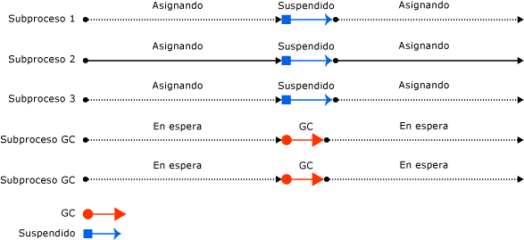

# Recolección de elementos no utilizados de estación de trabajo y de servidorWorkstation and server garbage collection

El recolector de elementos no utilizados se ajusta automáticamente y puede funcionar en gran variedad de escenarios.The garbage collector is self-tuning and can work in a wide variety of scenarios. Pero puede [establecer el tipo de recolección de elementos no utilizados](../../core/run-time-config/garbage-collector.md#flavors-of-garbage-collection) en función de las características de la carga de trabajo.However, you can [set the type of garbage collection](../../core/run-time-config/garbage-collector.md#flavors-of-garbage-collection) based on the characteristics of the workload. El CLR proporciona los tipos siguientes de recolección de elementos no utilizados:The CLR provides the following types of garbage collection:

- La recolección de elementos no utilizados (GC) de estación de trabajo, que está diseñada para las aplicaciones cliente.Workstation garbage collection (GC), which is designed for client apps. Es el tipo de GC predeterminado para las aplicaciones independientes.It's the default GC flavor for standalone apps. En el caso de las aplicaciones hospedadas, por ejemplo, las que se hospedan en ASP.NET, el host determina el tipo de GC predeterminado.For hosted apps, for example, those hosted by ASP.NET, the host determines the default GC flavor.

  La recolección de elementos no utilizados de estación de trabajo puede ser simultánea o no simultánea.Workstation garbage collection can be concurrent or non-concurrent. La recolección simultánea (o *en segundo plano*) de elementos no utilizados permite que los subprocesos administrados continúen con sus operaciones durante una recolección de elementos no utilizados.Concurrent (or *background*) garbage collection enables managed threads to continue operations during a garbage collection. La [recolección de elementos no utilizados en segundo plano](background-gc.md) reemplaza la [recolección simultánea de elementos no utilizados](background-gc.md#concurrent-garbage-collection) en .NET Framework 4 y versiones posteriores.[Background garbage collection](background-gc.md) replaces [concurrent garbage collection](background-gc.md#concurrent-garbage-collection) in .NET Framework 4 and later versions.

- Recolección de elementos no utilizados de servidor, diseñada para las aplicaciones de servidor que necesitan un alto nivel de rendimiento y escalabilidad.Server garbage collection, which is intended for server applications that need high throughput and scalability.

  - En .NET Core, la recolección de elementos no utilizados de servidor puede ser no simultánea o en segundo plano.In .NET Core, server garbage collection can be non-concurrent or background.

  - En .NET Framework 4.5 y versiones posteriores, la recolección de elementos no utilizados de servidor puede ser no simultánea o en segundo plano.In .NET Framework 4.5 and later versions, server garbage collection can be non-concurrent or background. En .NET Framework 4 y versiones anteriores, la recolección de elementos no utilizados de servidor no es simultánea.In .NET Framework 4 and previous versions, server garbage collection is non-concurrent.

En las siguientes ilustraciones se muestran los subprocesos dedicados que realizan la recolección de elementos no utilizados en un servidor:The following illustration shows the dedicated threads that perform the garbage collection on a server:

## Consideraciones sobre el rendimientoPerformance considerations

### Estación de trabajo de catálogo globalWorkstation GC

Estas son algunas consideraciones sobre subprocesos y rendimiento para la recolección de elementos no utilizados de estación de trabajo:The following are threading and performance considerations for workstation garbage collection:

- La recolección se produce en el subproceso del usuario que desencadenó la recolección de elementos no utilizados y permanece en la misma prioridad.The collection occurs on the user thread that triggered the garbage collection and remains at the same priority. Como los subprocesos de usuario suelen ejecutarse con prioridad normal, el recolector de elementos no utilizados (que se ejecuta en un subproceso de prioridad normal) debe competir con otros subprocesos por el tiempo de la CPU.Because user threads typically run at normal priority, the garbage collector (which runs on a normal priority thread) must compete with other threads for CPU time. (Los subprocesos que ejecutan código nativo no se suspenden en la recolección de elementos no utilizados de servidor o de estación de trabajo).(Threads that run native code are not suspended on either server or workstation garbage collection.)

- La recolección de elementos no utilizados de estación de trabajo siempre se utiliza en un equipo que tiene un solo procesador, sin tener en cuenta el [valor de configuración](../../core/run-time-config/garbage-collector.md#workstation-vs-server).Workstation garbage collection is always used on a computer that has only one processor, regardless of the [configuration setting](../../core/run-time-config/garbage-collector.md#workstation-vs-server).

### Servidor de catálogo globalServer GC

Estas son algunas consideraciones sobre subprocesos y rendimiento para la recolección de elementos no utilizados de servidor:The following are threading and performance considerations for server garbage collection:

- La recolección se produce en varios subprocesos dedicados que se ejecutan en el nivel de prioridad `THREAD_PRIORITY_HIGHEST` .The collection occurs on multiple dedicated threads that are running at `THREAD_PRIORITY_HIGHEST` priority level.

- Para cada CPU se proporciona un montón y un subproceso dedicado para realizar recolección de elementos no utilizados y, al mismo tiempo, se recolectan los montones.A heap and a dedicated thread to perform garbage collection are provided for each CPU, and the heaps are collected at the same time. Cada montón contiene un montón de objetos pequeños y un montón de objetos grandes; a todos ellos se puede tener acceso mediante código de usuario.Each heap contains a small object heap and a large object heap, and all heaps can be accessed by user code. Los objetos de montones diferentes pueden hacerse referencia a entre sí.Objects on different heaps can refer to each other.

- Dado que varios subprocesos de recolección de elementos no utilizados funcionan juntos, la recolección de elementos no utilizados de servidor es más rápida que la de estación de trabajo, con un montón del mismo tamaño.Because multiple garbage collection threads work together, server garbage collection is faster than workstation garbage collection on the same size heap.

- La recolección de elementos no utilizados de servidor suele tener segmentos de mayor tamaño.Server garbage collection often has larger size segments. Sin embargo, esto es solo una generalización: el tamaño de los segmentos es específico de la implementación y está sujeto a cambios.However, this is only a generalization: segment size is implementation-specific and is subject to change. No haga ninguna suposición sobre el tamaño de los segmentos asignados por el recolector de elementos no utilizados al optimizar la aplicación.Don't make assumptions about the size of segments allocated by the garbage collector when tuning your app.

- La recolección de elementos no utilizados de servidor puede consumir gran cantidad de recursos.Server garbage collection can be resource-intensive. Por ejemplo, imagine que hay 12 procesos que usan GC de servidor que se ejecutan en un equipo con cuatro procesadores.For example, imagine that there are 12 processes that use server GC running on a computer that has four processors. Si todos los procesos tienen que recopilar elementos no utilizados al mismo tiempo, interfieren entre sí, ya que serían 12 subprocesos programados en el mismo procesador.If all the processes happen to collect garbage at the same time, they would interfere with each other, as there would be 12 threads scheduled on the same processor. Si los procesos están activos, no es recomendable que todos usen GC de servidor.If the processes are active, it's not a good idea to have them all use server GC.

Si se ejecutan centenares de instancias de una aplicación, puede ser más conveniente utilizar la recolección de elementos no utilizados de estación de trabajo con la recolección simultánea de elementos no utilizados deshabilitada.If you're running hundreds of instances of an application, consider using workstation garbage collection with concurrent garbage collection disabled. De este modo se realizarán menos cambios de contexto, lo que puede mejorar el rendimiento.This will result in less context switching, which can improve performance.

## Vea tambiénSee also

- [Recolección de elementos no utilizados en segundo planoBackground garbage collection](background-gc.md)
- [Opciones de configuración de tiempo de ejecución para la recolección de elementos no utilizadosRun-time configuration options for garbage collection](../../core/run-time-config/garbage-collector.md)
