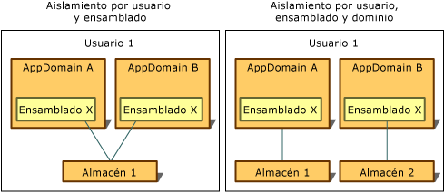

# Tipos de aislamiento
Acceso al almacenamiento aislado siempre está restringido al usuario que lo creó. Para implementar este tipo de aislamiento, common language runtime usa el mismo concepto de identidad de usuario que reconoce el sistema operativo, que es la identidad asociada con el proceso en el que se ejecuta el código cuando se abre el almacén. Esta identidad es una identidad de usuario autenticado, pero la suplantación puede hacer que la identidad del usuario actual para cambiar dinámicamente.  
  
 Acceso al almacenamiento aislado también está restringido por la identidad asociada con el dominio y el ensamblado de la aplicación, o con el ensamblado independiente. El tiempo de ejecución obtiene estas tres identidades de las maneras siguientes:  
  
-   Identidad de dominio representa la evidencia de la aplicación, que en el caso de una aplicación web podría ser la dirección URL completa. Para el código hospedado en el shell, la identidad de dominio podría basarse en la ruta de acceso del directorio de aplicación. Por ejemplo, si se ejecuta el ejecutable de la ruta de acceso C:\Office\MyApp.exe, la identidad de dominio sería C:\Office\MyApp.exe.  
  
-   Identidad del ensamblado es la evidencia del ensamblado. Esto podría deberse a una firma digital criptográfica, que puede ser el ensamblado [nombre seguro](../../../docs/framework/app-domains/strong-named-assemblies.md), el Editor de software del ensamblado o su identidad de dirección URL. Si un ensamblado tiene un nombre seguro y una identidad de publicador de software, se utiliza la identidad del publicador de software. Si el ensamblado procede de Internet y no está firmado, se utiliza la identidad de dirección URL. Para obtener más información sobre los ensamblados y nombres seguros, vea [programar con ensamblados](../../../docs/framework/app-domains/programming-with-assemblies.md).  
  
-   Almacenes móviles se trasladan con un usuario que tenga un perfil de usuario móvil. Los archivos se escriben en un directorio de red y se descargan en cualquier equipo que el usuario inicia sesión en. Para obtener más información sobre los perfiles de usuario móviles, consulte <xref:System.IO.IsolatedStorage.IsolatedStorageScope.Roaming?displayProperty=nameWithType>.  
  
 Mediante la combinación de los conceptos del usuario, dominio y la identidad del ensamblado, el almacenamiento aislado puede aislar datos de las maneras siguientes, cada uno de los cuales tiene sus propios escenarios de uso:  
  
-   [Aislamiento por usuario y ensamblado](#UserAssembly)  
  
-   [Aislamiento por usuario, dominio y ensamblado](#UserDomainAssembly)  
  
 Cualquiera de estos aislamientos se puede combinar con un perfil de usuario móvil. Para obtener más información, vea la sección [almacenamiento aislado y movilidad](#Roaming).  
  
 En la siguiente ilustración se muestra cómo se aíslan los almacenes en distintos ámbitos.  
  
   
Tipos de almacenamiento aislado  
  
 Tenga en cuenta que excepto para los almacenes móviles, el almacenamiento aislado es siempre aislado de forma implícita por equipo porque utiliza los medios de almacenamiento locales para un equipo determinado.  
  
> [!IMPORTANT]
>  El almacenamiento aislado no está disponible para las aplicaciones de la [!INCLUDE[win8_appname_long](../../../includes/win8-appname-long-md.md)]. En su lugar, se pueden usar las clases de datos de la aplicación del espacio de nombres `Windows.Storage` incluidas en la API de [!INCLUDE[wrt](../../../includes/wrt-md.md)] para almacenar archivos y datos locales. Para más información, vea [Datos de aplicación](http://go.microsoft.com/fwlink/?LinkId=229175) en el Centro de desarrollo de Windows.  
  
   
## Aislamiento por usuario y ensamblado  
 Cuando el ensamblado que utiliza los datos almacena debe ser accesible desde el dominio de la aplicación, el aislamiento por usuario y ensamblado es adecuado. Normalmente, en esta situación, el almacenamiento aislado se usa para almacenar los datos que se aplica en varias aplicaciones y no está asociados a cualquier aplicación determinada, como el nombre del usuario o información de licencia. Para tener acceso al almacenamiento aislado por usuario y ensamblado, código debe ser de confianza para transferir información entre aplicaciones. Por lo general, se permite el aislamiento por usuario y ensamblado en intranets, pero no en Internet. Al llamar a estático <xref:System.IO.IsolatedStorage.IsolatedStorageFile.GetStore%2A?displayProperty=nameWithType> método y pasando un usuario y un ensamblado <xref:System.IO.IsolatedStorage.IsolatedStorageScope> , se obtiene almacenamiento con este tipo de aislamiento.  
  
 En el ejemplo de código siguiente se recupera un almacén aislado por usuario y ensamblado. El almacén puede tener acceso mediante el `isoFile` objeto.  
  
 [!code-cpp[Conceptual.IsolatedStorage#17](../../../samples/snippets/cpp/VS_Snippets_CLR/conceptual.isolatedstorage/cpp/source11.cpp#17)]
 [!code-csharp[Conceptual.IsolatedStorage#17](../../../samples/snippets/csharp/VS_Snippets_CLR/conceptual.isolatedstorage/cs/source11.cs#17)]
 [!code-vb[Conceptual.IsolatedStorage#17](../../../samples/snippets/visualbasic/VS_Snippets_CLR/conceptual.isolatedstorage/vb/source11.vb#17)]  
  
 Para obtener un ejemplo que utiliza los parámetros de prueba, consulte <xref:System.IO.IsolatedStorage.IsolatedStorageFile.GetStore%28System.IO.IsolatedStorage.IsolatedStorageScope%2CSystem.Security.Policy.Evidence%2CSystem.Type%2CSystem.Security.Policy.Evidence%2CSystem.Type%29>.  
  
 El <xref:System.IO.IsolatedStorage.IsolatedStorageFile.GetUserStoreForAssembly%2A> método está disponible como un método abreviado, tal como se muestra en el ejemplo de código siguiente. Este acceso directo no se puede usar para abrir almacenes que son capaces de itinerancia; usar <xref:System.IO.IsolatedStorage.IsolatedStorageFile.GetStore%2A> en esos casos.  
  
 [!code-cpp[Conceptual.IsolatedStorage#18](../../../samples/snippets/cpp/VS_Snippets_CLR/conceptual.isolatedstorage/cpp/source11.cpp#18)]
 [!code-csharp[Conceptual.IsolatedStorage#18](../../../samples/snippets/csharp/VS_Snippets_CLR/conceptual.isolatedstorage/cs/source11.cs#18)]
 [!code-vb[Conceptual.IsolatedStorage#18](../../../samples/snippets/visualbasic/VS_Snippets_CLR/conceptual.isolatedstorage/vb/source11.vb#18)]  
  
   
## Aislamiento por usuario, dominio y ensamblado  
 Si la aplicación usa un ensamblado de terceros que requiera un almacén de datos privados, puede usar el almacenamiento aislado para almacenar los datos privados. Aislamiento por usuario, dominio y ensamblado garantiza que solo código en un ensamblado determinado puede tener acceso a los datos y únicamente cuando el ensamblado se usa por la aplicación que se estaba ejecutando cuando el ensamblado creó el almacén, y solo cuando se ejecuta el usuario para el que se creó el almacén de la  aplicación. Aislamiento por usuario, dominio y ensamblado mantiene el ensamblado de terceros de pérdida de datos a otras aplicaciones. Este tipo de aislamiento debe ser la opción predeterminada si sabe que desea usar el almacenamiento aislado, pero no está seguro de qué tipo de aislamiento usar. Al llamar a estático <xref:System.IO.IsolatedStorage.IsolatedStorageFile.GetStore%2A> método de <xref:System.IO.IsolatedStorage.IsolatedStorageFile> y pasar de un usuario, dominio y ensamblado <xref:System.IO.IsolatedStorage.IsolatedStorageScope> , se obtiene almacenamiento con este tipo de aislamiento.  
  
 En el ejemplo de código siguiente se recupera un almacén aislado por usuario, dominio y ensamblado. El almacén puede tener acceso mediante el `isoFile` objeto.  
  
 [!code-cpp[Conceptual.IsolatedStorage#14](../../../samples/snippets/cpp/VS_Snippets_CLR/conceptual.isolatedstorage/cpp/source10.cpp#14)]
 [!code-csharp[Conceptual.IsolatedStorage#14](../../../samples/snippets/csharp/VS_Snippets_CLR/conceptual.isolatedstorage/cs/source10.cs#14)]
 [!code-vb[Conceptual.IsolatedStorage#14](../../../samples/snippets/visualbasic/VS_Snippets_CLR/conceptual.isolatedstorage/vb/source10.vb#14)]  
  
 Otro método está disponible como un método abreviado, tal como se muestra en el ejemplo de código siguiente. Este acceso directo no se puede usar para abrir almacenes que son capaces de itinerancia; usar <xref:System.IO.IsolatedStorage.IsolatedStorageFile.GetStore%2A> en esos casos.  
  
 [!code-cpp[Conceptual.IsolatedStorage#15](../../../samples/snippets/cpp/VS_Snippets_CLR/conceptual.isolatedstorage/cpp/source10.cpp#15)]
 [!code-csharp[Conceptual.IsolatedStorage#15](../../../samples/snippets/csharp/VS_Snippets_CLR/conceptual.isolatedstorage/cs/source10.cs#15)]
 [!code-vb[Conceptual.IsolatedStorage#15](../../../samples/snippets/visualbasic/VS_Snippets_CLR/conceptual.isolatedstorage/vb/source10.vb#15)]  
  
   
## Almacenamiento aislado y movilidad  
 Perfiles de usuario móviles son una característica de Windows que permite a un usuario configure una identidad en una red y utilizar esa identidad para iniciar sesión en cualquier equipo de la red, conservando toda la configuración personalizada. Un ensamblado que usa almacenamiento aislado puede especificar que debe mover el almacenamiento aislado del usuario con perfil móvil del usuario. Movilidad puede utilizarse junto con el aislamiento por usuario y ensamblado o el aislamiento por usuario, dominio y ensamblado. Si no se utiliza un ámbito de la movilidad, los almacenes no se trasladarán aunque se use un perfil de usuario móvil.  
  
 En el ejemplo de código siguiente se recupera un almacén aislado por usuario y ensamblado móvil. El almacén puede tener acceso mediante el `isoFile` objeto.  
  
 [!code-cpp[Conceptual.IsolatedStorage#11](../../../samples/snippets/cpp/VS_Snippets_CLR/conceptual.isolatedstorage/cpp/source9.cpp#11)]
 [!code-csharp[Conceptual.IsolatedStorage#11](../../../samples/snippets/csharp/VS_Snippets_CLR/conceptual.isolatedstorage/cs/source9.cs#11)]
 [!code-vb[Conceptual.IsolatedStorage#11](../../../samples/snippets/visualbasic/VS_Snippets_CLR/conceptual.isolatedstorage/vb/source9.vb#11)]  
  
 Un ámbito de dominio se puede agregar para crear un almacén aislado por usuario, dominio y aplicación móvil. En el ejemplo de código siguiente se muestra cómo hacerlo.  
  
 [!code-cpp[Conceptual.IsolatedStorage#12](../../../samples/snippets/cpp/VS_Snippets_CLR/conceptual.isolatedstorage/cpp/source9.cpp#12)]
 [!code-csharp[Conceptual.IsolatedStorage#12](../../../samples/snippets/csharp/VS_Snippets_CLR/conceptual.isolatedstorage/cs/source9.cs#12)]
 [!code-vb[Conceptual.IsolatedStorage#12](../../../samples/snippets/visualbasic/VS_Snippets_CLR/conceptual.isolatedstorage/vb/source9.vb#12)]  
  
## Vea también  
 <xref:System.IO.IsolatedStorage.IsolatedStorageScope>  
 [Almacenamiento aislado](../../../docs/standard/io/isolated-storage.md)
