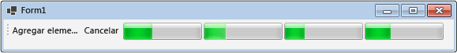

# Cómo: Cancelar un bloque de flujos de datos
En este ejemplo se explica cómo habilitar la cancelación en la aplicación. Este ejemplo usa Windows Forms para mostrar dónde están activos los elementos de trabajo en una canalización de flujo de datos y también los efectos de la canalización.  

[!INCLUDE [tpl-install-instructions](../../../includes/tpl-install-instructions.md)]
  
## Para crear la aplicación de Windows Forms  
  
1. Cree un proyecto de **Aplicación de Windows Forms** de Visual Basic o C#. En los pasos siguientes, el proyecto se denomina `CancellationWinForms`.  
  
2. En el diseñador de formularios del formulario principal, Form1.cs (Form1.vb para Visual Basic), agregue un control <xref:System.Windows.Forms.ToolStrip>.  
  
3. Agregue un control <xref:System.Windows.Forms.ToolStripButton> al control <xref:System.Windows.Forms.ToolStrip>. Establezca la propiedad <xref:System.Windows.Forms.ToolStripItem.DisplayStyle%2A> en <xref:System.Windows.Forms.ToolStripItemDisplayStyle.Text> y la propiedad <xref:System.Windows.Forms.ToolStripItem.Text%2A> en **Agregar elementos de trabajo**.  
  
4. Agregue un segundo control <xref:System.Windows.Forms.ToolStripButton> al control <xref:System.Windows.Forms.ToolStrip>. Establezca la propiedad <xref:System.Windows.Forms.ToolStripItem.DisplayStyle%2A> en <xref:System.Windows.Forms.ToolStripItemDisplayStyle.Text>, la propiedad <xref:System.Windows.Forms.ToolStripItem.Text%2A> en **Cancelar** y la propiedad <xref:System.Windows.Forms.ToolStripItem.Enabled%2A> en `False`.  
  
5. Agregue cuatro objetos <xref:System.Windows.Forms.ToolStripProgressBar> al control <xref:System.Windows.Forms.ToolStrip>.  
  
## Creación de la canalización de flujo de datos  
 En esta sección se describe cómo crear la canalización de flujo de datos que procesa los elementos de trabajo y actualiza las barras de progreso.  
  
### Para crear la canalización de flujo de datos  
  
1. En el proyecto, agregue una referencia a System.Threading.Tasks.Dataflow.dll.  
  
2. Asegúrese de que Form1.cs (Form1.vb para Visual Basic) contenga las siguientes instrucciones `using` (`Imports` en Visual Basic).  
  
     [!code-csharp[TPLDataflow_CancellationWinForms#1](../../../samples/snippets/csharp/VS_Snippets_Misc/tpldataflow_cancellationwinforms/cs/cancellationwinforms/form1.cs#1)]
     [!code-vb[TPLDataflow_CancellationWinForms#1](../../../samples/snippets/visualbasic/VS_Snippets_Misc/tpldataflow_cancellationwinforms/vb/cancellationwinforms/form1.vb#1)]  
  
3. Agregue la clase `WorkItem` como un tipo interno de la clase `Form1`.  
  
     [!code-csharp[TPLDataflow_CancellationWinForms#2](../../../samples/snippets/csharp/VS_Snippets_Misc/tpldataflow_cancellationwinforms/cs/cancellationwinforms/form1.cs#2)]
     [!code-vb[TPLDataflow_CancellationWinForms#2](../../../samples/snippets/visualbasic/VS_Snippets_Misc/tpldataflow_cancellationwinforms/vb/cancellationwinforms/form1.vb#2)]  
  
4. Agregue a la clase `Form1` los miembros de datos siguientes:  
  
     [!code-csharp[TPLDataflow_CancellationWinForms#3](../../../samples/snippets/csharp/VS_Snippets_Misc/tpldataflow_cancellationwinforms/cs/cancellationwinforms/form1.cs#3)]
     [!code-vb[TPLDataflow_CancellationWinForms#3](../../../samples/snippets/visualbasic/VS_Snippets_Misc/tpldataflow_cancellationwinforms/vb/cancellationwinforms/form1.vb#3)]  
  
5. Agregue el método siguiente, `CreatePipeline`, a la clase `Form1`.  
  
     [!code-csharp[TPLDataflow_CancellationWinForms#4](../../../samples/snippets/csharp/VS_Snippets_Misc/tpldataflow_cancellationwinforms/cs/cancellationwinforms/form1.cs#4)]
     [!code-vb[TPLDataflow_CancellationWinForms#4](../../../samples/snippets/visualbasic/VS_Snippets_Misc/tpldataflow_cancellationwinforms/vb/cancellationwinforms/form1.vb#4)]  
  
 Dado que los bloques de flujo de datos `incrementProgress` y `decrementProgress` actúan sobre la interfaz de usuario, es importante que esta acción se produzca en el subproceso de interfaz de usuario. Para lograrlo, durante la construcción, cada uno de estos objetos proporciona un objeto <xref:System.Threading.Tasks.Dataflow.ExecutionDataflowBlockOptions> que tiene la propiedad <xref:System.Threading.Tasks.Dataflow.DataflowBlockOptions.TaskScheduler%2A> establecida como <xref:System.Threading.Tasks.TaskScheduler.FromCurrentSynchronizationContext%2A?displayProperty=nameWithType>. El método <xref:System.Threading.Tasks.TaskScheduler.FromCurrentSynchronizationContext%2A?displayProperty=nameWithType> crea un objeto <xref:System.Threading.Tasks.TaskScheduler> que funciona en el contexto de sincronización actual. Dado que al constructor `Form1` se le llama desde el subproceso de interfaz de usuario, las acciones de los bloques de flujo de datos `incrementProgress` y `decrementProgress` se ejecutan también en el subproceso de interfaz de usuario.  
  
 Este ejemplo establece la propiedad <xref:System.Threading.Tasks.Dataflow.DataflowBlockOptions.CancellationToken%2A> cuando construye los miembros de la canalización. Dado que la propiedad <xref:System.Threading.Tasks.Dataflow.DataflowBlockOptions.CancellationToken%2A> cancela de forma permanente la ejecución del bloque de flujo de datos, se debe volver a crear la canalización completa después de que el usuario cancela la operación, en caso de que después desee agregar más elementos de trabajo a la canalización. Para consultar un ejemplo en el que se muestre una forma alternativa de cancelar un bloque de flujo de datos, a fin de que se pueda realizar otro trabajo después de cancelar una operación, vea [Tutorial: uso de flujo de datos en una Aplicación de Windows Forms](../../../docs/standard/parallel-programming/walkthrough-using-dataflow-in-a-windows-forms-application.md).  
  
## Conexión de la canalización de flujo de datos a la interfaz de usuario  
 En esta sección se describe cómo conectar la canalización de flujo de datos a la interfaz de usuario. Tanto la creación de la canalización como la adición de elementos de trabajo a la canalización se controlan mediante el controlador de eventos para el botón **Agregar elementos de trabajo**. La cancelación se inicia con el botón **Cancelar**. Cuando el usuario hace clic en cualquiera de estos botones, se inicia la acción correspondiente de forma asincrónica.  
  
### Para conectar la canalización de flujo de datos a la interfaz de usuario  
  
1. En el diseñador de formularios del formulario principal, cree un controlador de eventos para el evento <xref:System.Windows.Forms.ToolStripItem.Click> del botón **Agregar elementos de trabajo**.  
  
2. Implemente el evento <xref:System.Windows.Forms.ToolStripItem.Click> para el botón **Agregar elementos de trabajo**.  
  
     [!code-csharp[TPLDataflow_CancellationWinForms#5](../../../samples/snippets/csharp/VS_Snippets_Misc/tpldataflow_cancellationwinforms/cs/cancellationwinforms/form1.cs#5)]
     [!code-vb[TPLDataflow_CancellationWinForms#5](../../../samples/snippets/visualbasic/VS_Snippets_Misc/tpldataflow_cancellationwinforms/vb/cancellationwinforms/form1.vb#5)]  
  
3. En el diseñador de formularios del formulario principal, cree un controlador de eventos <xref:System.Windows.Forms.ToolStripItem.Click> para el botón **Cancelar**.  
  
4. Implemente el controlador de eventos <xref:System.Windows.Forms.ToolStripItem.Click> para el botón **Cancelar**.  
  
     [!code-csharp[TPLDataflow_CancellationWinForms#6](../../../samples/snippets/csharp/VS_Snippets_Misc/tpldataflow_cancellationwinforms/cs/cancellationwinforms/form1.cs#6)]
     [!code-vb[TPLDataflow_CancellationWinForms#6](../../../samples/snippets/visualbasic/VS_Snippets_Misc/tpldataflow_cancellationwinforms/vb/cancellationwinforms/form1.vb#6)]  
  
## Ejemplo  
 En el siguiente ejemplo se muestra el código completo de Form1.cs (Form1.vb para Visual Basic).  
  
 [!code-csharp[TPLDataflow_CancellationWinForms#100](../../../samples/snippets/csharp/VS_Snippets_Misc/tpldataflow_cancellationwinforms/cs/cancellationwinforms/form1.cs#100)]
 [!code-vb[TPLDataflow_CancellationWinForms#100](../../../samples/snippets/visualbasic/VS_Snippets_Misc/tpldataflow_cancellationwinforms/vb/cancellationwinforms/form1.vb#100)]  
  
 En la ilustración siguiente se muestra la aplicación en ejecución.  
  
   

## Vea también

- [Flujo de datos](../../../docs/standard/parallel-programming/dataflow-task-parallel-library.md)
