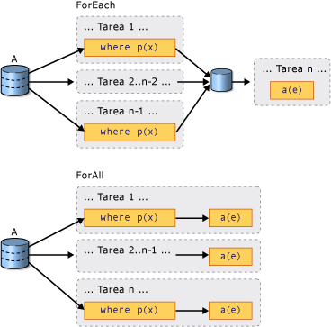

# Introducción a PLINQ

## ¿Qué es una consulta en paralelo?

Language Integrated Query (LINQ) apareció por primera vez en .NET Framework 3.5. Ofrece un modelo unificado para consultar cualquier origen de datos <xref:System.Collections.IEnumerable?displayProperty=nameWithType> o <xref:System.Collections.Generic.IEnumerable%601?displayProperty=nameWithType> en un modo con seguridad de tipos. LINQ to Objects es el nombre de las consultas LINQ que se ejecutan en colecciones en memoria, como <xref:System.Collections.Generic.List%601> y matrices. En este artículo, se da por echo que posee un conocimiento básico de LINQ. Para obtener más información, vea [Language Integrated Query (LINQ) (C#)](../../csharp/programming-guide/concepts/linq/index.md) o [Language Integrated Query (LINQ) (Visual Basic)](../../visual-basic/programming-guide/concepts/linq/index.md).

Parallel LINQ (PLINQ) es una implementación en paralelo del modelo LINQ. En muchos sentidos, una consulta PLINQ se parece a una consulta LINQ to Objects no en paralelo. Las consultas PLINQ, al igual que las consultas LINQ secuenciales, funcionan en cualquier origen de datos <xref:System.Collections.IEnumerable> o <xref:System.Collections.Generic.IEnumerable%601> en memoria y tienen ejecución aplazada, lo que significa que no se empiezan a ejecutar hasta que se enumera la consulta. La principal diferencia es que PLINQ intenta usar completamente todos los procesadores del sistema. Para ello, crea particiones del origen de datos en segmentos y, luego, ejecuta la consulta en cada segmento en subprocesos de trabajo independientes en paralelo en varios procesadores. En muchos casos, la ejecución en paralelo significa que la consulta se ejecuta considerablemente más rápido.

A través de la ejecución en paralelo, PLINQ puede alcanzar importantes mejoras de rendimiento con respecto al código heredado en ciertos tipos de consultas, a menudo solo con agregar la operación de consulta <xref:System.Linq.ParallelEnumerable.AsParallel%2A> al origen de datos. Sin embargo, el paralelismo puede presentar sus propias complejidades y no todas las operaciones de consulta se ejecutan más rápido en PLINQ. De hecho, la paralelización en realidad ralentiza ciertas consultas. Por lo tanto, debe entender cómo ciertos problemas, como la ordenación, afectan a las consultas en paralelo. Para más información, consulte [Introducción a la velocidad en PLINQ](../../../docs/standard/parallel-programming/understanding-speedup-in-plinq.md).

> [!NOTE]
> En esta documentación, se utilizan expresiones lambda para definir delegados en PLINQ. Si no está familiarizado con las expresiones lambda de C# o Visual Basic, consulte [Expresiones lambda en PLINQ y TPL](../../../docs/standard/parallel-programming/lambda-expressions-in-plinq-and-tpl.md).

En el resto del artículo se ofrece información general de las principales clases PLINQ y se analiza cómo crear consultas PLINQ. Cada sección incluye vínculos a información más detallada y ejemplos de código.

## La clase ParallelEnumerable

La clase <xref:System.Linq.ParallelEnumerable?displayProperty=nameWithType> expone casi toda la funcionalidad de PLINQ. Junto con el resto de los tipos de espacios de nombres <xref:System.Linq?displayProperty=nameWithType>, se compilan en el ensamblado System.Core.dll. Los proyectos C# y Visual Basic predeterminados en Visual Studio hacen referencia al ensamblado e importan el espacio de nombres.

<xref:System.Linq.ParallelEnumerable> incluye implementaciones de todos los operadores de consulta estándar que LINQ to Objects admite, a pesar de que no intenta ejecutar en paralelo cada uno de ellos. Si no está familiarizado con LINK, consulte [Introducción a LINQ (C#)](../../csharp/programming-guide/concepts/linq/index.md) e [Introducción a LINQ (Visual Basic)](../../visual-basic/programming-guide/concepts/linq/introduction-to-linq.md).

Además de los operadores de consulta estándar, la clase <xref:System.Linq.ParallelEnumerable> contiene un conjunto de métodos que permiten comportamientos específicos de la ejecución en paralelo. Estos métodos específicos de PLINQ se muestran en la tabla siguiente.

|Operador ParallelEnumerable|Descripción|
|---------------------------------|-----------------|
|<xref:System.Linq.ParallelEnumerable.AsParallel%2A>|Punto de entrada de PLINQ. Especifica que el resto de la consulta se debe ejecutar en paralelo, si es posible.|
|<xref:System.Linq.ParallelEnumerable.AsSequential%2A>|Especifica que el resto de la consulta se debe ejecutar en secuencia, como una consulta LINQ no en paralelo.|
|<xref:System.Linq.ParallelEnumerable.AsOrdered%2A>|Especifica que PLINQ debe conservar la ordenación de la secuencia de origen para el resto de la consulta o hasta que cambie la ordenación, por ejemplo, mediante el uso de una cláusula orderby (Order By en Visual Basic).|
|<xref:System.Linq.ParallelEnumerable.AsUnordered%2A>|Especifica que PLINQ no necesita conservar la ordenación de la secuencia de origen para el resto de la consulta.|
|<xref:System.Linq.ParallelEnumerable.WithCancellation%2A>|Especifica que PLINQ debe supervisar periódicamente el estado del token de cancelación que se proporciona y cancelar la ejecución si se solicita.|
|<xref:System.Linq.ParallelEnumerable.WithDegreeOfParallelism%2A>|Especifica la cantidad máxima de procesadores que PLINQ debe usar para ejecutar la consulta en paralelo.|
|<xref:System.Linq.ParallelEnumerable.WithMergeOptions%2A>|Proporciona una sugerencia sobre cómo PLINQ debería, si es posible, combinar los resultados en paralelo en una sola secuencia en el subproceso utilizado.|
|<xref:System.Linq.ParallelEnumerable.WithExecutionMode%2A>|Especifica si PLINQ debe ejecutar la consulta en paralelo incluso si el comportamiento predeterminado indica que se debería ejecutar en secuencia.|
|<xref:System.Linq.ParallelEnumerable.ForAll%2A>|Método de enumeración multiproceso que, a diferencia de la iteración sobre los resultados de la consulta, permite procesar los resultados en paralelo sin tener que combinarlos primero en el subproceso del consumidor.|
|<xref:System.Linq.ParallelEnumerable.Aggregate%2A> overload|Sobrecarga única para PLINQ que permite la agregación inmediata sobre particiones locales de subprocesos, además de una función de agregación local para combinar los resultados de todas las particiones.|

## El modelo de participación

Cuando escribe una consulta, participa en PLINQ al invocar el método de extensión <xref:System.Linq.ParallelEnumerable.AsParallel%2A?displayProperty=nameWithType> en el origen de datos, tal como se muestra en el ejemplo siguiente.

[!code-csharp[PLINQ#1](../../../samples/snippets/csharp/VS_Snippets_Misc/plinq/cs/plinq2_cs.cs#1)]
[!code-vb[PLINQ#1](../../../samples/snippets/visualbasic/VS_Snippets_Misc/plinq/vb/plinq2_vb.vb#1)]

El método de extensión <xref:System.Linq.ParallelEnumerable.AsParallel%2A> enlaza los operadores de consulta subsiguientes, en este caso, `where` y `select`, a las implementaciones <xref:System.Linq.ParallelEnumerable?displayProperty=nameWithType>.

## Modos de ejecución

De manera predeterminada, PLINQ es conservador. En tiempo de ejecución, la infraestructura de PLINQ analiza la estructura general de la consulta. Si existe la probabilidad de que la consulta genere aumentos de velocidad a través de la paralelización, PLINQ particiona la secuencia de origen en tareas que se pueden ejecutar en simultáneo. Si ejecutar una consulta en paralelo no es seguro, PLINQ simplemente la ejecuta en secuencia. Si PLINQ puede elegir entre un algoritmo en paralelo posiblemente costoso y un algoritmo secuencial económico, de manera predeterminada elegirá el algoritmo secuencial. Puede usar el método <xref:System.Linq.ParallelEnumerable.WithExecutionMode%2A> y la enumeración <xref:System.Linq.ParallelExecutionMode?displayProperty=nameWithType> para indicar a PLINQ que seleccione el algoritmo paralelo. Esto resulta útil cuando, a través de pruebas y mediciones, sabe que una consulta determinada se ejecuta más rápido en paralelo. Para obtener más información, vea [Cómo: Especificar el modo de ejecución en PLINQ](../../../docs/standard/parallel-programming/how-to-specify-the-execution-mode-in-plinq.md).

## Grado de paralelismo

De manera predeterminada, PLINQ usa todos los procesadores del equipo host. Puede indicar a PLINQ que use más de un número especificado de procesadores mediante el método <xref:System.Linq.ParallelEnumerable.WithDegreeOfParallelism%2A>. Esto resulta útil cuando desea asegurarse de que otros procesos que estén en ejecución en el equipo reciban cierta cantidad de tiempo de CPU. El siguiente fragmento de código limita la consulta para que solo use un máximo de dos procesadores.

[!code-csharp[PLINQ#5](../../../samples/snippets/csharp/VS_Snippets_Misc/plinq/cs/plinqsamples.cs#5)]
[!code-vb[PLINQ#5](../../../samples/snippets/visualbasic/VS_Snippets_Misc/plinq/vb/plinq2_vb.vb#5)]

En casos en los que una consulta realiza una cantidad considerable de trabajo no enlazado a proceso, como E/S de archivo, puede se recomendable especificar un grado de paralelismo mayor que el número de núcleos de la máquina.

## Comparación entre consultas en paralelo ordenadas y no ordenadas

En algunas consultas, un operador de consulta debe generar resultados que conserven la ordenación de la secuencia de origen. PLINQ proporciona el operador <xref:System.Linq.ParallelEnumerable.AsOrdered%2A> para este propósito. <xref:System.Linq.ParallelEnumerable.AsOrdered%2A> es distinto de <xref:System.Linq.ParallelEnumerable.AsSequential%2A>. Una secuencia <xref:System.Linq.ParallelEnumerable.AsOrdered%2A> de todos modos se procesa en paralelo, pero sus resultados se almacenan en búfer y se ordenan. Dado que conservar el orden implica normalmente trabajo adicional, una secuencia <xref:System.Linq.ParallelEnumerable.AsOrdered%2A> se podría procesar más despacio que la secuencia <xref:System.Linq.ParallelEnumerable.AsUnordered%2A> predeterminada. El hecho que una operación en paralelo ordenada determinada sea más rápida que una versión secuencial de la operación depende de muchos factores.

En el ejemplo de código siguiente se muestra cómo participar en conservar el orden.

[!code-csharp[PLINQ#3](../../../samples/snippets/csharp/VS_Snippets_Misc/plinq/cs/plinq2_cs.cs#3)]
[!code-vb[PLINQ#3](../../../samples/snippets/visualbasic/VS_Snippets_Misc/plinq/vb/plinq2_vb.vb#3)]

Para más información, consulte cómo [conservar el orden en PLINQ](../../../docs/standard/parallel-programming/order-preservation-in-plinq.md).

## Comparación entre consultas en paralelo y consultas secuenciales

Algunas operaciones requieren que los datos de origen se entreguen en secuencia. Los operadores de consulta <xref:System.Linq.ParallelEnumerable> vuelven automáticamente al modo secuencial cuando es necesario. Para los operadores de consulta definidos por el usuario y los delegados de usuario que requieren la ejecución secuencial, PLINQ proporciona el método <xref:System.Linq.ParallelEnumerable.AsSequential%2A>. Cuando se usa <xref:System.Linq.ParallelEnumerable.AsSequential%2A>, todos los operadores subsiguientes de la consulta se ejecutan secuencialmente hasta que se vuelve a llamar a <xref:System.Linq.ParallelEnumerable.AsParallel%2A>. Para obtener más información, vea [Cómo: Combinar consultas LINQ paralelas y secuenciales](../../../docs/standard/parallel-programming/how-to-combine-parallel-and-sequential-linq-queries.md).

## Opciones para combinar resultados de consulta

Cuando una consulta PLINQ se ejecuta en paralelo, sus resultados a partir de cada subproceso de trabajo se deben volver a combinar en el subproceso principal para que los use un bucle `foreach` (`For Each` en Visual Basic) o para su inserción en una lista o matriz. En algunos casos, podría ser recomendable especificar un tipo determinado de operación Merge, por ejemplo, para comenzar a generar resultados más rápidamente. Para este propósito, PLINQ admite el método <xref:System.Linq.ParallelEnumerable.WithMergeOptions%2A> y la enumeración <xref:System.Linq.ParallelMergeOptions>. Para más información, consulte las [opciones de combinación en PLINQ](../../../docs/standard/parallel-programming/merge-options-in-plinq.md).

## El operador ForAll

En las consultas LINK secuenciales, la ejecución se aplaza hasta que la consulta se enumera en un bucle `foreach` (`For Each` en Visual Basic) o mediante la invocación de un método como <xref:System.Linq.ParallelEnumerable.ToList%2A>, <xref:System.Linq.ParallelEnumerable.ToArray%2A> o <xref:System.Linq.ParallelEnumerable.ToDictionary%2A>. En PLINQ, también puede usar `foreach` para ejecutar la consulta e iterar a través de los resultados. Sin embargo, `foreach` no se ejecuta en paralelo y, por lo tanto, requiere que el resultado de todas las tareas en paralelo se combinen nuevamente en el subproceso en el que se ejecuta el bucle. En PLINQ, puede usar `foreach` cuando deba conservar la ordenación final de los resultados de la consulta y también cada vez que procese los resultados de forma serial; por ejemplo, cuando llama a `Console.WriteLine` para cada elemento. Para lograr un ejecución más rápida de las consultas cuando no es necesario conservar el orden y cuando el procesamiento mismo de los resultados se puede ejecutar en paralelo, use el método <xref:System.Linq.ParallelEnumerable.ForAll%2A> para ejecutar una consulta PLINQ. <xref:System.Linq.ParallelEnumerable.ForAll%2A> no lleva a cabo este paso de combinación final. En el ejemplo de código siguiente, se muestra cómo se utiliza el método <xref:System.Linq.ParallelEnumerable.ForAll%2A>. Aquí se usa <xref:System.Collections.Concurrent.ConcurrentBag%601?displayProperty=nameWithType> porque está optimizado para varios subprocesos, lo que agrega simultaneidad sin intentar quitar ningún elemento.

[!code-csharp[PLINQ#4](../../../samples/snippets/csharp/VS_Snippets_Misc/plinq/cs/plinq2_cs.cs#4)]
[!code-vb[PLINQ#4](../../../samples/snippets/visualbasic/VS_Snippets_Misc/plinq/vb/plinq2_vb.vb#4)]

En la ilustración siguiente se muestra la diferencia entre `foreach` y <xref:System.Linq.ParallelEnumerable.ForAll%2A> con respecto a la ejecución de la consulta.

## Cancelación

PLINQ se integra con los tipos de cancelación en .NET Framework 4. (Para más información, consulte el tema sobre la [cancelación en subprocesos administrados](../../../docs/standard/threading/cancellation-in-managed-threads.md)). Por lo tanto, a diferencia de las consultas LINQ to Objects secuenciales, las consultas PLINQ se pueden cancelar. Para crear una consulta PLINQ cancelable, use el operador <xref:System.Linq.ParallelEnumerable.WithCancellation%2A> en la consulta y proporcione una instancia <xref:System.Threading.CancellationToken> como argumento. Cuando la propiedad <xref:System.Threading.CancellationToken.IsCancellationRequested%2A> del token se establece en true, PLINQ lo tendrá en cuenta, detendrá el procesamiento de todos los subprocesos e iniciará <xref:System.OperationCanceledException>.

Es posible que una consulta PLINQ siga procesando algunos elementos una vez establecido el token de cancelación.

Para una mayor capacidad de respuesta, también puede responder a las solicitudes de cancelación en delegados de usuario de ejecución prolongada. Para obtener más información, vea [Cómo: Cancelar una consulta PLINQ](../../../docs/standard/parallel-programming/how-to-cancel-a-plinq-query.md).

## Excepciones

Cuando se ejecuta una consulta PLINQ, distintos subprocesos pueden generar varias excepciones de forma simultánea. Además, el código para controlar la excepción puede estar en un subproceso distinto al del código que generó la excepción. PLINQ usa el tipo <xref:System.AggregateException> para encapsular todas las excepciones que generó una consulta y calcular las referencias de esas excepciones nuevamente en el subproceso que realiza la llamada. En el subproceso que realiza la llamada, solo se requiere un bloque try-catch. Sin embargo, puede iterar a través de todas las excepciones que están encapsuladas en <xref:System.AggregateException> y capturar cualquiera desde la que pueda realizar una recuperación de forma segura. En raras ocasiones, se pueden generar algunas excepciones que no se ajustan en <xref:System.AggregateException>, y <xref:System.Threading.ThreadAbortException> tampoco se ajusta.

Cuando las excepciones pueden propagarse de nuevo al subproceso de unión, es posible que una consulta continúe procesando algunos elementos después de que se haya producido la excepción.

Para obtener más información, vea [Cómo: Controlar excepciones en una consulta PLINQ](../../../docs/standard/parallel-programming/how-to-handle-exceptions-in-a-plinq-query.md).

## Particionadores personalizados

En algunos casos, puede mejorar el rendimiento de las consultas si escribe un particionador personalizado que aproveche algunas características de los datos de origen. En la consulta, el mismo particionador personalizado es el objeto enumerable que se consulta.

[!code-csharp[PLINQ#2](../../../samples/snippets/csharp/VS_Snippets_Misc/plinq/cs/plinq2_cs.cs#2)]
[!code-vb[PLINQ#2](../../../samples/snippets/visualbasic/VS_Snippets_Misc/plinq/vb/plinq3.vb#2)]

PLINQ admite una cantidad fija de particiones (a pesar de que los datos se pueden reasignar de forma dinámica a esas particiones durante el tiempo de ejecución para el equilibrio de carga). <xref:System.Threading.Tasks.Parallel.For%2A> y <xref:System.Threading.Tasks.Parallel.ForEach%2A> admiten solo la partición dinámica, lo que significa que el número de particiones cambia en tiempo de ejecución. Para más información, consulte [Custom Partitioners for PLINQ and TPL](../../../docs/standard/parallel-programming/custom-partitioners-for-plinq-and-tpl.md) (Particionadores personalizados para PLINQ y TPL).

## Medición del rendimiento de PLINQ

En muchos casos, una consulta se puede ejecutar en paralelo, pero la sobrecarga que implica configurar la consulta en paralelo supera el beneficio obtenido en el rendimiento. Si una consulta no realiza mucho cálculo o si el origen de datos es pequeño, una consulta PLINQ podría ser más lenta que una consulta LINQ to Objects secuencial. Puede usar el analizador de rendimiento en paralelo en Visual Studio Team Server para comparar el rendimiento de diversas consultas, ubicar cuellos de botella en el procesamiento y determinar si la consulta se ejecuta en paralelo o secuencialmente. Para más información, vea [Visualizador de simultaneidad](/visualstudio/profiling/concurrency-visualizer) y [Cómo: Medir el rendimiento de consultas PLINQ](../../../docs/standard/parallel-programming/how-to-measure-plinq-query-performance.md).

## Vea también

- [Parallel LINQ (PLINQ)](../../../docs/standard/parallel-programming/parallel-linq-plinq.md)
- [Introducción a la velocidad en PLINQ](../../../docs/standard/parallel-programming/understanding-speedup-in-plinq.md)
