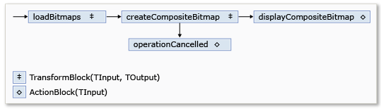

# Tutorial: Usar flujos de datos en aplicaciones de Windows FormsWalkthrough: Using Dataflow in a Windows Forms Application
Este documento muestra cómo crear una red de bloques de flujo de datos que realizan el procesamiento de imágenes en una aplicación de Windows Forms.This document demonstrates how to create a network of dataflow blocks that perform image processing in a Windows Forms application.  
  
 En este ejemplo se cargan archivos de imagen de la carpeta especificada, se crea una imagen compuesta y se muestra el resultado.This example loads image files from the specified folder, creates a composite image, and displays the result. En el ejemplo se utiliza el modelo de flujo de datos para distribuir las imágenes por la red.The example uses the dataflow model to route images through the network. En el modelo de flujo de datos, los componentes independientes de un programa se comunican entre sí mediante mensajes.In the dataflow model, independent components of a program communicate with one another by sending messages. Cuando un componente recibe un mensaje, realiza alguna acción y pasa el resultado a otro componente.When a component receives a message, it performs some action and then passes the result to another component. Compare esto con el modelo de flujo de control, en el que una aplicación utiliza estructuras de control, como por ejemplo, instrucciones condicionales, bucles, etc., para controlar el orden de las operaciones en un programa.Compare this with the control flow model, in which an application uses control structures, for example, conditional statements, loops, and so on, to control the order of operations in a program.  
  
## Requisitos previosPrerequisites  
 Lea [Flujo de datos](../../../docs/standard/parallel-programming/dataflow-task-parallel-library.md) antes de empezar este tutorial.Read [Dataflow](../../../docs/standard/parallel-programming/dataflow-task-parallel-library.md) before you start this walkthrough.  
  
> [!TIP]
>  La biblioteca de flujos de datos TPL (espacio de nombres <xref:System.Threading.Tasks.Dataflow?displayProperty=nameWithType>) no se distribuye con [!INCLUDE[net_v45](../../../includes/net-v45-md.md)].The TPL Dataflow Library (<xref:System.Threading.Tasks.Dataflow?displayProperty=nameWithType> namespace) is not distributed with the [!INCLUDE[net_v45](../../../includes/net-v45-md.md)]. Para instalar el <xref:System.Threading.Tasks.Dataflow> espacio de nombres, abra el proyecto en [!INCLUDE[vs_dev11_long](../../../includes/vs-dev11-long-md.md)], elija **administrar paquetes de NuGet** en el menú proyecto y busque en línea el `Microsoft.Tpl.Dataflow` paquete.To install the <xref:System.Threading.Tasks.Dataflow> namespace, open your project in [!INCLUDE[vs_dev11_long](../../../includes/vs-dev11-long-md.md)], choose **Manage NuGet Packages** from the Project menu, and search online for the `Microsoft.Tpl.Dataflow` package.  
 
  
## SeccionesSections  
 Este tutorial contiene las siguientes secciones:This walkthrough contains the following sections:  
  
-   [Crear una aplicación de Windows FormsCreating the Windows Forms Application](#winforms)  
  
-   [Crear la red del flujo de datosCreating the Dataflow Network](#network)  
  
-   [Conectar la red del flujo de datos a la interfaz de usuarioConnecting the Dataflow Network to the User Interface](#ui)  
  
-   [Ejemplo completoThe Complete Example](#complete)  
  
   
## Crear una aplicación de Windows FormsCreating the Windows Forms Application  
 En esta sección se describe cómo crear la aplicación básica de Windows Forms y agregar controles al formulario principal.This section describes how to create the basic Windows Forms application and add controls to the main form.  
  
#### Para crear la aplicación de Windows FormsTo Create the Windows Forms Application  
  
1.  En [!INCLUDE[vsprvs](../../../includes/vsprvs-md.md)], cree un proyecto **Aplicación de Windows Forms** de [!INCLUDE[csprcs](../../../includes/csprcs-md.md)] o Visual Basic.In [!INCLUDE[vsprvs](../../../includes/vsprvs-md.md)], create a [!INCLUDE[csprcs](../../../includes/csprcs-md.md)] or Visual Basic **Windows Forms Application** project. En este documento, el proyecto se denomina `CompositeImages`.In this document, the project is named `CompositeImages`.  
  
2.  En el Diseñador de formularios para el formulario principal, Form1.cs (Form1.vb con [!INCLUDE[vbprvb](../../../includes/vbprvb-md.md)]), agregue un <xref:System.Windows.Forms.ToolStrip> control.On the form designer for the main form, Form1.cs (Form1.vb for [!INCLUDE[vbprvb](../../../includes/vbprvb-md.md)]), add a <xref:System.Windows.Forms.ToolStrip> control.  
  
3.  Agregar un <xref:System.Windows.Forms.ToolStripButton> el control a la <xref:System.Windows.Forms.ToolStrip> control.Add a <xref:System.Windows.Forms.ToolStripButton> control to the <xref:System.Windows.Forms.ToolStrip> control. Establecer el <xref:System.Windows.Forms.ToolStripItem.DisplayStyle%2A> propiedad a <xref:System.Windows.Forms.ToolStripItemDisplayStyle.Text> y <xref:System.Windows.Forms.ToolStripItem.Text%2A> propiedad **elegir la carpeta de**.Set the <xref:System.Windows.Forms.ToolStripItem.DisplayStyle%2A> property to <xref:System.Windows.Forms.ToolStripItemDisplayStyle.Text> and the <xref:System.Windows.Forms.ToolStripItem.Text%2A> property to **Choose Folder**.  
  
4.  Agregue un segundo <xref:System.Windows.Forms.ToolStripButton> el control a la <xref:System.Windows.Forms.ToolStrip> control.Add a second <xref:System.Windows.Forms.ToolStripButton> control to the <xref:System.Windows.Forms.ToolStrip> control. Establecer el <xref:System.Windows.Forms.ToolStripItem.DisplayStyle%2A> propiedad <xref:System.Windows.Forms.ToolStripItemDisplayStyle.Text>, el <xref:System.Windows.Forms.ToolStripItem.Text%2A> propiedad **cancelar**y el <xref:System.Windows.Forms.ToolStripItem.Enabled%2A> propiedad para `False`.Set the <xref:System.Windows.Forms.ToolStripItem.DisplayStyle%2A> property to <xref:System.Windows.Forms.ToolStripItemDisplayStyle.Text>, the <xref:System.Windows.Forms.ToolStripItem.Text%2A> property to **Cancel**, and the <xref:System.Windows.Forms.ToolStripItem.Enabled%2A> property to `False`.  
  
5.  Agregar un <xref:System.Windows.Forms.PictureBox> objeto al formulario principal.Add a <xref:System.Windows.Forms.PictureBox> object to the main form. Establezca la propiedad <xref:System.Windows.Forms.Control.Dock%2A> en <xref:System.Windows.Forms.DockStyle.Fill>.Set the <xref:System.Windows.Forms.Control.Dock%2A> property to <xref:System.Windows.Forms.DockStyle.Fill>.  
  
   
## Crear la red del flujo de datosCreating the Dataflow Network  
 En esta sección se describe cómo crear la red del flujo de datos que lleva a cabo el procesamiento de imágenes.This section describes how to create the dataflow network that performs image processing.  
  
#### Para crear la red del flujo de datosTo Create the Dataflow Network  
  
1.  Agregue a su proyecto una referencia a System.Threading.Tasks.Dataflow.dll.Add a reference to System.Threading.Tasks.Dataflow.dll to your project.  
  
2.  Asegúrese de que Form1.cs (Form1.vb para [!INCLUDE[vbprvb](../../../includes/vbprvb-md.md)]) contenga las siguientes instrucciones `using` (`Using` en [!INCLUDE[vbprvb](../../../includes/vbprvb-md.md)]):Ensure that Form1.cs (Form1.vb for [!INCLUDE[vbprvb](../../../includes/vbprvb-md.md)]) contains the following `using` (`Using` in [!INCLUDE[vbprvb](../../../includes/vbprvb-md.md)]) statements:  
  
     [!code-csharp[TPLDataflow_CompositeImages#1](../../../samples/snippets/csharp/VS_Snippets_Misc/tpldataflow_compositeimages/cs/compositeimages/form1.cs#1)]  
  
3.  Agregue a la clase `Form1` los miembros de datos siguientes:Add the following data members to the `Form1` class:  
  
     [!code-csharp[TPLDataflow_CompositeImages#2](../../../samples/snippets/csharp/VS_Snippets_Misc/tpldataflow_compositeimages/cs/compositeimages/form1.cs#2)]  
  
4.  Agregue el método siguiente, `CreateImageProcessingNetwork`, a la clase `Form1`.Add the following method, `CreateImageProcessingNetwork`, to the `Form1` class. Este método crea la red de procesamiento de imágenes.This method creates the image processing network.  
  
     [!code-csharp[TPLDataflow_CompositeImages#3](../../../samples/snippets/csharp/VS_Snippets_Misc/tpldataflow_compositeimages/cs/compositeimages/form1.cs#3)]  
  
5.  Implemente el método `LoadBitmaps`.Implement the `LoadBitmaps` method.  
  
     [!code-csharp[TPLDataflow_CompositeImages#4](../../../samples/snippets/csharp/VS_Snippets_Misc/tpldataflow_compositeimages/cs/compositeimages/form1.cs#4)]  
  
6.  Implemente el método `CreateCompositeBitmap`.Implement the `CreateCompositeBitmap` method.  
  
     [!code-csharp[TPLDataflow_CompositeImages#5](../../../samples/snippets/csharp/VS_Snippets_Misc/tpldataflow_compositeimages/cs/compositeimages/form1.cs#5)]  
  
    > [!NOTE]
    >  La versión de C# de la `CreateCompositeBitmap` método utiliza punteros para permitir un procesamiento eficiente de los <xref:System.Drawing.Bitmap?displayProperty=nameWithType> objetos.The C# version of the `CreateCompositeBitmap` method uses pointers to enable efficient processing of the <xref:System.Drawing.Bitmap?displayProperty=nameWithType> objects. Por lo tanto, debe habilitar la opción **Permitir código no seguro** en el proyecto para utilizar la palabra clave [unsafe](~/docs/csharp/language-reference/keywords/unsafe.md).Therefore, you must enable the **Allow unsafe code** option in your project in order to use the [unsafe](~/docs/csharp/language-reference/keywords/unsafe.md) keyword. Para obtener más información acerca de cómo habilitar el código no seguro en un [!INCLUDE[csprcs](../../../includes/csprcs-md.md)] del proyecto, vea [página compilación, Diseñador de proyectos (C#)] https://msdn.microsoft.com/library/kb4wyys2).For more information about how to enable unsafe code in a [!INCLUDE[csprcs](../../../includes/csprcs-md.md)] project, see [Build Page, Project Designer (C#)]https://msdn.microsoft.com/library/kb4wyys2).  
  
 En la tabla siguiente se describen los miembros de la red.The following table describes the members of the network.  
  
|MiembroMember|TipoType|DescripciónDescription|  
|------------|----------|-----------------|  
|`loadBitmaps`|<xref:System.Threading.Tasks.Dataflow.TransformBlock%602>|Toma una ruta de acceso de carpeta como entrada y genera una colección de <xref:System.Drawing.Bitmap> objetos como salida.Takes a folder path as input and produces a collection of <xref:System.Drawing.Bitmap> objects as output.|  
|`createCompositeBitmap`|<xref:System.Threading.Tasks.Dataflow.TransformBlock%602>|Toma una colección de <xref:System.Drawing.Bitmap> objetos como entrada y genera un mapa de bits compuesto como salida.Takes a collection of <xref:System.Drawing.Bitmap> objects as input and produces a composite bitmap as output.|  
|`displayCompositeBitmap`|<xref:System.Threading.Tasks.Dataflow.ActionBlock%601>|Muestra el mapa de bits compuesto en el formulario.Displays the composite bitmap on the form.|  
|`operationCancelled`|<xref:System.Threading.Tasks.Dataflow.ActionBlock%601>|Muestra una imagen para indicar que la operación se cancela y permite al usuario seleccionar otra carpeta.Displays an image to indicate that the operation is canceled and enables the user to select another folder.|  
  
 Para conectar los bloques de flujo de datos para formar una red, este ejemplo se utiliza la <xref:System.Threading.Tasks.Dataflow.ISourceBlock%601.LinkTo%2A> método.To connect the dataflow blocks to form a network, this example uses the <xref:System.Threading.Tasks.Dataflow.ISourceBlock%601.LinkTo%2A> method. El <xref:System.Threading.Tasks.Dataflow.ISourceBlock%601.LinkTo%2A> método contiene una versión sobrecargada que toma un <xref:System.Predicate%601> objeto que determina si el bloque de destino acepta o rechaza un mensaje.The <xref:System.Threading.Tasks.Dataflow.ISourceBlock%601.LinkTo%2A> method contains an overloaded version that takes a <xref:System.Predicate%601> object that determines whether the target block accepts or rejects a message. Este mecanismo de filtrado permite que los bloques de mensajes reciban solo ciertos valores.This filtering mechanism enables message blocks to receive only certain values. En este ejemplo, la red puede dividirse en ramas de una de dos maneras.In this example, the network can branch in one of two ways. La rama principal carga las imágenes desde el disco, crea la imagen compuesta y la muestra en el formulario.The main branch loads the images from disk, creates the composite image, and displays that image on the form. La rama alternativa cancela la operación actual.The alternate branch cancels the current operation. El <xref:System.Predicate%601> objetos permiten que los bloques de flujo de datos a lo largo de la bifurcación main para cambiar a la bifurcación alternativa rechazando determinados mensajes.The <xref:System.Predicate%601> objects enable the dataflow blocks along the main branch to switch to the alternative branch by rejecting certain messages. Por ejemplo, si el usuario cancela la operación, el bloque de flujo de datos `createCompositeBitmap` produce `null` (`Nothing` en [!INCLUDE[vbprvb](../../../includes/vbprvb-md.md)]) como salida.For example, if the user cancels the operation, the dataflow block `createCompositeBitmap` produces `null` (`Nothing` in [!INCLUDE[vbprvb](../../../includes/vbprvb-md.md)]) as its output. El bloque de flujo de datos `displayCompositeBitmap` rechaza valores de entrada `null` y, por lo tanto, el mensaje se ofrece a `operationCancelled`.The dataflow block `displayCompositeBitmap` rejects `null` input values, and therefore, the message is offered to `operationCancelled`. El bloque de flujo de datos `operationCancelled` acepta todos los mensajes y, por lo tanto, muestra una imagen para indicar que se ha cancelado la operación.The dataflow block `operationCancelled` accepts all messages and therefore, displays an image to indicate that the operation is canceled.  
  
 En la ilustración siguiente se muestra la red de procesamiento de imágenes.The following illustration shows the image processing network.  
  
   
  
 Dado que los bloques de flujo de datos `displayCompositeBitmap` y `operationCancelled` actúan sobre la interfaz de usuario, es importante que esta acción se produzca en el subproceso de interfaz de usuario.Because the `displayCompositeBitmap` and `operationCancelled` dataflow blocks act on the user interface, it is important that these actions occur on the user-interface thread. Para ello, durante la construcción, estos objetos proporcionan una <xref:System.Threading.Tasks.Dataflow.ExecutionDataflowBlockOptions> objeto que tiene el <xref:System.Threading.Tasks.Dataflow.DataflowBlockOptions.TaskScheduler%2A> propiedad establecida en <xref:System.Threading.Tasks.TaskScheduler.FromCurrentSynchronizationContext%2A?displayProperty=nameWithType>.To accomplish this, during construction, these objects each provide a <xref:System.Threading.Tasks.Dataflow.ExecutionDataflowBlockOptions> object that has the <xref:System.Threading.Tasks.Dataflow.DataflowBlockOptions.TaskScheduler%2A> property set to <xref:System.Threading.Tasks.TaskScheduler.FromCurrentSynchronizationContext%2A?displayProperty=nameWithType>. El método <xref:System.Threading.Tasks.TaskScheduler.FromCurrentSynchronizationContext%2A?displayProperty=nameWithType> crea un objeto <xref:System.Threading.Tasks.TaskScheduler> que funciona en el contexto de sincronización actual.The <xref:System.Threading.Tasks.TaskScheduler.FromCurrentSynchronizationContext%2A?displayProperty=nameWithType> method creates a <xref:System.Threading.Tasks.TaskScheduler> object that performs work on the current synchronization context. Como se llama al método `CreateImageProcessingNetwork` desde el controlador del botón **Elegir carpeta**, que se ejecuta en el subproceso de la interfaz de usuario, las acciones para los bloques de flujo de datos `displayCompositeBitmap` y `operationCancelled` también se ejecutan en el subproceso de la interfaz de usuario.Because the `CreateImageProcessingNetwork` method is called from the handler of the **Choose Folder** button, which runs on the user-interface thread, the actions for the `displayCompositeBitmap` and `operationCancelled` dataflow blocks also run on the user-interface thread.  
  
 Este ejemplo usa un token de cancelación compartidos en lugar de establecer la <xref:System.Threading.Tasks.Dataflow.DataflowBlockOptions.CancellationToken%2A> propiedad porque el <xref:System.Threading.Tasks.Dataflow.DataflowBlockOptions.CancellationToken%2A> propiedad permanentemente cancela la ejecución de bloques de flujo de datos.This example uses a shared cancellation token instead of setting the <xref:System.Threading.Tasks.Dataflow.DataflowBlockOptions.CancellationToken%2A> property because the <xref:System.Threading.Tasks.Dataflow.DataflowBlockOptions.CancellationToken%2A> property permanently cancels dataflow block execution. En este ejemplo, un token de cancelación permite reutilizar la misma red del flujo de datos varias veces, incluso cuando el usuario cancela una o varias operaciones.A cancellation token enables this example to reuse the same dataflow network multiple times, even when the user cancels one or more operations. Para obtener un ejemplo que usa <xref:System.Threading.Tasks.Dataflow.DataflowBlockOptions.CancellationToken%2A> para cancelar la ejecución de un bloque de flujo de datos de modo permanente, consulte [Cómo: cancelar un Dataflow Block](../../../docs/standard/parallel-programming/how-to-cancel-a-dataflow-block.md).For an example that uses <xref:System.Threading.Tasks.Dataflow.DataflowBlockOptions.CancellationToken%2A> to permanently cancel the execution of a dataflow block, see [How to: Cancel a Dataflow Block](../../../docs/standard/parallel-programming/how-to-cancel-a-dataflow-block.md).  
  
   
## Conectar la red del flujo de datos a la interfaz de usuarioConnecting the Dataflow Network to the User Interface  
 En esta sección se describe cómo conectar la red del flujo de datos a la interfaz de usuario.This section describes how to connect the dataflow network to the user interface. La creación de la imagen compuesta y la cancelación de la operación se inician desde los botones **Elegir carpeta** y **Cancelar**.The creation of the composite image and cancellation of the operation are initiated from the **Choose Folder** and **Cancel** buttons. Cuando el usuario elige cualquiera de ellos, se inicia la acción correspondiente de forma asincrónica.When the user chooses either of these buttons, the appropriate action is initiated in an asynchronous manner.  
  
#### Para conectar la red del flujo de datos a la interfaz de usuarioTo Connect the Dataflow Network to the User Interface  
  
1.  En el Diseñador de formularios del formulario principal, cree un controlador de eventos para el <xref:System.Windows.Forms.ToolStripItem.Click> eventos para el **elegir la carpeta** botón.On the form designer for the main form, create an event handler for the <xref:System.Windows.Forms.ToolStripItem.Click> event for the **Choose Folder** button.  
  
2.  Implemente el <xref:System.Windows.Forms.ToolStripItem.Click> eventos para el **elegir la carpeta** botón.Implement the <xref:System.Windows.Forms.ToolStripItem.Click> event for the **Choose Folder** button.  
  
     [!code-csharp[TPLDataflow_CompositeImages#6](../../../samples/snippets/csharp/VS_Snippets_Misc/tpldataflow_compositeimages/cs/compositeimages/form1.cs#6)]  
  
3.  En el Diseñador de formularios del formulario principal, cree un controlador de eventos para el <xref:System.Windows.Forms.ToolStripItem.Click> eventos para el **cancelar** botón.On the form designer for the main form, create an event handler for the <xref:System.Windows.Forms.ToolStripItem.Click> event for the **Cancel** button.  
  
4.  Implemente el <xref:System.Windows.Forms.ToolStripItem.Click> eventos para el **cancelar** botón.Implement the <xref:System.Windows.Forms.ToolStripItem.Click> event for the **Cancel** button.  
  
     [!code-csharp[TPLDataflow_CompositeImages#7](../../../samples/snippets/csharp/VS_Snippets_Misc/tpldataflow_compositeimages/cs/compositeimages/form1.cs#7)]  
  
   
## Ejemplo completoThe Complete Example  
 En el ejemplo siguiente se muestra el código completo de este tutorial.The following example shows the complete code for this walkthrough.  
  
 [!code-csharp[TPLDataflow_CompositeImages#100](../../../samples/snippets/csharp/VS_Snippets_Misc/tpldataflow_compositeimages/cs/compositeimages/form1.cs#100)]  
  
 En la ilustración siguiente se muestra la salida típica de la carpeta \Sample Pictures\ común.The following illustration shows typical output for the common \Sample Pictures\ folder.  
  
   
  
## Pasos siguientesNext Steps  
  
## Vea tambiénSee Also  
 [Flujo de datosDataflow](../../../docs/standard/parallel-programming/dataflow-task-parallel-library.md)
