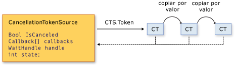

# Cancelación en subprocesos administrados
A partir de .NET Framework 4, .NET Framework usa un modelo unificado para la cancelación cooperativa de operaciones asincrónicas o sincrónicas de ejecución prolongada. Este modelo se basa en un objeto ligero denominado token de cancelación. El objeto que invoca una o más operaciones cancelables, por ejemplo creando un nuevo subproceso o tarea, pasa el token a cada operación. Las operaciones individuales pueden pasar a su vez copias del token a otras operaciones. En algún momento posterior, el objeto que creó el token puede usarlo para solicitar que las operaciones se detengan. Solo el objeto solicitante puede emitir la solicitud de cancelación y cada agente de escucha es responsable de observar la solicitud y responder a ella de manera puntual.  
  
 El patrón general para implementar el modelo de cancelación cooperativa es:  
  
- Crear una instancia de un objeto <xref:System.Threading.CancellationTokenSource>, que administra y envía una notificación de cancelación a los tokens de cancelación individuales.  
  
- Pasar el token devuelto por la propiedad <xref:System.Threading.CancellationTokenSource.Token%2A?displayProperty=nameWithType> para cada tarea o el subproceso que realiza escuchas de cancelación.  
  
- Proporcionar un mecanismo para que cada tarea o subproceso responda a la cancelación.  
  
- Llamar al método <xref:System.Threading.CancellationTokenSource.Cancel%2A?displayProperty=nameWithType> para proporcionar una notificación de cancelación.  
  
> [!IMPORTANT]
> La clase <xref:System.Threading.CancellationTokenSource> implementa la interfaz <xref:System.IDisposable>. Debe asegurarse de llamar al método <xref:System.Threading.CancellationTokenSource.Dispose%2A?displayProperty=nameWithType> cuando termine de usar el origen del token de cancelación para liberar los recursos no administrados que contiene.  
  
 En la siguiente ilustración se muestra la relación entre un origen de token y todas las copias de su token.  
  
   
  
 El nuevo modelo de cancelación facilita la creación de bibliotecas y aplicaciones compatibles con la cancelación y admite las siguientes características:  
  
- La cancelación es cooperativa y no se impone al agente de escucha. El agente de escucha determina cómo finalizar correctamente en respuesta a una solicitud de cancelación.  
  
- La solicitud es distinta que la escucha. Un objeto que invoca una operación cancelable puede controlar cuándo se solicita la cancelación (si se solicita).  
  
- El objeto solicitante emite la solicitud de cancelación para todas las copias del token usando simplemente una llamada de método.  
  
- Si los une en un *token vinculado*, un agente de escucha puede escuchar varios tokens simultáneamente.  
  
- El código de usuario puede observar y responder a las solicitudes de cancelación desde código de biblioteca y el código de biblioteca puede observar y responder a las solicitudes de cancelación desde código de usuario.  
  
- Los agentes de escucha pueden recibir las solicitudes de cancelación mediante sondeo, registro de devolución de llamada o espera en identificadores de espera.  
  
## Tipos de cancelación  
 El marco de cancelación se implementa como un conjunto de tipos relacionados. Estos tipos se enumeran en la tabla siguiente.  
  
|Nombre de tipo|Descripción|  
|---------------|-----------------|  
|<xref:System.Threading.CancellationTokenSource>|Objeto que se crea un token de cancelación y también emite la solicitud de cancelación para todas las copias de ese token.|  
|<xref:System.Threading.CancellationToken>|Tipo de valor ligero pasado a uno o varios agentes de escucha, normalmente como un parámetro de método. Los agentes de escucha supervisan el valor de la propiedad `IsCancellationRequested` del token mediante sondeo, devolución de llamada o identificador de espera.|  
|<xref:System.OperationCanceledException>|Las sobrecargas del constructor de esta excepción aceptan <xref:System.Threading.CancellationToken> como parámetro. Los agentes de escucha pueden generar esta excepción para comprobar el origen de la cancelación y notificar a otros que ha respondido a una solicitud de cancelación.|  
  
 El nuevo modelo de cancelación se integra en .NET Framework en varios tipos. Los más importantes son <xref:System.Threading.Tasks.Parallel?displayProperty=nameWithType>, <xref:System.Threading.Tasks.Task?displayProperty=nameWithType>, <xref:System.Threading.Tasks.Task%601?displayProperty=nameWithType> y <xref:System.Linq.ParallelEnumerable?displayProperty=nameWithType>. Le recomendamos usar este nuevo modelo de cancelación para todo el código de biblioteca y aplicación nuevo.  
  
## Ejemplo de código  
 En el ejemplo siguiente, el objeto solicitante crea un objeto <xref:System.Threading.CancellationTokenSource> y, a continuación, pasa su propiedad <xref:System.Threading.CancellationTokenSource.Token%2A> a la operación cancelable. La operación que recibe la solicitud supervisa el valor de la propiedad <xref:System.Threading.CancellationToken.IsCancellationRequested%2A> del token mediante sondeo. Cuando el valor se convierte en `true`, el agente de escucha puede finalizar de la manera adecuada. En este ejemplo el método simplemente sale, que es lo único necesario en muchos casos.  
  
> [!NOTE]
> En el ejemplo se usa el método <xref:System.Threading.ThreadPool.QueueUserWorkItem%2A> para demostrar que el nuevo marco de cancelación es compatible con las API heredadas. Para obtener un ejemplo en donde se utiliza el nuevo tipo preferido, <xref:System.Threading.Tasks.Task?displayProperty=nameWithType>, vea [Procedimiento: Cancelar una tarea y sus elementos secundarios](../parallel-programming/how-to-cancel-a-task-and-its-children.md).  
  
 [!code-csharp[Cancellation#1](../../../samples/snippets/csharp/VS_Snippets_Misc/cancellation/cs/cancellationex1.cs#1)]
 [!code-vb[Cancellation#1](../../../samples/snippets/visualbasic/VS_Snippets_Misc/cancellation/vb/cancellationex1.vb#1)]  
  
## Cancelación de operaciones frente a cancelación de objetos  
 En el nuevo marco de cancelación, la cancelación se refiere a las operaciones, no a objetos. La solicitud de cancelación significa que la operación debe detenerse lo antes posible después de realizar cualquier limpieza necesaria. Un token de cancelación debe hacer referencia a una "operación cancelable", independientemente de si esa operación está implementada en su programa. Después de establecer la propiedad <xref:System.Threading.CancellationToken.IsCancellationRequested%2A> del token en `true`, no puede restablecerse a `false`. Por lo tanto, los tokens de cancelación no pueden volver a usarse una vez cancelados.  
  
 Si necesita un mecanismo de cancelación de objetos, puede basarlo en el mecanismo de cancelación de operaciones mediante una llamada al método <xref:System.Threading.CancellationToken.Register%2A?displayProperty=nameWithType>, tal como se muestra en el ejemplo siguiente.  
  
 [!code-csharp[Cancellation#2](../../../samples/snippets/csharp/VS_Snippets_Misc/cancellation/cs/objectcancellation1.cs#2)]
 [!code-vb[Cancellation#2](../../../samples/snippets/visualbasic/VS_Snippets_Misc/cancellation/vb/objectcancellation1.vb#2)]  
  
 Si un objeto admite más de una operación cancelable simultánea, pase un token independiente como entrada para cada operación cancelable. De este modo, se puede cancelar una operación sin que afecte al resto.  
  
## Escucha y respuesta a solicitudes de cancelación  
 En el delegado de usuario, el implementador de una operación cancelable determina cómo finalizar la operación en respuesta a una solicitud de cancelación. En muchos casos, el delegado de usuario puede realizar simplemente cualquier limpieza necesaria y volver inmediatamente.  
  
 Sin embargo, en casos más complejos, es posible que sea necesario que el delegado de usuario notifique al código de biblioteca que se ha producido la cancelación. En estos casos, la manera correcta de finalizar la operación es que el delegado llame al método <xref:System.Threading.CancellationToken.ThrowIfCancellationRequested%2A>, lo que provocará que se genere <xref:System.OperationCanceledException>. El código de biblioteca puede detectar esta excepción en el subproceso de delegado de usuario y examinar el token de la excepción para determinar si la excepción indica una cancelación cooperativa o alguna otra situación excepcional.  
  
 La clase <xref:System.Threading.Tasks.Task> administra <xref:System.OperationCanceledException> de esta manera. Para más información, vea [Cancelación de tareas](../parallel-programming/task-cancellation.md).  
  
### Escuchas mediante sondeo  
 Para los cálculos de ejecución prolongada que se repiten, puede escuchar una solicitud de cancelación sondeando periódicamente el valor de la propiedad <xref:System.Threading.CancellationToken.IsCancellationRequested%2A?displayProperty=nameWithType>. Si su valor es `true`, el método debe realizar una limpieza y finalizar lo antes posible. La frecuencia óptima de sondeo depende del tipo de aplicación. Es el desarrollador quien determina la mejor frecuencia de sondeo para cualquier programa dado. El sondeo en sí no afecta significativamente al rendimiento. En el ejemplo siguiente se muestra una posible manera de sondeo.  
  
 [!code-csharp[Cancellation#3](../../../samples/snippets/csharp/VS_Snippets_Misc/cancellation/cs/cancellationex11.cs#3)]
 [!code-vb[Cancellation#3](../../../samples/snippets/visualbasic/VS_Snippets_Misc/cancellation/vb/cancellationex11.vb#3)]  
  
 Para obtener un ejemplo más completo, vea [Cómo: Escucha de solicitudes de cancelación mediante sondeo](how-to-listen-for-cancellation-requests-by-polling.md).  
  
### Escuchas mediante el registro de una devolución de llamada  
 Algunas operaciones se pueden bloquear de forma que no pueden comprobar el valor del token de cancelación de manera oportuna. En estos casos, se puede registrar un método de devolución de llamada que desbloquee el método cuando se reciba una solicitud de cancelación.  
  
 El método <xref:System.Threading.CancellationToken.Register%2A> devuelve un objeto <xref:System.Threading.CancellationTokenRegistration> que se usa específicamente para este propósito. En el ejemplo siguiente se muestra cómo usar el método <xref:System.Threading.CancellationToken.Register%2A> para cancelar una solicitud web asincrónica.  
  
 [!code-csharp[Cancellation#4](../../../samples/snippets/csharp/VS_Snippets_Misc/cancellation/cs/cancellationex4.cs#4)]
 [!code-vb[Cancellation#4](../../../samples/snippets/visualbasic/VS_Snippets_Misc/cancellation/vb/cancellationex4.vb#4)]  
  
 El objeto <xref:System.Threading.CancellationTokenRegistration> administra la sincronización de subprocesos y garantiza que la devolución de llamada dejará de ejecutarse en un momento concreto en el tiempo.  
  
 Para garantizar la capacidad de respuesta del sistema y evitar los interbloqueos, deben seguirse las siguientes directrices al registrar devoluciones de llamada:  
  
- El método de devolución de llamada debe ser rápido porque se llama sincrónicamente y, por tanto, la llamada a <xref:System.Threading.CancellationTokenSource.Cancel%2A> no devuelve un valor hasta que no se devuelve la devolución de llamada.  
  
- Si se llama a <xref:System.Threading.CancellationTokenRegistration.Dispose%2A> mientras se ejecuta la devolución de llamada y se mantiene un bloqueo que está esperando la devolución de llamada, el programa puede causar interbloqueos. Después de que `Dispose` devuelve un valor, puede liberar todos los recursos requeridos por la devolución de llamada.  
  
- Las devoluciones de llamada no deben realizar ningún subproceso manual ni uso de o <xref:System.Threading.SynchronizationContext> en una devolución de llamada. Si una devolución de llamada debe ejecutarse en un subproceso concreto, use el constructor <xref:System.Threading.CancellationTokenRegistration?displayProperty=nameWithType> que le permite especificar que la clase syncContext de destino es el <xref:System.Threading.SynchronizationContext.Current%2A?displayProperty=nameWithType> activo. Si se realiza un subproceso manual en una devolución de llamada, puede producirse un interbloqueo.  
  
 Para obtener un ejemplo más completo, vea [Cómo: Registro de devoluciones de llamada como solicitudes de cancelación](how-to-register-callbacks-for-cancellation-requests.md).  
  
### Escuchas mediante un identificador de espera  
 Cuando una operación cancelable puede bloquearse mientras espera en una primitiva de sincronización como <xref:System.Threading.ManualResetEvent?displayProperty=nameWithType> o <xref:System.Threading.Semaphore?displayProperty=nameWithType>, se puede usar la propiedad <xref:System.Threading.CancellationToken.WaitHandle%2A?displayProperty=nameWithType> para habilitar la operación de espera en el evento y la solicitud de cancelación. El identificador de espera del token de cancelación se señalará en respuesta a una solicitud de cancelación y el método puede usar el valor devuelto del método <xref:System.Threading.WaitHandle.WaitAny%2A> para determinar si era el token de cancelación el que señalaba. A continuación, la operación puede cerrarse o generar <xref:System.OperationCanceledException>, según corresponda.  
  
 [!code-csharp[Cancellation#5](../../../samples/snippets/csharp/VS_Snippets_Misc/cancellation/cs/cancellationex9.cs#5)]
 [!code-vb[Cancellation#5](../../../samples/snippets/visualbasic/VS_Snippets_Misc/cancellation/vb/cancellationex9.vb#5)]  
  
 En el nuevo código destinado a .NET Framework 4, <xref:System.Threading.ManualResetEventSlim?displayProperty=nameWithType> y <xref:System.Threading.SemaphoreSlim?displayProperty=nameWithType> admiten el nuevo marco de cancelación en sus métodos `Wait`. <xref:System.Threading.CancellationToken> puede pasarse al método y, cuando se solicita la cancelación, el evento se activa y genera <xref:System.OperationCanceledException>.  
  
 [!code-csharp[Cancellation#6](../../../samples/snippets/csharp/VS_Snippets_Misc/cancellation/cs/cancellationex10.cs#6)]
 [!code-vb[Cancellation#6](../../../samples/snippets/visualbasic/VS_Snippets_Misc/cancellation/vb/cancellationex10.vb#6)]  
  
 Para obtener un ejemplo más completo, vea [Cómo: Escucha de solicitudes de cancelación que tienen identificadores de espera](how-to-listen-for-cancellation-requests-that-have-wait-handles.md).  
  
### Escucha de varios tokens simultáneamente  
 En algunos casos, un agente de escucha tiene que escuchar varios tokens de cancelación de manera simultánea. Por ejemplo, una operación cancelable puede tener que supervisar un token de cancelación interno además de un token pasado externamente como argumento a un parámetro de método. Para lograr esto, cree un origen de tokens vinculados que pueda combinar dos o más tokens en uno, como se muestra en el ejemplo siguiente.  
  
 [!code-csharp[Cancellation#7](../../../samples/snippets/csharp/VS_Snippets_Misc/cancellation/cs/cancellationex13.cs#7)]
 [!code-vb[Cancellation#7](../../../samples/snippets/visualbasic/VS_Snippets_Misc/cancellation/vb/cancellationex13.vb#7)]  
  
 Tenga en cuenta que debe llamar a `Dispose` en el origen de tokens vinculados cuando haya terminado con él. Para obtener un ejemplo más completo, vea [Cómo: Escucha de varias solicitudes de cancelación](how-to-listen-for-multiple-cancellation-requests.md).  
  
## Cooperación entre código de biblioteca y código de usuario  
 El marco de cancelación unificada hace posible que el código de biblioteca pueda cancelar el código de usuario y que el código de usuario pueda cancelar el código de la biblioteca de manera cooperativa. Una buena cooperación depende de que cada lado siga estas instrucciones:  
  
- Si el código de biblioteca proporciona operaciones cancelables, también debe proporcionar métodos públicos que acepten un token de cancelación externo para que el código de usuario pueda solicitar la cancelación.  
  
- Si el código de biblioteca llama al código de usuario, el código de biblioteca debe interpretar OperationCanceledException (externalToken) como *cancelación cooperativa* y no necesariamente como una excepción de error.  
  
- Los delegados de usuario deben intentar responder a las solicitudes de cancelación del código de biblioteca de manera adecuada.  
  
 <xref:System.Threading.Tasks.Task?displayProperty=nameWithType> y <xref:System.Linq.ParallelEnumerable?displayProperty=nameWithType> son ejemplos de clases que siguen estas instrucciones. Para más información, vea [Cancelación de tareas](../parallel-programming/task-cancellation.md) y [Cómo: Cancelar una consulta PLINQ](../parallel-programming/how-to-cancel-a-plinq-query.md).  
  
## Vea también

- [Principios básicos del subprocesamiento administrado](managed-threading-basics.md)
