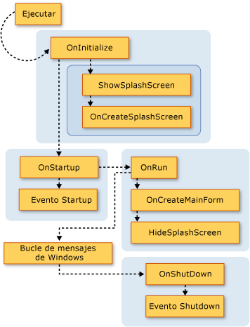
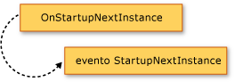
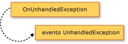

# Ampliar el modelo de la aplicaci&#243;n de Visual Basic
[!INCLUDE[vs2017banner](../../../visual-basic/developing-apps/includes/vs2017banner.md)]

Puede agregar funcionalidad al modelo de la aplicación reemplazando los miembros `Overridable` de la clase <xref:Microsoft.VisualBasic.ApplicationServices.WindowsFormsApplicationBase>.  Esta técnica le permite personalizar el comportamiento del modelo de la aplicación y agregar llamadas a sus propios métodos mientras se inicia y se cierra la aplicación.  
  
## Información general visual del modelo de la aplicación  
 Esta sección presenta visualmente la secuencia de llamadas a funciones en el Modelo de aplicaciones de Visual Basic.  La sección siguiente describe en detalle el propósito de cada función.  
  
 El gráfico siguiente muestra la secuencia de llamadas al modelo de aplicaciones en una aplicación normal de formularios Windows Forms de Visual Basic.  La secuencia se inicia cuando el procedimiento `Sub Main` llama al método <xref:Microsoft.VisualBasic.ApplicationServices.WindowsFormsApplicationBase.Run%2A>.  
  
   
  
 El modelo de aplicaciones de Visual Basic proporciona los eventos <xref:Microsoft.VisualBasic.ApplicationServices.WindowsFormsApplicationBase.StartupNextInstance> y <xref:Microsoft.VisualBasic.ApplicationServices.WindowsFormsApplicationBase.UnhandledException>.  Los gráficos siguientes muestran el mecanismo para provocar estos eventos.  
  
   
  
   
  
## Reemplazar los métodos base  
 El método <xref:Microsoft.VisualBasic.ApplicationServices.WindowsFormsApplicationBase.Run%2A> define el orden en que se ejecutan los métodos de la `Application`.  De manera predeterminada, el procedimiento `Sub Main` de una aplicación de Windows Forms llama al método <xref:Microsoft.VisualBasic.ApplicationServices.WindowsFormsApplicationBase.Run%2A>.  
  
 Si la aplicación es normal \(una aplicación con varias instancias\) o es la primera instancia de una aplicación de instancia única, el método <xref:Microsoft.VisualBasic.ApplicationServices.WindowsFormsApplicationBase.Run%2A> ejecuta los métodos `Overridable` en el orden siguiente:  
  
1.  <xref:Microsoft.VisualBasic.ApplicationServices.WindowsFormsApplicationBase.OnInitialize%2A>.  De manera predeterminada, este método establece los estilos visuales, los estilos de presentación de texto y en la entidad de seguridad actual del subproceso principal de la aplicación \(si esta utiliza la autenticación de Windows\), además de llamar a `ShowSplashScreen` si no se utiliza `/nosplash` ni `-nosplash` como argumento de la línea de comandos.  
  
     La secuencia de inicio de la aplicación se cancela si esta función devuelve `False`.  Esto puede ser útil si hay circunstancias en las que la aplicación no se debe ejecutar.  
  
     El método <xref:Microsoft.VisualBasic.ApplicationServices.WindowsFormsApplicationBase.OnInitialize%2A> llama a los métodos siguientes:  
  
    1.  <xref:Microsoft.VisualBasic.ApplicationServices.WindowsFormsApplicationBase.ShowSplashScreen%2A>.  Determina si la aplicación tiene una pantalla de presentación definida y, en tal caso, muestra la pantalla de presentación en un subproceso independiente.  
  
         El método <xref:Microsoft.VisualBasic.ApplicationServices.WindowsFormsApplicationBase.ShowSplashScreen%2A> contiene el código que muestra la pantalla de presentación durante, al menos, el número de milisegundos especificado por la propiedad <xref:Microsoft.VisualBasic.ApplicationServices.WindowsFormsApplicationBase.MinimumSplashScreenDisplayTime%2A>.  Para utilizar esta funcionalidad, hay que agregar la pantalla de presentación a la aplicación mediante el **Diseñador de proyectos** \(que establece la propiedad `My.Application.MinimumSplashScreenDisplayTime` en dos segundos\) o establecer la propiedad `My.Application.MinimumSplashScreenDisplayTime` en un método que reemplace al método <xref:Microsoft.VisualBasic.ApplicationServices.WindowsFormsApplicationBase.OnInitialize%2A> u <xref:Microsoft.VisualBasic.ApplicationServices.WindowsFormsApplicationBase.OnCreateSplashScreen%2A>.  Para obtener más información, vea <xref:Microsoft.VisualBasic.ApplicationServices.WindowsFormsApplicationBase.MinimumSplashScreenDisplayTime%2A>.  
  
    2.  <xref:Microsoft.VisualBasic.ApplicationServices.WindowsFormsApplicationBase.OnCreateSplashScreen%2A>.  Permite a un diseñador emitir código que inicializa la pantalla de presentación.  
  
         De forma predeterminada, este método no hace nada.  Si se selecciona una pantalla de presentación para la aplicación en el **Diseñador de proyectos** de [!INCLUDE[vbprvb](../../../csharp/programming-guide/concepts/linq/includes/vbprvb-md.md)], el diseñador reemplaza el método <xref:Microsoft.VisualBasic.ApplicationServices.WindowsFormsApplicationBase.OnCreateSplashScreen%2A> con un método que establece la propiedad <xref:Microsoft.VisualBasic.ApplicationServices.WindowsFormsApplicationBase.SplashScreen%2A> en una nueva instancia del formulario de la pantalla de presentación.  
  
2.  <xref:Microsoft.VisualBasic.ApplicationServices.WindowsFormsApplicationBase.OnStartup%2A>.  Proporciona un punto de extensibilidad para generar el evento `Startup`.  La secuencia de inicio de la aplicación se detiene si esta función devuelve `False`.  
  
     De manera predeterminada, este método genera el evento <xref:Microsoft.VisualBasic.ApplicationServices.WindowsFormsApplicationBase.Startup>.  Si el controlador de eventos establece la propiedad <xref:System.ComponentModel.CancelEventArgs.Cancel%2A> del argumento de evento en `True`, el método devuelve `False` para cancelar el inicio de la aplicación.  
  
3.  <xref:Microsoft.VisualBasic.ApplicationServices.WindowsFormsApplicationBase.OnRun%2A>.  Proporciona el punto inicial cuando la aplicación principal está lista para comenzar a ejecutarse, después de finalizar la inicialización.  
  
     De forma predeterminada, antes de entrar en el bucle del mensaje de formularios Windows Forms, este método llama a los métodos `OnCreateMainForm` \(para crear el formulario principal de la aplicación\) y `HideSplashScreen` \(para cerrar la pantalla de presentación\):  
  
    1.  <xref:Microsoft.VisualBasic.ApplicationServices.WindowsFormsApplicationBase.OnCreateMainForm%2A>.  Proporciona a un diseñador una manera de emitir código que inicializa el formulario principal.  
  
         De forma predeterminada, este método no hace nada.  Sin embargo, cuando se selecciona un formulario principal para la aplicación en el **Diseñador de proyectos** de [!INCLUDE[vbprvb](../../../csharp/programming-guide/concepts/linq/includes/vbprvb-md.md)], el diseñador reemplaza el método <xref:Microsoft.VisualBasic.ApplicationServices.WindowsFormsApplicationBase.OnCreateMainForm%2A> con un método que establece la propiedad <xref:Microsoft.VisualBasic.ApplicationServices.WindowsFormsApplicationBase.MainForm%2A> en una nueva instancia del formulario principal.  
  
    2.  <xref:Microsoft.VisualBasic.ApplicationServices.WindowsFormsApplicationBase.HideSplashScreen%2A>.  Si la aplicación tiene definida una pantalla de presentación y está abierta, este método cierra la pantalla de presentación.  
  
         De manera predeterminada, este método cierra la pantalla de presentación.  
  
4.  <xref:Microsoft.VisualBasic.ApplicationServices.WindowsFormsApplicationBase.OnStartupNextInstance%2A>.  Proporciona una manera de personalizar el comportamiento de una aplicación de instancia única cuando se inicia otra instancia de la aplicación.  
  
     De manera predeterminada, este método genera el evento <xref:Microsoft.VisualBasic.ApplicationServices.WindowsFormsApplicationBase.StartupNextInstance>.  
  
5.  <xref:Microsoft.VisualBasic.ApplicationServices.WindowsFormsApplicationBase.OnShutdown%2A>.  Proporciona un punto de extensibilidad para generar el evento `Shutdown`.  Este método no se ejecuta si se produce una excepción no controlada en la aplicación principal.  
  
     De manera predeterminada, este método genera el evento <xref:Microsoft.VisualBasic.ApplicationServices.WindowsFormsApplicationBase.Shutdown>.  
  
6.  <xref:Microsoft.VisualBasic.ApplicationServices.WindowsFormsApplicationBase.OnUnhandledException%2A>.  Se ejecuta si se produce una excepción no controlada en cualquiera de los métodos enumerados anteriormente.  
  
     De manera predeterminada, este método genera el evento <xref:Microsoft.VisualBasic.ApplicationServices.WindowsFormsApplicationBase.UnhandledException> siempre que no se haya adjuntado un depurador y la aplicación esté controlando el evento `UnhandledException`.  
  
 Si la aplicación es de instancia única y ya está en ejecución, la siguiente instancia de la aplicación llama al método <xref:Microsoft.VisualBasic.ApplicationServices.WindowsFormsApplicationBase.OnStartupNextInstance%2A> en la instancia original de la aplicación y, después, finaliza.  
  
 El constructor <xref:Microsoft.VisualBasic.ApplicationServices.WindowsFormsApplicationBase> llama a la propiedad <xref:Microsoft.VisualBasic.ApplicationServices.WindowsFormsApplicationBase.UseCompatibleTextRendering%2A> para determinar qué motor de representación de texto se debe utilizar para los formularios de la aplicación.  De forma predeterminada, la propiedad <xref:Microsoft.VisualBasic.ApplicationServices.WindowsFormsApplicationBase.UseCompatibleTextRendering%2A> devuelve `False`, que indica que se utilice motor de representación de texto GDI, que es el valor predeterminado en [!INCLUDE[vbprvblong](../../../visual-basic/developing-apps/customizing-extending-my/includes/vbprvblong-md.md)].  Puede reemplazar la propiedad <xref:Microsoft.VisualBasic.ApplicationServices.WindowsFormsApplicationBase.UseCompatibleTextRendering%2A> para que devuelva `True`, que indica que se debe usar el motor de representación de texto GDI\+, que es la configuración predeterminada en Visual Basic .NET 2002 y Visual Basic .NET 2003.  
  
## Configurar la aplicación  
 Como una parte del modelo de aplicaciones de [!INCLUDE[vbprvb](../../../csharp/programming-guide/concepts/linq/includes/vbprvb-md.md)], la clase <xref:Microsoft.VisualBasic.ApplicationServices.WindowsFormsApplicationBase> suministra propiedades protegidas que configuran la aplicación.  Estas propiedades se deben establecer en el constructor de la clase que las implementa.  
  
 En un proyecto predeterminado de formularios Windows Forms, el **Diseñador de proyectos** crea el código para establecer las propiedades con la configuración del diseñador.  Las propiedades sólo se utilizan cuando la aplicación está iniciándose; establecerlas después de que se inicia la aplicación no tiene ningún efecto.  
  
||||  
|-|-|-|  
|Propiedad|Determina|Valor en el panel de la aplicación del Diseñador de proyectos|  
|<xref:Microsoft.VisualBasic.ApplicationServices.WindowsFormsApplicationBase.IsSingleInstance%2A>|Si la aplicación se ejecuta como una instancia única o una aplicación de varias instancias.|Casilla de**Cree una aplicación de instancia única**|  
|<xref:Microsoft.VisualBasic.ApplicationServices.WindowsFormsApplicationBase.EnableVisualStyles%2A>|Si la aplicación utiliza los estilos visuales que coinciden con Windows XP.|Casilla de**Los estilos visuales de XP de permiso**|  
|<xref:Microsoft.VisualBasic.ApplicationServices.WindowsFormsApplicationBase.SaveMySettingsOnExit%2A>|Si la aplicación guarda automáticamente los cambios en la configuración del usuario de la aplicación cuando finaliza.|Casilla de**Guarde My.Settings en el cierre**|  
|<xref:Microsoft.VisualBasic.ApplicationServices.WindowsFormsApplicationBase.ShutdownStyle%2A>|Lo que hace que la aplicación finalice, por ejemplo cuando se cierra el formulario de inicio o cuando se cierra el último formulario.|Lista de**Modo de apagado**|  
  
## Vea también  
 <xref:Microsoft.VisualBasic.ApplicationServices.ApplicationBase>   
 <xref:Microsoft.VisualBasic.ApplicationServices.WindowsFormsApplicationBase.Startup>   
 <xref:Microsoft.VisualBasic.ApplicationServices.WindowsFormsApplicationBase.StartupNextInstance>   
 <xref:Microsoft.VisualBasic.ApplicationServices.WindowsFormsApplicationBase.UnhandledException>   
 <xref:Microsoft.VisualBasic.ApplicationServices.WindowsFormsApplicationBase.Shutdown>   
 <xref:Microsoft.VisualBasic.ApplicationServices.WindowsFormsApplicationBase.NetworkAvailabilityChanged>   
 <xref:Microsoft.VisualBasic.ApplicationServices.WindowsFormsApplicationBase>   
 [Información general sobre el modelo de aplicaciones de Visual Basic](../../../visual-basic/developing-apps/development-with-my/overview-of-the-visual-basic-application-model.md)   
 [Aplicación \(Página, Diseñador de proyectos\) \(Visual Basic\)](/visual-studio/ide/reference/application-page-project-designer-visual-basic)