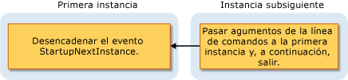

# Información general sobre el modelo de aplicaciones de Visual Basic
Visual Basic proporciona un modelo bien definido para controlar el comportamiento de las aplicaciones de Windows Forms: el modelo de aplicaciones de Visual Basic. Este modelo incluye eventos para controlar la aplicación inicio y cierre, así como eventos para capturar las excepciones no controladas. También proporciona soporte técnico para desarrollar aplicaciones de instancia única. El modelo de aplicaciones es extensible, por lo que los desarrolladores que necesitan más control pueden personalizar sus métodos reemplazables.  
  
## Utiliza el modelo de aplicaciones de  
 Una aplicación típica necesita realizar tareas cuando se inicia y se cierra. Por ejemplo, cuando se inicia, la aplicación puede mostrar una pantalla de presentación, realizar conexiones de base de datos, cargar un estado guardado y así sucesivamente. Cuando se cierra la aplicación, puede cerrar las conexiones de base de datos, guardar el estado actual y así sucesivamente. Además, la aplicación puede ejecutar código específico cuando se cierra la aplicación el detalle de forma inesperada, por ejemplo, como durante una excepción no controlada.  
  
 El modelo de aplicaciones de Visual Basic resulta muy sencillo crear un *instancia única* aplicación. Una aplicación de instancia única difiere de una aplicación normal en el que se puede ejecutar solo una instancia de la aplicación a la vez. Un intento para iniciar otra instancia de una aplicación de instancia única da como resultado en la instancia original que se va a notificar, por medio de la `StartupNextInstance` eventos, que se realiza otro intento de inicio. La notificación incluye argumentos de línea de comandos de la instancia subsiguiente. A continuación, se cierra la instancia subsiguiente de la aplicación antes de que pueda producir ninguna inicialización.  
  
 Una aplicación de instancia única se inicia y comprueba si es la primera instancia o una instancia subsiguiente de la aplicación:  
  
-   Si es la primera instancia, se inicia como de costumbre.  
  
-   Cada intento posterior de iniciar la aplicación, mientras se ejecuta la primera instancia, produce un comportamiento muy diferente. El intento subsiguiente notifica a la primera instancia acerca de los argumentos de línea de comandos y, a continuación, se cierra inmediatamente. Los identificadores de la primera instancia del `StartupNextInstance` evento para determinar qué se argumentos de línea de comandos de la instancia subsiguiente y continúa ejecutándose.  
  
     Este diagrama muestra cómo una instancia subsiguiente señala la primera instancia.  
  
       
  
 Controlando la `StartupNextInstance` eventos, puede controlar cómo se comportará su aplicación de instancia única. Por ejemplo, Microsoft Outlook se ejecuta normalmente como una aplicación de instancia única; Cuando Outlook se ejecuta y se intenta iniciar Outlook nuevo, éste se desplaza a la instancia original pero no se abre otra instancia.  
  
## Eventos en el modelo de aplicación  
 Los siguientes eventos se encuentran en el modelo de aplicación:  
  
-   **Inicio de la aplicación**. La aplicación genera el <xref:Microsoft.VisualBasic.ApplicationServices.WindowsFormsApplicationBase.Startup> eventos cuando se inicia. Controlando este evento, puede agregar código que inicialice la aplicación antes de que se carga el formulario principal. El `Startup` también proporciona eventos para cancelar la ejecución de la aplicación durante la fase del proceso de inicio, si lo desea.  
  
     Puede configurar la aplicación para mostrar una pantalla de presentación mientras se ejecuta el código de inicio de la aplicación. De forma predeterminada, el modelo de aplicaciones suprime la presentación de la pantalla cuando ya sea el `/nosplash` o `-nosplash` se utilizan los argumentos de línea de comandos.  
  
-   **Aplicaciones de instancia única**. El <xref:Microsoft.VisualBasic.ApplicationServices.WindowsFormsApplicationBase.StartupNextInstance> evento se desencadena cuando se inicia una instancia subsiguiente de una aplicación de instancia única. El evento pasa los argumentos de línea de comandos de la instancia subsiguiente.  
  
-   **Las excepciones no controladas**. Si la aplicación encuentra una excepción no controlada, genera el <xref:Microsoft.VisualBasic.ApplicationServices.WindowsFormsApplicationBase.UnhandledException> eventos. El controlador para ese evento puede examinar la excepción y determinar si se debe continuar la ejecución.  
  
     El `UnhandledException` no se produce el evento en algunas circunstancias. Para obtener más información, consulta <xref:Microsoft.VisualBasic.ApplicationServices.WindowsFormsApplicationBase.UnhandledException>.  
  
-   **Cambios de conectividad de red**. Si cambia la disponibilidad de la red del equipo, la aplicación genera el <xref:Microsoft.VisualBasic.ApplicationServices.WindowsFormsApplicationBase.NetworkAvailabilityChanged> eventos.  
  
     El `NetworkAvailabilityChanged` no se produce el evento en algunas circunstancias. Para obtener más información, consulta <xref:Microsoft.VisualBasic.ApplicationServices.WindowsFormsApplicationBase.NetworkAvailabilityChanged>.  
  
-   **Cerrar aplicación**. La aplicación proporciona el <xref:Microsoft.VisualBasic.ApplicationServices.WindowsFormsApplicationBase.Shutdown> evento para indicar cuándo está a punto de apagar. En ese evento controlador, puede asegurarse de que las operaciones de la aplicación necesita realizar, cerrar y guardar, por ejemplo, se han completado. Puede configurar la aplicación se apague cuando se cierra el formulario principal, o apagar solo cuando se cierran todos los formularios.  
  
## Disponibilidad  
 De forma predeterminada, el modelo de aplicaciones de Visual Basic está disponible para los proyectos de formularios Windows Forms. Si configurar la aplicación para utilizar un objeto de inicio diferentes, o iniciar el código de aplicación con un personalizado `Sub Main`, a continuación, dicho objeto o clase que necesite proporcionar una implementación de la <xref:Microsoft.VisualBasic.ApplicationServices.WindowsFormsApplicationBase> clase se debe utilizar el modelo de aplicación. Para obtener información acerca de cómo cambiar el objeto de inicio, consulte [página de aplicación, Diseñador de proyectos (Visual Basic)](/visualstudio/ide/reference/application-page-project-designer-visual-basic).  
  
## Vea también  
 <xref:Microsoft.VisualBasic.ApplicationServices.WindowsFormsApplicationBase>  
 <xref:Microsoft.VisualBasic.ApplicationServices.WindowsFormsApplicationBase.Startup>  
 <xref:Microsoft.VisualBasic.ApplicationServices.WindowsFormsApplicationBase.StartupNextInstance>  
 <xref:Microsoft.VisualBasic.ApplicationServices.WindowsFormsApplicationBase.UnhandledException>  
 <xref:Microsoft.VisualBasic.ApplicationServices.WindowsFormsApplicationBase.Shutdown>  
 <xref:Microsoft.VisualBasic.ApplicationServices.WindowsFormsApplicationBase.NetworkAvailabilityChanged>  
 <xref:Microsoft.VisualBasic.ApplicationServices.WindowsFormsApplicationBase>  
 [Extensión del modelo de la aplicación de Visual Basic](../../../visual-basic/developing-apps/customizing-extending-my/extending-the-visual-basic-application-model.md)
