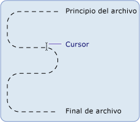

# Fundamentos del sistema de archivos y la E/S de archivos en .NET Framework (Visual Basic)
[!INCLUDE[vs2017banner](../../../../visual-basic/developing-apps/includes/vs2017banner.md)]

Las clases del espacio de nombres <xref:System.IO> se usan para trabajar con unidades, archivos y directorios.  
  
 El espacio de nombres <xref:System.IO> contiene las clases <xref:System.IO.File> y <xref:System.IO.Directory>, que proporcionan la funcionalidad [!INCLUDE[dnprdnshort](../../../../csharp/getting-started/includes/dnprdnshort-md.md)] para manipular archivos y directorios. Dado que los métodos de estos objetos son miembros estáticos o compartidos, podrá usarlos directamente sin crear primero una instancia de la clase. A estas clases están asociadas las clases <xref:System.IO.FileInfo> y <xref:System.IO.DirectoryInfo>, que les resultarán familiares a los usuarios de la característica `My`. Para usar estas clases, debe usar los nombres completos o importar los espacios de nombres adecuados, incluidas las instrucciones `Imports` , al principio del código afectado. Para obtener más información, consulte [Instrucción Imports (Tipo y espacio de nombres de .NET)](../../../../visual-basic/language-reference/statements/imports-statement-net-namespace-and-type.md).  
  
> [!NOTE]
>  Otros temas de esta sección usan el objeto `My.Computer.FileSystem` en lugar de las clases `System.IO` para trabajar con unidades, archivos y directorios. El objeto `My.Computer.FileSystem` está diseñado principalmente para su uso en programas de [!INCLUDE[vbprvb](../../../../csharp/programming-guide/concepts/linq/includes/vbprvb-md.md)]. Las clases `System.IO` están diseñadas para su uso en cualquier lenguaje que admita [!INCLUDE[dnprdnshort](../../../../csharp/getting-started/includes/dnprdnshort-md.md)], incluido [!INCLUDE[vbprvb](../../../../csharp/programming-guide/concepts/linq/includes/vbprvb-md.md)].  
  
## Definición de una secuencia  
 [!INCLUDE[dnprdnshort](../../../../csharp/getting-started/includes/dnprdnshort-md.md)] usa secuencias para que sea posible leer archivos y escribir en ellos. Una secuencia se puede considerar un conjunto unidimensional de datos contiguos con un principio y un fin, en el que el cursor indica la posición actual en la secuencia.  
  
   
  
## Operaciones con secuencias  
 Los datos contenidos en la secuencia pueden proceder de la memoria, de un archivo o de un socket TCP/IP. Las secuencias tienen una serie de operaciones fundamentales que se les pueden aplicar:  
  
-   Lectura. Puede leer de una secuencia transfiriendo los datos desde la secuencia a una estructura de datos, como una matriz de bytes.  
  
-   **Escritura**. Puede escribir en una secuencia transfiriendo datos desde un origen de datos a la secuencia.  
  
-   **Búsqueda**. Puede consultar y modificar su posición en la secuencia.  
  
 Para obtener más información, consulta [Composing Streams](../Topic/Composing%20Streams.md).  
  
## Tipos de secuencias  
 En [!INCLUDE[dnprdnshort](../../../../csharp/getting-started/includes/dnprdnshort-md.md)], una secuencia se representa mediante la clase <xref:System.IO.Stream>, que constituye la clase abstracta para las demás secuencias. No se puede crear directamente una instancia de la clase <xref:System.IO.Stream>, sino que se debe usar una de las clases que implementa.  
  
 Hay muchos tipos de secuencias, pero para trabajar con la entrada/salida (E/S) de archivo, los tipos más importantes son la clase <xref:System.IO.FileStream> (que proporciona una manera de leer archivos y escribir en ellos) y la clase <xref:System.IO.IsolatedStorage.IsolatedStorageFileStream> (que proporciona una manera de crear archivos y directorios en almacenamiento aislado). Existen otras secuencias que se pueden usar al trabajar con E/S de archivo, entre las que se incluyen las siguientes:  
  
-   <xref:System.IO.BufferedStream>  
  
-   <xref:System.Security.Cryptography.CryptoStream>  
  
-   <xref:System.IO.MemoryStream>  
  
-   <xref:System.Net.Sockets.NetworkStream>.  
  
 En la tabla siguiente se enumeran las tareas que se suelen realizar con una secuencia:  
  
|||  
|-|-|  
|Para|Vea|  
|Leer y escribir en un archivo de datos|[Cómo: Leer y escribir en un archivo de datos recién creado](../Topic/How%20to:%20Read%20and%20Write%20to%20a%20Newly%20Created%20Data%20File.md)|  
|Leer texto de un archivo|[Cómo: Leer texto de un archivo](../Topic/How%20to:%20Read%20Text%20from%20a%20File.md)|  
|Escribir texto en un archivo|[Cómo: Escribir texto en un archivo](../Topic/How%20to:%20Write%20Text%20to%20a%20File.md)|  
|Leer caracteres de una cadena|[Cómo: Leer caracteres de una cadena](../Topic/How%20to:%20Read%20Characters%20from%20a%20String.md)|  
|Escribir caracteres en una cadena|[Cómo: Escribir caracteres en una cadena](../Topic/How%20to:%20Write%20Characters%20to%20a%20String.md)|  
|Cifrar datos|[Cifrar datos](../Topic/Encrypting%20Data.md)|  
|Descifrar datos|[Descifrar datos](../Topic/Decrypting%20Data.md)|  
  
## Acceso a archivos y atributos  
 Puede controlar cómo se crean, se abren y se comparten los archivos con las enumeraciones <xref:System.IO.FileAccess>, <xref:System.IO.FileMode> y <xref:System.IO.FileShare>, que contienen las marcas usadas por los constructores de la clase <xref:System.IO.FileStream>. Por ejemplo, cuando se abre o se crea una clase <xref:System.IO.FileStream>, la enumeración <xref:System.IO.FileMode> permite especificar si el archivo se abre para anexarlo, si se crea un archivo en caso de que no exista el archivo especificado, si el archivo se sobrescribe, etc.  
  
 La enumeración <xref:System.IO.FileAttributes> permite la recopilación de información específica del archivo. La enumeración <xref:System.IO.FileAttributes> devuelve los atributos almacenados del archivo, por ejemplo, si está comprimido, cifrado u oculto, o bien si es de solo lectura, un archivo, un directorio, un archivo de sistema o un archivo temporal.  
  
 En la tabla siguiente se enumeran las tareas que implican acceso a archivos y atributos de archivo:  
  
|||  
|-|-|  
|**En**|**Vea**|  
|Abrir y anexar texto a un archivo de registro|[Cómo: Abrir y anexar a un archivo de registro](../Topic/How%20to:%20Open%20and%20Append%20to%20a%20Log%20File.md)|  
|Determinar los atributos de un archivo|<xref:System.IO.FileAttributes>|  
  
## Permisos de archivo  
 Es posible controlar el acceso a archivos y directorios mediante la clase <xref:System.Security.Permissions.FileIOPermission>. Esto puede ser especialmente importante para los desarrolladores que trabajan con formularios Web Forms, que de forma predeterminada se ejecutan en el contexto de una cuenta de usuario local especial denominada ASPNET, creada como parte de las instalaciones de [!INCLUDE[vstecasp](../../../../csharp/language-reference/preprocessor-directives/includes/vstecasp-md.md)] y [!INCLUDE[dnprdnshort](../../../../csharp/getting-started/includes/dnprdnshort-md.md)] . Cuando este tipo de aplicación solicita acceso a un recurso, la cuenta de usuario ASPNET tiene permisos limitados, que pueden impedir que el usuario realice acciones como escribir en un archivo desde una aplicación web. Para obtener más información, consulte [Permisos de seguridad](http://msdn.microsoft.com/es-es/b03757b4-e926-4196-b738-3733ced2bda0) y <xref:System.Security.Permissions.FileIOPermission>.  
  
## Almacenamiento aislado de archivos  
 El almacenamiento aislado es un intento de resolver los problemas creados al trabajar con archivos en los casos en que el usuario o el código carezcan de los permisos necesarios. El almacenamiento aislado asigna a cada usuario un compartimiento de datos, que puede contener uno o más almacenes. Los almacenes se pueden aislar entre sí por usuario y por ensamblado. Solo el usuario y el ensamblado que crearon un almacén tienen acceso a él. Un almacén actúa como un sistema de archivos virtual completo: dentro de un almacén, puede crear y manipular archivos y directorios.  
  
 En la tabla siguiente se enumeran las tareas que suelen estar asociadas con el almacenamiento aislado de archivos.  
  
|||  
|-|-|  
|Para|Vea|  
|Crear un almacenamiento aislado|[Cómo: Obtener los almacenes de almacenamiento aislado](../Topic/How%20to:%20Obtain%20Stores%20for%20Isolated%20Storage.md)|  
|Enumerar almacenamientos aislados|[Cómo: Enumerar los almacenes de almacenamiento aislado](../Topic/How%20to:%20Enumerate%20Stores%20for%20Isolated%20Storage.md)|  
|Eliminar un almacenamiento aislado|[Cómo: Eliminar almacenes de almacenamiento aislado](../Topic/How%20to:%20Delete%20Stores%20in%20Isolated%20Storage.md)|  
|Crear un archivo o directorio en almacenamiento aislado|[Cómo: Crear archivos y directorios en almacenamiento aislado](../Topic/How%20to:%20Create%20Files%20and%20Directories%20in%20Isolated%20Storage.md)|  
|Buscar un archivo en almacenamiento aislado|[Cómo: Buscar archivos y directorios existentes en almacenamiento aislado](../Topic/How%20to:%20Find%20Existing%20Files%20and%20Directories%20in%20Isolated%20Storage.md)|  
|Leer un archivo en almacenamiento aislado o escribir en él|[Cómo: Leer y escribir en archivos en almacenamiento aislado](../Topic/How%20to:%20Read%20and%20Write%20to%20Files%20in%20Isolated%20Storage.md)|  
|Eliminar un archivo o directorio en almacenamiento aislado|[Cómo: Eliminar archivos y directorios en almacenamiento aislado](../Topic/How%20to:%20Delete%20Files%20and%20Directories%20in%20Isolated%20Storage.md)|  
  
## Eventos de archivo  
 El componente <xref:System.IO.FileSystemWatcher> permite ver los cambios en los archivos y los directorios del sistema o en cualquier equipo al que tenga acceso de red. Por ejemplo, si se modifica un archivo, puede enviar una alerta a un usuario para indicarle que se ha realizado un cambio. Cuando se producen cambios, se generan uno o varios eventos que se almacenan en un búfer y se entregan al componente <xref:System.IO.FileSystemWatcher> para su procesamiento.  
  
## Vea también  
 [Crear secuencias](../Topic/Composing%20Streams.md)   
 [E/S de archivos y secuencias](../Topic/File%20and%20Stream%20I-O.md)   
 [E/S de archivos asincrónica](../Topic/Asynchronous%20File%20I-O.md)   
 [Clases utilizadas en el sistema de archivos y la E/S de archivos en .NET Framework (Visual Basic)](../../../../visual-basic/developing-apps/programming/drives-directories-files/classes-used-in-net-framework-file-io-and-the-file-system.md)