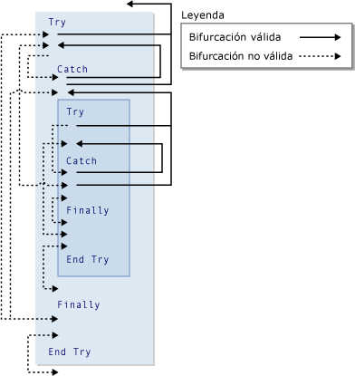

# <a name="goto-statement"></a>GoTo (Instrucción)
Ramas incondicionalmente a una línea especificada en un procedimiento.  
  
## <a name="syntax"></a>Sintaxis  
  
```  
GoTo line  
```  
  
## <a name="part"></a>Parte  
 `line`  
 Obligatorio. Cualquier etiqueta de línea.  
  
## <a name="remarks"></a>Comentarios  
 El `GoTo` instrucción solamente puede bifurcar a líneas en el procedimiento en el que aparece. La línea debe tener una línea en la etiqueta que `GoTo` puede hacer referencia a. Para obtener más información, vea [Cómo: Etiquetar instrucciones](../../../visual-basic/programming-guide/program-structure/how-to-label-statements.md).  
  
> [!NOTE]
>  `GoTo` las instrucciones pueden dificultar la lectura y el mantenimiento del código. Siempre que sea posible, use una estructura de control en su lugar. Para obtener más información, consulte [flujo de Control](../../../visual-basic/programming-guide/language-features/control-flow/index.md).  
  
 No puede usar un `GoTo` instrucción para bifurcar desde fuera de un `For`... `Next`, `For Each`... `Next`, `SyncLock`... `End SyncLock`, `Try`... `Catch`... `Finally`, `With`... `End With`, o `Using`... `End Using` construcción una etiqueta dentro.  
  
## <a name="branching-and-try-constructions"></a>Bifurcación y construcciones Try  
 Dentro de un `Try`... `Catch`... `Finally` construcción, las reglas siguientes se aplican a la bifurcación con la `GoTo` instrucción.  
  
|Bloque o región|Bifurcación en desde fuera de|Bifurcación hacia fuera desde dentro de|  
|---------------------|-------------------------------|-------------------------------|  
|`Try` Bloque|Solo desde un `Catch` bloque de la misma construcción <sup>1</sup>|Solo fuera de la construcción toda|  
|`Catch` Bloque|No permite nunca|Solo fuera de la construcción toda, o la `Try` bloque de la misma construcción <sup>1</sup>|  
|`Finally` Bloque|No permite nunca|No permite nunca|  
  
 <sup>1</sup> si uno `Try`... `Catch`... `Finally` está anidada dentro de otra, una `Catch` bloque puede bifurcar a la `Try` bloquear su propio nivel de anidamiento, pero no en cualquier otro `Try` bloque. Anidada `Try`... `Catch`... `Finally` debe estar contenida completamente en un `Try` o `Catch` bloque de la construcción en el que está anidada.  
  
 La siguiente ilustración muestra una `Try` construcción anidada dentro de otra. Las distintas bifurcaciones entre los bloques de las dos construcciones se indican como válidos o no es válido.  
  
   
Bifurcaciones válidas y no válidas en construcciones Try  
  
## <a name="example"></a>Ejemplo  
 En el ejemplo siguiente se usa el `GoTo` instrucción para bifurcar a etiquetas de línea en un procedimiento.  
  
 [!code-vb[VbVbalrStatements#31](../../../visual-basic/language-reference/error-messages/codesnippet/VisualBasic/goto-statement_1.vb)]  
  
## <a name="see-also"></a>Vea también
- [Do...Loop (instrucción)](../../../visual-basic/language-reference/statements/do-loop-statement.md)
- [For...Next (instrucción)](../../../visual-basic/language-reference/statements/for-next-statement.md)
- [For Each...Next (instrucción)](../../../visual-basic/language-reference/statements/for-each-next-statement.md)
- [If...Then...Else (instrucción)](../../../visual-basic/language-reference/statements/if-then-else-statement.md)
- [Select...Case (instrucción)](../../../visual-basic/language-reference/statements/select-case-statement.md)
- [Try...Catch...Finally (instrucción)](../../../visual-basic/language-reference/statements/try-catch-finally-statement.md)
- [While...End While (instrucción)](../../../visual-basic/language-reference/statements/while-end-while-statement.md)
- [With...End With (instrucción)](../../../visual-basic/language-reference/statements/with-end-with-statement.md)
