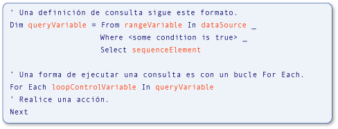

# <a name="type-relationships-in-query-operations-visual-basic"></a><span data-ttu-id="d4a63-102">Relaciones entre tipos en operaciones de consulta (Visual Basic)</span><span class="sxs-lookup"><span data-stu-id="d4a63-102">Type Relationships in Query Operations (Visual Basic)</span></span>
<span data-ttu-id="d4a63-103">Las variables utilizadas en [!INCLUDE[vbteclinqext](~/includes/vbteclinqext-md.md)] consulta operaciones están fuertemente tipadas y deben ser compatibles entre sí.</span><span class="sxs-lookup"><span data-stu-id="d4a63-103">Variables used in [!INCLUDE[vbteclinqext](~/includes/vbteclinqext-md.md)] query operations are strongly typed and must be compatible with each other.</span></span> <span data-ttu-id="d4a63-104">Establecimiento inflexible de tipos se usa en el origen de datos, en la propia consulta y en la ejecución de la consulta.</span><span class="sxs-lookup"><span data-stu-id="d4a63-104">Strong typing is used in the data source, in the query itself, and in the query execution.</span></span> <span data-ttu-id="d4a63-105">La ilustración siguiente identifica los términos que se usan para describir un [!INCLUDE[vbteclinq](~/includes/vbteclinq-md.md)] consulta.</span><span class="sxs-lookup"><span data-stu-id="d4a63-105">The following illustration identifies terms used to describe a [!INCLUDE[vbteclinq](~/includes/vbteclinq-md.md)] query.</span></span> <span data-ttu-id="d4a63-106">Para obtener más información acerca de las partes de una consulta, vea [operaciones básicas de consulta (Visual Basic)](../../../../visual-basic/programming-guide/concepts/linq/basic-query-operations.md).</span><span class="sxs-lookup"><span data-stu-id="d4a63-106">For more information about the parts of a query, see [Basic Query Operations (Visual Basic)](../../../../visual-basic/programming-guide/concepts/linq/basic-query-operations.md).</span></span>  
  
 <span data-ttu-id="d4a63-107">![Consulta de pseudocódigo con elementos resaltados. ] (../../../../visual-basic/programming-guide/concepts/linq/media/sjltyperels.png "SJLtypeRels")</span><span class="sxs-lookup"><span data-stu-id="d4a63-107"></span></span>  
<span data-ttu-id="d4a63-108">Partes de una consulta LINQ</span><span class="sxs-lookup"><span data-stu-id="d4a63-108">Parts of a LINQ query</span></span>  
  
 <span data-ttu-id="d4a63-109">El tipo de la variable de rango en la consulta debe ser compatible con el tipo de los elementos del origen de datos.</span><span class="sxs-lookup"><span data-stu-id="d4a63-109">The type of the range variable in the query must be compatible with the type of the elements in the data source.</span></span> <span data-ttu-id="d4a63-110">El tipo de la variable de consulta debe ser compatible con el elemento de secuencia definido en el `Select` cláusula.</span><span class="sxs-lookup"><span data-stu-id="d4a63-110">The type of the query variable must be compatible with the sequence element defined in the `Select` clause.</span></span> <span data-ttu-id="d4a63-111">Por último, el tipo de los elementos de secuencia también debe ser compatible con el tipo de la variable de control de bucle que se utiliza en el `For Each` instrucción que ejecuta la consulta.</span><span class="sxs-lookup"><span data-stu-id="d4a63-111">Finally, the type of the sequence elements also must be compatible with the type of the loop control variable that is used in the `For Each` statement that executes the query.</span></span> <span data-ttu-id="d4a63-112">Este establecimiento inflexible de tipos facilita la identificación de los errores de tipo en tiempo de compilación.</span><span class="sxs-lookup"><span data-stu-id="d4a63-112">This strong typing facilitates identification of type errors at compile time.</span></span>  
  
 <span data-ttu-id="d4a63-113">Visual Basic, establecimiento inflexible de tipos fácil implementando la inferencia de tipo local, también conocido como *tipos implícitos*.</span><span class="sxs-lookup"><span data-stu-id="d4a63-113">Visual Basic makes strong typing convenient by implementing local type inference, also known as *implicit typing*.</span></span> <span data-ttu-id="d4a63-114">Que se usa la característica en el ejemplo anterior y verá que se utilizan a lo largo del [!INCLUDE[vbteclinq](~/includes/vbteclinq-md.md)] documentación y ejemplos.</span><span class="sxs-lookup"><span data-stu-id="d4a63-114">That feature is used in the previous example, and you will see it used throughout the [!INCLUDE[vbteclinq](~/includes/vbteclinq-md.md)] samples and documentation.</span></span> <span data-ttu-id="d4a63-115">En Visual Basic, la inferencia de tipo local se logra simplemente mediante un `Dim` instrucción sin un `As` cláusula.</span><span class="sxs-lookup"><span data-stu-id="d4a63-115">In Visual Basic, local type inference is accomplished simply by using a `Dim` statement without an `As` clause.</span></span> <span data-ttu-id="d4a63-116">En el ejemplo siguiente, `city` está fuertemente tipado como una cadena.</span><span class="sxs-lookup"><span data-stu-id="d4a63-116">In the following example, `city` is strongly typed as a string.</span></span>  
  
 [!code-vb[VbLINQTypeRels#1](../../../../visual-basic/programming-guide/concepts/linq/codesnippet/VisualBasic/type-relationships-in-query-operations_1.vb)]  
  
> [!NOTE]
>  <span data-ttu-id="d4a63-117">Inferencia de tipo local sólo funcionará cuando `Option Infer` está establecido en `On`.</span><span class="sxs-lookup"><span data-stu-id="d4a63-117">Local type inference works only when `Option Infer` is set to `On`.</span></span> <span data-ttu-id="d4a63-118">Para obtener más información, consulte [Option Infer instrucción](../../../../visual-basic/language-reference/statements/option-infer-statement.md).</span><span class="sxs-lookup"><span data-stu-id="d4a63-118">For more information, see [Option Infer Statement](../../../../visual-basic/language-reference/statements/option-infer-statement.md).</span></span>  
  
 <span data-ttu-id="d4a63-119">Sin embargo, incluso si utiliza la inferencia de tipo local en una consulta, las mismas relaciones de tipo están presentes entre las variables en el origen de datos, la variable de consulta y el bucle de ejecución de consulta.</span><span class="sxs-lookup"><span data-stu-id="d4a63-119">However, even if you use local type inference in a query, the same type relationships are present among the variables in the data source, the query variable, and the query execution loop.</span></span> <span data-ttu-id="d4a63-120">Resulta útil tener un conocimiento básico de estas relaciones de tipo cuando se escribe [!INCLUDE[vbteclinq](~/includes/vbteclinq-md.md)] consultas o trabajar con los ejemplos y ejemplos de código en la documentación.</span><span class="sxs-lookup"><span data-stu-id="d4a63-120">It is useful to have a basic understanding of these type relationships when you are writing [!INCLUDE[vbteclinq](~/includes/vbteclinq-md.md)] queries, or working with the samples and code examples in the documentation.</span></span>  
  
 <span data-ttu-id="d4a63-121">Debe especificar un tipo explícito para una variable de rango que no coincide con el tipo devuelto desde el origen de datos.</span><span class="sxs-lookup"><span data-stu-id="d4a63-121">You may need to specify an explicit type for a range variable that does not match the type returned from the data source.</span></span> <span data-ttu-id="d4a63-122">Puede especificar el tipo de la variable de rango mediante una `As` cláusula.</span><span class="sxs-lookup"><span data-stu-id="d4a63-122">You can specify the type of the range variable by using an `As` clause.</span></span> <span data-ttu-id="d4a63-123">Sin embargo, esto provoca un error si la conversión es un [conversión de restricción](../../../../visual-basic/programming-guide/language-features/data-types/widening-and-narrowing-conversions.md) y `Option Strict` está establecido en `On`.</span><span class="sxs-lookup"><span data-stu-id="d4a63-123">However, this results in an error if the conversion is a [narrowing conversion](../../../../visual-basic/programming-guide/language-features/data-types/widening-and-narrowing-conversions.md) and `Option Strict` is set to `On`.</span></span> <span data-ttu-id="d4a63-124">Por lo tanto, se recomienda realizar la conversión en los valores recuperados del origen de datos.</span><span class="sxs-lookup"><span data-stu-id="d4a63-124">Therefore, we recommend that you perform the conversion on the values retrieved from the data source.</span></span> <span data-ttu-id="d4a63-125">Puede convertir los valores del origen de datos para el tipo de variable de rango explícito mediante el <xref:System.Linq.Enumerable.Cast%2A> método.</span><span class="sxs-lookup"><span data-stu-id="d4a63-125">You can convert the values from the data source to the explicit range variable type by using the <xref:System.Linq.Enumerable.Cast%2A> method.</span></span> <span data-ttu-id="d4a63-126">También puede convertir los valores seleccionados en el `Select` cláusula para un tipo explícito que sea diferente del tipo de la variable de rango.</span><span class="sxs-lookup"><span data-stu-id="d4a63-126">You can also cast the values selected in the `Select` clause to an explicit type that is different from the type of the range variable.</span></span> <span data-ttu-id="d4a63-127">Estos puntos se reflejan en el código siguiente.</span><span class="sxs-lookup"><span data-stu-id="d4a63-127">These points are illustrated in the following code.</span></span>  
  
 [!code-vb[VbLINQTypeRels#4](../../../../visual-basic/programming-guide/concepts/linq/codesnippet/VisualBasic/type-relationships-in-query-operations_2.vb)]  
  
## <a name="queries-that-return-entire-elements-of-the-source-data"></a><span data-ttu-id="d4a63-128">Consultas que devuelven elementos completos de los datos de origen</span><span class="sxs-lookup"><span data-stu-id="d4a63-128">Queries That Return Entire Elements of the Source Data</span></span>  
 <span data-ttu-id="d4a63-129">El ejemplo siguiente muestra un [!INCLUDE[vbteclinq](~/includes/vbteclinq-md.md)] operación que devuelve una secuencia de elementos seleccionados del origen de datos de consulta.</span><span class="sxs-lookup"><span data-stu-id="d4a63-129">The following example shows a [!INCLUDE[vbteclinq](~/includes/vbteclinq-md.md)] query operation that returns a sequence of elements selected from the source data.</span></span> <span data-ttu-id="d4a63-130">El origen, `names`, contiene una matriz de cadenas, y el resultado de la consulta es una secuencia que contiene las cadenas que empiecen por la letra M.</span><span class="sxs-lookup"><span data-stu-id="d4a63-130">The source, `names`, contains an array of strings, and the query output is a sequence containing strings that start with the letter M.</span></span>  
  
 [!code-vb[VbLINQTypeRels#2](../../../../visual-basic/programming-guide/concepts/linq/codesnippet/VisualBasic/type-relationships-in-query-operations_3.vb)]  
  
 <span data-ttu-id="d4a63-131">Esto es equivalente al código siguiente, pero es mucho más cortos y fáciles de escribir.</span><span class="sxs-lookup"><span data-stu-id="d4a63-131">This is equivalent to the following code, but is much shorter and easier to write.</span></span> <span data-ttu-id="d4a63-132">Dependencia de la inferencia de tipo local en las consultas es el estilo preferido en Visual Basic.</span><span class="sxs-lookup"><span data-stu-id="d4a63-132">Reliance on local type inference in queries is the preferred style in Visual Basic.</span></span>  
  
 [!code-vb[VbLINQTypeRels#3](../../../../visual-basic/programming-guide/concepts/linq/codesnippet/VisualBasic/type-relationships-in-query-operations_4.vb)]  
  
 <span data-ttu-id="d4a63-133">Las siguientes relaciones existen en ambos de los ejemplos de código anterior, si se determinan los tipos de forma implícita o explícita.</span><span class="sxs-lookup"><span data-stu-id="d4a63-133">The following relationships exist in both of the previous code examples, whether the types are determined implicitly or explicitly.</span></span>  
  
1.  <span data-ttu-id="d4a63-134">El tipo de los elementos del origen de datos, `names`, es el tipo de la variable de rango, `name`, en la consulta.</span><span class="sxs-lookup"><span data-stu-id="d4a63-134">The type of the elements in the data source, `names`, is the type of the range variable, `name`, in the query.</span></span>  
  
2.  <span data-ttu-id="d4a63-135">El tipo del objeto que se selecciona, `name`, determina el tipo de la variable de consulta, `mNames`.</span><span class="sxs-lookup"><span data-stu-id="d4a63-135">The type of the object that is selected, `name`, determines the type of the query variable, `mNames`.</span></span> <span data-ttu-id="d4a63-136">Aquí `name` es una cadena, por lo que la variable de consulta es IEnumerable (Of String) en Visual Basic.</span><span class="sxs-lookup"><span data-stu-id="d4a63-136">Here `name` is a string, so the query variable is IEnumerable(Of String) in Visual Basic.</span></span>  
  
3.  <span data-ttu-id="d4a63-137">La consulta definida en `mNames` se ejecuta en el `For Each` bucle.</span><span class="sxs-lookup"><span data-stu-id="d4a63-137">The query defined in `mNames` is executed in the `For Each` loop.</span></span> <span data-ttu-id="d4a63-138">El bucle recorre en iteración el resultado de ejecutar la consulta.</span><span class="sxs-lookup"><span data-stu-id="d4a63-138">The loop iterates over the result of executing the query.</span></span> <span data-ttu-id="d4a63-139">Dado que `mNames`, cuando se ejecuta, devuelve una secuencia de cadenas, la variable de iteración del bucle, `nm`, también es una cadena.</span><span class="sxs-lookup"><span data-stu-id="d4a63-139">Because `mNames`, when it is executed, will return a sequence of strings, the loop iteration variable, `nm`, also is a string.</span></span>  
  
## <a name="queries-that-return-one-field-from-selected-elements"></a><span data-ttu-id="d4a63-140">Consultas que devuelven un campo de elementos seleccionados</span><span class="sxs-lookup"><span data-stu-id="d4a63-140">Queries That Return One Field from Selected Elements</span></span>  
 <span data-ttu-id="d4a63-141">El ejemplo siguiente muestra un [!INCLUDE[vbtecdlinq](~/includes/vbtecdlinq-md.md)] operación que devuelve una secuencia que contiene solo una parte de cada elemento seleccionado en el origen de datos de consulta.</span><span class="sxs-lookup"><span data-stu-id="d4a63-141">The following example shows a [!INCLUDE[vbtecdlinq](~/includes/vbtecdlinq-md.md)] query operation that returns a sequence containing only one part of each element selected from the data source.</span></span> <span data-ttu-id="d4a63-142">La consulta toma una colección de `Customer` objetos como origen de datos y solo para proyectos de la `Name` propiedad en el resultado.</span><span class="sxs-lookup"><span data-stu-id="d4a63-142">The query takes a collection of `Customer` objects as its data source and projects only the `Name` property in the result.</span></span> <span data-ttu-id="d4a63-143">Dado que el nombre del cliente es una cadena, la consulta genera una secuencia de cadenas como salida.</span><span class="sxs-lookup"><span data-stu-id="d4a63-143">Because the customer name is a string, the query produces a sequence of strings as output.</span></span>  
  
```vb  
' Method GetTable returns a table of Customer objects.  
Dim customers = db.GetTable(Of Customer)()  
Dim custNames = From cust In customers   
                Where cust.City = "London"   
                Select cust.Name  
  
For Each custName In custNames  
    Console.WriteLine(custName)  
Next  
```  
  
 <span data-ttu-id="d4a63-144">Las relaciones entre las variables son similares a las del ejemplo más sencillo.</span><span class="sxs-lookup"><span data-stu-id="d4a63-144">The relationships between variables are like those in the simpler example.</span></span>  
  
1.  <span data-ttu-id="d4a63-145">El tipo de los elementos del origen de datos, `customers`, es el tipo de la variable de rango, `cust`, en la consulta.</span><span class="sxs-lookup"><span data-stu-id="d4a63-145">The type of the elements in the data source, `customers`, is the type of the range variable, `cust`, in the query.</span></span> <span data-ttu-id="d4a63-146">En este ejemplo, que es de tipo `Customer`.</span><span class="sxs-lookup"><span data-stu-id="d4a63-146">In this example, that type is `Customer`.</span></span>  
  
2.  <span data-ttu-id="d4a63-147">El `Select` instrucción devuelve el `Name` propiedad de cada `Customer` objeto en lugar de todo el objeto.</span><span class="sxs-lookup"><span data-stu-id="d4a63-147">The `Select` statement returns the `Name` property of each `Customer` object instead of the whole object.</span></span> <span data-ttu-id="d4a63-148">Dado que `Name` es una cadena, la variable de consulta, `custNames`, volverá a estar IEnumerable (Of String), no de `Customer`.</span><span class="sxs-lookup"><span data-stu-id="d4a63-148">Because `Name` is a string, the query variable, `custNames`, will again be IEnumerable(Of String), not of `Customer`.</span></span>  
  
3.  <span data-ttu-id="d4a63-149">Dado que `custNames` representa una secuencia de cadenas, la `For Each` variable de iteración del bucle, `custName`, debe ser una cadena.</span><span class="sxs-lookup"><span data-stu-id="d4a63-149">Because `custNames` represents a sequence of strings, the `For Each` loop's iteration variable, `custName`, must be a string.</span></span>  
  
 <span data-ttu-id="d4a63-150">Sin la inferencia de tipo local, el ejemplo anterior sería más difícil de escribir y comprender, como se muestra en el ejemplo siguiente.</span><span class="sxs-lookup"><span data-stu-id="d4a63-150">Without local type inference, the previous example would be more cumbersome to write and to understand, as the following example shows.</span></span>  
  
```vb  
' Method GetTable returns a table of Customer objects.  
 Dim customers As Table(Of Customer) = db.GetTable(Of Customer)()  
 Dim custNames As IEnumerable(Of String) =  
     From cust As Customer In customers   
     Where cust.City = "London"   
     Select cust.Name  
  
 For Each custName As String In custNames  
     Console.WriteLine(custName)  
 Next  
```  
  
## <a name="queries-that-require-anonymous-types"></a><span data-ttu-id="d4a63-151">Consultas que requieren tipos anónimos</span><span class="sxs-lookup"><span data-stu-id="d4a63-151">Queries That Require Anonymous Types</span></span>  
 <span data-ttu-id="d4a63-152">En el ejemplo siguiente se muestra una situación más compleja.</span><span class="sxs-lookup"><span data-stu-id="d4a63-152">The following example shows a more complex situation.</span></span> <span data-ttu-id="d4a63-153">En el ejemplo anterior, es conveniente especificar explícitamente los tipos de todas las variables.</span><span class="sxs-lookup"><span data-stu-id="d4a63-153">In the previous example, it was inconvenient to specify types for all the variables explicitly.</span></span> <span data-ttu-id="d4a63-154">En este ejemplo, es imposible.</span><span class="sxs-lookup"><span data-stu-id="d4a63-154">In this example, it is impossible.</span></span> <span data-ttu-id="d4a63-155">En lugar de seleccionar todo `Customer` elementos desde el origen de datos o un campo único de cada elemento, el `Select` cláusula en esta consulta devuelve dos propiedades de la versión original `Customer` objeto: `Name` y `City`.</span><span class="sxs-lookup"><span data-stu-id="d4a63-155">Instead of selecting entire `Customer` elements from the data source, or a single field from each element, the `Select` clause in this query returns two properties of the original `Customer` object: `Name` and `City`.</span></span> <span data-ttu-id="d4a63-156">En respuesta a la `Select` cláusula, el compilador define un tipo anónimo que contiene esas dos propiedades.</span><span class="sxs-lookup"><span data-stu-id="d4a63-156">In response to the `Select` clause, the compiler defines an anonymous type that contains those two properties.</span></span> <span data-ttu-id="d4a63-157">El resultado de ejecutar `nameCityQuery` en el `For Each` bucle es una colección de instancias del nuevo tipo anónimo.</span><span class="sxs-lookup"><span data-stu-id="d4a63-157">The result of executing `nameCityQuery` in the `For Each` loop is a collection of instances of the new anonymous type.</span></span> <span data-ttu-id="d4a63-158">Dado que el tipo anónimo no tiene ningún nombre utilizable, no se puede especificar el tipo de `nameCityQuery` o `custInfo` explícitamente.</span><span class="sxs-lookup"><span data-stu-id="d4a63-158">Because the anonymous type has no usable name, you cannot specify the type of `nameCityQuery` or `custInfo` explicitly.</span></span> <span data-ttu-id="d4a63-159">Es decir, con un tipo anónimo, no tiene ningún nombre de tipo que se utilizará en lugar de `String` en `IEnumerable(Of String)`.</span><span class="sxs-lookup"><span data-stu-id="d4a63-159">That is, with an anonymous type, you have no type name to use in place of `String` in `IEnumerable(Of String)`.</span></span> <span data-ttu-id="d4a63-160">Para más información, vea [Tipos anónimos](../../../../visual-basic/programming-guide/language-features/objects-and-classes/anonymous-types.md).</span><span class="sxs-lookup"><span data-stu-id="d4a63-160">For more information, see [Anonymous Types](../../../../visual-basic/programming-guide/language-features/objects-and-classes/anonymous-types.md).</span></span>  
  
```vb  
' Method GetTable returns a table of Customer objects.  
Dim customers = db.GetTable(Of Customer)()  
Dim nameCityQuery = From cust In customers   
                    Where cust.City = "London"   
                    Select cust.Name, cust.City  
  
For Each custInfo In nameCityQuery  
    Console.WriteLine(custInfo.Name)  
Next  
```  
  
 <span data-ttu-id="d4a63-161">Aunque no es posible especificar tipos para todas las variables en el ejemplo anterior, las relaciones siguen siendo los mismos.</span><span class="sxs-lookup"><span data-stu-id="d4a63-161">Although it is not possible to specify types for all the variables in the previous example, the relationships remain the same.</span></span>  
  
1.  <span data-ttu-id="d4a63-162">El tipo de los elementos del origen de datos nuevo es el tipo de la variable de rango en la consulta.</span><span class="sxs-lookup"><span data-stu-id="d4a63-162">The type of the elements in the data source is again the type of the range variable in the query.</span></span> <span data-ttu-id="d4a63-163">En este ejemplo, `cust` es una instancia de `Customer`.</span><span class="sxs-lookup"><span data-stu-id="d4a63-163">In this example, `cust` is an instance of `Customer`.</span></span>  
  
2.  <span data-ttu-id="d4a63-164">Dado que la `Select` instrucción genera un tipo anónimo, la variable de consulta, `nameCityQuery`, debe escribirse de forma implícita como un tipo anónimo.</span><span class="sxs-lookup"><span data-stu-id="d4a63-164">Because the `Select` statement produces an anonymous type, the query variable, `nameCityQuery`, must be implicitly typed as an anonymous type.</span></span> <span data-ttu-id="d4a63-165">Un tipo anónimo no tiene ningún nombre utilizable y, por tanto, no se puede especificar explícitamente.</span><span class="sxs-lookup"><span data-stu-id="d4a63-165">An anonymous type has no usable name, and therefore cannot be specified explicitly.</span></span>  
  
3.  <span data-ttu-id="d4a63-166">El tipo de la variable de iteración en la `For Each` bucle es el tipo anónimo creado en el paso 2.</span><span class="sxs-lookup"><span data-stu-id="d4a63-166">The type of the iteration variable in the `For Each` loop is the anonymous type created in step 2.</span></span> <span data-ttu-id="d4a63-167">Dado que el tipo no tiene ningún nombre utilizable, el tipo de la variable de iteración del bucle debe determinarse implícitamente.</span><span class="sxs-lookup"><span data-stu-id="d4a63-167">Because the type has no usable name, the type of the loop iteration variable must be determined implicitly.</span></span>  
  
## <a name="see-also"></a><span data-ttu-id="d4a63-168">Vea también</span><span class="sxs-lookup"><span data-stu-id="d4a63-168">See Also</span></span>  
 [<span data-ttu-id="d4a63-169">Introducción a LINQ en Visual Basic</span><span class="sxs-lookup"><span data-stu-id="d4a63-169">Getting Started with LINQ in Visual Basic</span></span>](../../../../visual-basic/programming-guide/concepts/linq/getting-started-with-linq.md)  
 [<span data-ttu-id="d4a63-170">Tipos anónimos</span><span class="sxs-lookup"><span data-stu-id="d4a63-170">Anonymous Types</span></span>](../../../../visual-basic/programming-guide/language-features/objects-and-classes/anonymous-types.md)  
 [<span data-ttu-id="d4a63-171">Inferencia de tipo de variable local</span><span class="sxs-lookup"><span data-stu-id="d4a63-171">Local Type Inference</span></span>](../../../../visual-basic/programming-guide/language-features/variables/local-type-inference.md)  
 [<span data-ttu-id="d4a63-172">Introducción a LINQ en Visual Basic</span><span class="sxs-lookup"><span data-stu-id="d4a63-172">Introduction to LINQ in Visual Basic</span></span>](../../../../visual-basic/programming-guide/language-features/linq/introduction-to-linq.md)  
 [<span data-ttu-id="d4a63-173">LINQ</span><span class="sxs-lookup"><span data-stu-id="d4a63-173">LINQ</span></span>](../../../../visual-basic/programming-guide/language-features/linq/index.md)  
 [<span data-ttu-id="d4a63-174">Consultas</span><span class="sxs-lookup"><span data-stu-id="d4a63-174">Queries</span></span>](../../../../visual-basic/language-reference/queries/queries.md)
