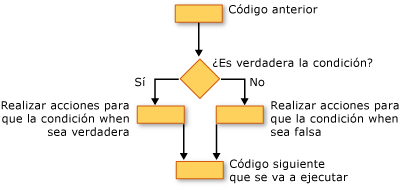

# Estructuras de decisión (Visual Basic)Decision Structures (Visual Basic)
Visual Basic permite probar condiciones y realizar diferentes operaciones en función de los resultados de esa prueba.Visual Basic lets you test conditions and perform different operations depending on the results of that test. Puede probar si una condición es true o false para distintos valores de una expresión o varias excepciones que se genera cuando se ejecuta una serie de instrucciones.You can test for a condition being true or false, for various values of an expression, or for various exceptions generated when you execute a series of statements.  
  
 En la siguiente ilustración muestra una estructura de decisión que comprueba una condición es true y realiza acciones diferentes dependiendo de si es true o false.The following illustration shows a decision structure that tests for a condition being true and takes different actions depending on whether it is true or false.  
  
   
Emprender acciones diferentes cuando una condición es true y cuando es falseTaking different actions when a condition is true and when it is false  
  
## If... Then... Construcción elseIf...Then...Else Construction  
 `If...Then...Else` construcciones le permiten probar una o más condiciones y ejecutar una o varias instrucciones según cada condición.`If...Then...Else` constructions let you test for one or more conditions and run one or more statements depending on each condition. Puede probar las condiciones y realizar acciones en las siguientes maneras:You can test conditions and take actions in the following ways:  
  
-   Ejecutar una o más instrucciones si una condición es `True`Run one or more statements if a condition is `True`  
  
-   Ejecutar una o más instrucciones si una condición es `False`Run one or more statements if a condition is `False`  
  
-   Ejecutar algunas instrucciones si una condición es `True` y otras personas si `False`Run some statements if a condition is `True` and others if it is `False`  
  
-   Probar una condición adicional si es un requisito previo `False`Test an additional condition if a prior condition is `False`  
  
 La estructura de control que proporciona todas estas posibilidades es la [si... Then... Else (instrucción)](../../../../visual-basic/language-reference/statements/if-then-else-statement.md).The control structure that offers all these possibilities is the [If...Then...Else Statement](../../../../visual-basic/language-reference/statements/if-then-else-statement.md). Puede usar una versión de línea si tiene simplemente una comprobación y una instrucción que se ejecutará.You can use a single-line version if you have just one test and one statement to run. Si tiene un conjunto más complejo de condiciones y acciones, puede usar la versión de varias líneas.If you have a more complex set of conditions and actions, you can use the multiple-line version.  
  
## Seleccione... Construcción de mayúsculasSelect...Case Construction  
 El `Select...Case` construcción permite evaluar una expresión una vez y ejecutar distintos conjuntos de instrucciones basados en diferentes valores posibles.The `Select...Case` construction lets you evaluate an expression one time and run different sets of statements based on different possible values. Para obtener más información, vea [seleccione... Caso instrucción](../../../../visual-basic/language-reference/statements/select-case-statement.md).For more information, see [Select...Case Statement](../../../../visual-basic/language-reference/statements/select-case-statement.md).  
  
## Try... Catch... Por último, construcciónTry...Catch...Finally Construction  
 `Try...Catch...Finally` construcciones permiten ejecutar un conjunto de instrucciones en un entorno que conserva el control si cualquiera de las instrucciones provoca una excepción.`Try...Catch...Finally` constructions let you run a set of statements under an environment that retains control if any one of your statements causes an exception. Puede realizar acciones diferentes para diferentes excepciones.You can take different actions for different exceptions. También puede especificar un bloque de código que se ejecuta antes de salir de todo el `Try...Catch...Finally` construcción, independientemente de lo que ocurre.You can optionally specify a block of code that runs before you exit the whole `Try...Catch...Finally` construction, regardless of what occurs. Para obtener más información, vea [Try...Catch...Finally Statement](../../../../visual-basic/language-reference/statements/try-catch-finally-statement.md) (Try...Catch...Finally [Instrucción, Visual Basic]).For more information, see [Try...Catch...Finally Statement](../../../../visual-basic/language-reference/statements/try-catch-finally-statement.md).  
  
> [!NOTE]
>  Para muchas de las estructuras de control, al hacer clic en una palabra clave, se resaltan todas las palabras clave en la estructura.For many control structures, when you click a keyword, all of the keywords in the structure are highlighted. Por ejemplo, al hacer clic en `If` en un `If...Then...Else` construcción, todas las instancias de `If`, `Then`, `ElseIf`, `Else`, y `End If` se resaltan en la construcción.For instance, when you click `If` in an `If...Then...Else` construction, all instances of `If`, `Then`, `ElseIf`, `Else`, and `End If` in the construction are highlighted. Para mover a la palabra clave resaltada siguiente o anterior, presione CTRL + MAYÚS + flecha abajo o CTRL + MAYÚS + flecha arriba.To move to the next or previous highlighted keyword, press CTRL+SHIFT+DOWN ARROW or CTRL+SHIFT+UP ARROW.  
  
## Vea tambiénSee Also  
 [Flujo de controlControl Flow](../../../../visual-basic/programming-guide/language-features/control-flow/index.md)  
 [Estructuras de bucleLoop Structures](../../../../visual-basic/programming-guide/language-features/control-flow/loop-structures.md)  
 [Estructuras de control adicionalesOther Control Structures](../../../../visual-basic/programming-guide/language-features/control-flow/other-control-structures.md)  
 [Estructuras de control anidadasNested Control Structures](../../../../visual-basic/programming-guide/language-features/control-flow/nested-control-structures.md)  
 [If (operador)If Operator](../../../../visual-basic/language-reference/operators/if-operator.md)
