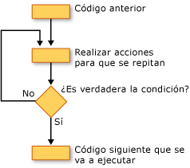

# Estructuras de bucles (Visual Basic)
[!INCLUDE[vbprvb](../../../../csharp/programming-guide/concepts/linq/includes/vbprvb_md.md)]estructuras de bucles permiten ejecutar una o más líneas de código repetidamente. Puede repetir las instrucciones en una estructura de bucle hasta que una condición `True`, hasta que una condición es `False`, especifica el número de veces o una vez para cada elemento de una colección.  
  
 La ilustración siguiente muestra una estructura de bucle que ejecuta un conjunto de instrucciones hasta que una condición sea true.  
  
   
Ejecución de un conjunto de instrucciones hasta que una condición sea true  
  
## Bucles while  
 The `While`... `End While` construcción ejecuta un conjunto de instrucciones mientras la condición especificada en el `While` instrucción es `True`. Para obtener más información, consulte [mientras... End While (instrucción)](../../../../visual-basic/language-reference/statements/while-end-while-statement.md).  
  
## Bucles Do  
 The `Do`... `Loop` le permite probar una condición al principio o al final de una estructura de bucle. También puede especificar si se repite el bucle mientras la condición permanezca `True` o hasta que se convierte en `True`. Para obtener más información, consulte [hacer... Instrucción de bucle](../../../../visual-basic/language-reference/statements/do-loop-statement.md).  
  
## For (bucles)  
 The `For`... `Next` construcción realiza el bucle un número determinado de veces. Utiliza una variable de control de bucle, también se denomina un *contador*, realizar un seguimiento de las repeticiones. Especificar los valores iniciales y finales de este contador y, opcionalmente, puede especificar la cantidad que incrementa de una repetición a la siguiente. Para obtener más información, consulte [para... Next (instrucción)](../../../../visual-basic/language-reference/statements/for-next-statement.md).  
  
## Bucles For Each  
 The `For Each`... `Next` construcción ejecuta un conjunto de instrucciones una vez por cada elemento de una colección. Especifique la variable de control de bucle, pero no es necesario determinar inicial o final de los valores para el mismo. Para obtener más información, consulte [For Each... Next (instrucción)](../../../../visual-basic/language-reference/statements/for-each-next-statement.md).  
  
## Vea también  
 [Flujo de control](../../../../visual-basic/programming-guide/language-features/control-flow/index.md)   
 [Estructuras de decisión](../../../../visual-basic/programming-guide/language-features/control-flow/decision-structures.md)   
 [Otras estructuras de Control](../../../../visual-basic/programming-guide/language-features/control-flow/other-control-structures.md)   
 [Estructuras de control anidadas](../../../../visual-basic/programming-guide/language-features/control-flow/nested-control-structures.md)
