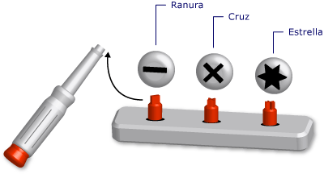

# Tipos gen&#233;ricos en Visual Basic (Visual Basic)
[!INCLUDE[vs2017banner](../../../../csharp/includes/vs2017banner.md)]

Un *tipo genérico* es un elemento de programación único que se adapta para ejecutar la misma funcionalidad para distintos tipos de datos. Cuando se define una clase o un procedimiento genérico, no es necesario definir una versión independiente para cada tipo de datos para el que quiera ejecutar esa funcionalidad.  
  
 Una analogía es un juego de destornilladores con puntas extraíbles. Inspeccione el tornillo que quiere roscar y seleccione la punta adecuada \(plana, de cruz o de estrella\). Una vez insertada la punta correcta en el mango del destornillador, realiza la misma función exacta con el destornillador, es decir, roscar el tornillo.  
  
   
Juego de destornilladores como herramienta genérica  
  
 Al definir un tipo genérico, lo puede parametrizar con uno o más tipos de datos. Esto permite que el código que los usa se adapte los tipos de datos a sus requisitos. Su código puede declarar varios elementos de programación diferentes a partir del elemento genérico y cada uno de ellos actúa en un conjunto distinto de tipos de datos. Pero todos los elementos declarados funcionan con la misma lógica, independientemente de los tipos de datos que usen.  
  
 Por ejemplo, puede que quiera crear y usar una clase de cola que funcione en un tipo de datos concreto, como `String`. Puede declarar esta clase desde <xref:System.Collections.Generic.Queue%601?displayProperty=fullName>, como se muestra en el ejemplo siguiente.  
  
 [!code-vb[VbVbalrDataTypes#1](../../../../visual-basic/language-reference/data-types/codesnippet/VisualBasic/generic-types_1.vb)]  
  
 Ahora puede usar `stringQ` para trabajar exclusivamente con valores `String`. Dado que `stringQ` es específico de `String` en lugar de generalizarse para los valores `Object`, no dispone de enlace en tiempo de ejecución ni conversión de tipos. Esto ahorra tiempo de ejecución y reduce los errores de tiempo de ejecución.  
  
 Para obtener más información sobre el uso de un tipo genérico, vea [Cómo: Utilizar una clase genérica](../../../../visual-basic/programming-guide/language-features/data-types/how-to-use-a-generic-class.md).  
  
## Ejemplo de una clase genérica  
 En el ejemplo siguiente se muestra un esquema de definición de una clase genérica.  
  
 [!code-vb[VbVbalrDataTypes#2](../../../../visual-basic/language-reference/data-types/codesnippet/VisualBasic/generic-types_2.vb)]  
  
 En el esquema anterior, `t` es un *parámetro de tipo*, es decir, un marcador de posición para un tipo de datos proporcionado al declarar la clase. En otro lugar del código, puede declarar distintas versiones de `classHolder` proporcionando diversos tipos de datos para `t`. En el ejemplo siguiente se muestran dos declaraciones de este tipo.  
  
 [!code-vb[VbVbalrDataTypes#3](../../../../visual-basic/language-reference/data-types/codesnippet/VisualBasic/generic-types_3.vb)]  
  
 Las instrucciones anteriores declaran *clases construidas*, en las que un tipo específico reemplaza el parámetro de tipo. Este reemplazo se propaga por todo el código en la clase construida. En el ejemplo siguiente se muestra el aspecto del procedimiento `processNewItem` en `integerClass`.  
  
 [!code-vb[VbVbalrDataTypes#4](../../../../visual-basic/language-reference/data-types/codesnippet/VisualBasic/generic-types_4.vb)]  
  
 Para obtener un ejemplo más completo, vea [Cómo: Definir una clase que pueda proporcionar la misma funcionalidad en tipos de datos diferentes](../../../../visual-basic/programming-guide/language-features/data-types/how-to-define-a-class-that-can-provide-identical-functionality.md).  
  
## Elementos de programación válidos  
 Puede definir y usar clases genéricas, estructuras, interfaces, procedimientos y delegados. Tenga en cuenta que [!INCLUDE[dnprdnshort](../../../../csharp/getting-started/includes/dnprdnshort_md.md)] define varias clases genéricas, estructuras e interfaces que representan los elementos genéricos que se usan habitualmente. El espacio de nombres <xref:System.Collections.Generic?displayProperty=fullName> proporciona diccionarios, listas, colas y pilas. Antes de definir su propio elemento genérico, vea si ya está disponible en <xref:System.Collections.Generic?displayProperty=fullName>.  
  
 Los procedimientos no son tipos, pero puede definir y usar procedimientos genéricos. Vea [Procedimientos genéricos en Visual Basic](../../../../visual-basic/programming-guide/language-features/data-types/generic-procedures.md).  
  
## Ventajas de los tipos genéricos  
 Un tipo genérico sirve como base para declarar varios elementos de programación diferentes, cada uno de los cuales actúa en un tipo de datos específico. Las alternativas a un tipo genérico son:  
  
1.  Un tipo único que actúe en el tipo de datos `Object`.  
  
2.  Un conjunto de versiones del tipo *específicas del tipo*, cada una de las cuales esté codificada por separado y actúe en un tipo de datos concreto, como `String`, `Integer` o un tipo definido por el usuario, como `customer`.  
  
 Un tipo genérico tiene las ventajas siguientes sobre estas alternativas:  
  
-   **Seguridad de tipos.** Los tipos genéricos fuerzan la comprobación de tipos en tiempo de compilación. Los tipos basados en `Object` aceptan cualquier tipo de datos; debe escribir código para comprobar si un tipo de datos de entrada es aceptable. Con los tipos genéricos, el compilador puede detectar errores de coincidencia de tipo antes del tiempo de ejecución.  
  
-   **Rendimiento.** No es necesario que los tipos genéricos apliquen la conversión *boxing* y *unboxing* a los datos, ya que cada uno está diseñado para un tipo de datos. Las operaciones basadas en `Object` deben aplicar la conversión boxing a los tipos de datos de entrada para convertirlos a `Object` y aplicar la conversión unboxing a los datos destinados a la salida. La conversión boxing y la conversión unboxing reducen el rendimiento.  
  
     Los tipos basados en `Object` también se enlazan en tiempo de ejecución, lo que significa que el acceso a sus miembros requiere código adicional en tiempo de ejecución. Esto también reduce el rendimiento.  
  
-   **Consolidación del código.** El código de un tipo genérico debe definirse una sola vez. Un conjunto de versiones específicas del tipo de un tipo debe replicar el mismo código en cada versión, a excepción del tipo de datos específico de la versión. Con los tipos genéricos, las versiones específicas del tipo se generan a partir del tipo genérico original.  
  
-   **Reutilización del código.** El código que no depende de un tipo de datos determinado se puede reutilizar con distintos tipos de datos si es genérico. A menudo se puede reutilizar incluso con un tipo de datos no previsto originalmente.  
  
-   **Compatibilidad con IDE.** Si usa un tipo construido declarado a partir de un tipo genérico, el entorno de desarrollo integrado \(IDE\) puede proporcionarle más soporte mientras desarrolla el código. Por ejemplo, IntelliSense puede mostrarle las opciones específicas del tipo de un argumento para un constructor o un método.  
  
-   **Algoritmos genéricos.** Los algoritmos abstractos que son independientes del tipo son buenos candidatos para los tipos genéricos. Por ejemplo, un procedimiento genérico que ordena los elementos mediante la interfaz <xref:System.IComparable> puede usarse con cualquier tipo de datos que implemente <xref:System.IComparable>.  
  
## Restricciones  
 Aunque el código de una definición de tipo genérico debe ser tan independiente del tipo como sea posible, puede que tenga que requerir una funcionalidad concreta de cualquier tipo de datos proporcionado a su tipo genérico. Por ejemplo, si desea comparar dos elementos con el fin de ordenarlos o intercalarlos, su tipo de datos debe implementar la interfaz <xref:System.IComparable>. Para imponer este requisito, puede agregar una *restricción* al parámetro de tipo.  
  
### Ejemplo de una restricción  
 En el ejemplo siguiente se muestra un esquema de definición de una clase con una restricción que requiere que el argumento de tipo implemente <xref:System.IComparable>.  
  
 [!code-vb[VbVbalrDataTypes#5](../../../../visual-basic/language-reference/data-types/codesnippet/VisualBasic/generic-types_5.vb)]  
  
 Si el código subsiguiente intenta construir una clase a partir de `itemManager` proporcionando un tipo que no implemente <xref:System.IComparable>, el compilador indicará un error.  
  
### Tipos de restricciones  
 La restricción puede especificar los requisitos siguientes en cualquier combinación:  
  
-   El argumento de tipo debe implementar una o varias interfaces  
  
-   El argumento de tipo debe ser del tipo de una clase como máximo, o bien heredarse a lo sumo de una clase.  
  
-   El argumento de tipo debe exponer un constructor sin parámetros accesible para el código que crea objetos a partir de él.  
  
-   El argumento de tipo debe ser un *tipo de referencia* o un *tipo de valor*.  
  
 Si necesita imponer más que un requisito, use una *lista de restricciones* separadas por comas entre llaves \(`{ }`\). Para requerir un constructor accesible, incluya la palabra clave [New \(Operador\)](../../../../visual-basic/language-reference/operators/new-operator.md) en la lista. Para requerir un tipo de referencia, incluya la palabra clave `Class`; para requerir un tipo de valor, incluya la palabra clave `Structure`.  
  
 Para más información sobre las restricciones, vea [Lista de tipos](../../../../visual-basic/language-reference/statements/type-list.md).  
  
### Ejemplo de varias restricciones  
 En el ejemplo siguiente se muestra un esquema de definición de una clase genérica con una lista de restricciones en el parámetro de tipo. En el código que crea una instancia de esta clase, el argumento de tipo debe implementar ambas interfaces <xref:System.IComparable> y <xref:System.IDisposable>, ser un tipo de referencia y exponer un constructor sin parámetros accesible.  
  
 [!code-vb[VbVbalrDataTypes#6](../../../../visual-basic/language-reference/data-types/codesnippet/VisualBasic/generic-types_6.vb)]  
  
## Condiciones importantes  
 Los tipos genéricos introducen y usan las condiciones siguientes:  
  
-   *Tipo genérico*. Definición de clase, estructura, interfaz, procedimiento o delegado para la que proporciona al menos un tipo de datos cuando la declara.  
  
-   *Parámetro de tipo*. En una definición de tipo genérico, marcador de posición para un tipo de datos que proporciona al declarar el tipo.  
  
-   *Argumento de tipo*. Tipo de datos específico que reemplaza un parámetro de tipo cuando declara un tipo construido a partir de un tipo genérico.  
  
-   *Restricción*. Condición en un parámetro de tipo que restringe el argumento de tipo puede proporcionar para este. Una restricción puede requerir que el argumento de tipo implemente una interfaz determinada, sea de una clase concreta o se herede de esta, tenga un constructor sin parámetros accesible o sea un tipo de referencia o un tipo de valor. Puede combinar estas restricciones, pero puede especificar una clase como máximo.  
  
-   *Tipo construido*. Clase, estructura, interfaz, procedimiento o delegado que se declara a partir de un tipo genérico proporcionando argumentos de tipo para sus parámetros de tipo.  
  
## Vea también  
 [Tipos de datos](../../../../visual-basic/programming-guide/language-features/data-types/index.md)   
 [Caracteres de tipo](../../../../visual-basic/programming-guide/language-features/data-types/type-characters.md)   
 [Tipos de valor y tipos de referencia](../../../../visual-basic/programming-guide/language-features/data-types/value-types-and-reference-types.md)   
 [Conversiones de tipos en Visual Basic](../../../../visual-basic/programming-guide/language-features/data-types/type-conversions.md)   
 [Solucionar problemas de tipos de datos](../../../../visual-basic/programming-guide/language-features/data-types/troubleshooting-data-types.md)   
 [Tipos de datos](../../../../visual-basic/language-reference/data-types/data-type-summary.md)   
 [Of](../../../../visual-basic/language-reference/statements/of-clause.md)   
 [As](../../../../visual-basic/language-reference/statements/as-clause.md)   
 [Object \(Tipo de datos\)](../../../../visual-basic/language-reference/data-types/object-data-type.md)   
 [Covarianza y contravarianza](../Topic/Covariance%20and%20Contravariance%20\(C%23%20and%20Visual%20Basic\).md)   
 [Iteradores](../Topic/Iterators%20\(C%23%20and%20Visual%20Basic\).md)