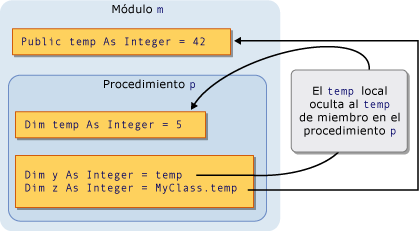
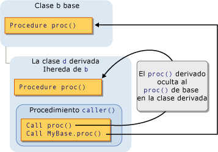

# Sombrear en Visual Basic
[!INCLUDE[vs2017banner](../../../../csharp/includes/vs2017banner.md)]

Si dos elementos de programación comparten el mismo nombre, uno de ellos puede ocultar o *sombrear* al otro.  En esta situación, el elemento sombreado no está disponible como referencia; en vez de esto, cuando el código utiliza el nombre del elemento, el compilador de [!INCLUDE[vbprvb](../../../../csharp/programming-guide/concepts/linq/includes/vbprvb_md.md)] resuelve en favor del elemento que sombrea.  
  
## Propósito  
 La finalidad principal de sombrear es proteger la definición de los miembros de la clase.  La clase base puede sufrir un cambio que cree un elemento con el mismo nombre que otro ya definido.  Si sucede esto, el modificador `Shadows` fuerza a referencias a través de la clase para que se resuelvan en el miembro definido en lugar de hacerlo en el nuevo elemento de la clase base.  
  
## Tipos de sombreado  
 Un elemento puede sombrear a otro de dos formas.  El elemento que sombrea puede declararse dentro de una subregión de la región que contiene el elemento sombreado, en cuyo caso el sombreado se consigue *por ámbito*.  O bien, una clase derivada puede redefinir un miembro de una clase base, en cuyo caso el sombreado se consigue *por herencia*.  
  
### Sombreado por ámbito  
 Es posible que los elementos de programación del mismo módulo, clase o estructura tengan un nombre idéntico pero ámbitos diferentes.  Si dos elementos se declaran de esta manera y el código hace referencia al nombre que comparten, el elemento de ámbito más restringido oculta al otro elemento \(el ámbito de bloque es el más restringido\).  
  
 Por ejemplo, un módulo puede definir una variable `Public` denominada `temp` y un procedimiento contenido en el módulo puede declarar una variable local con el mismo nombre `temp`.  Las referencias al nombre `temp` desde dentro del procedimiento obtienen acceso a la variable local, mientras que las referencias a `temp` desde fuera del procedimiento obtienen acceso a la variable `Public`.  En este caso, la variable de procedimiento `temp` ensombrece a la variable de módulo `temp`.  
  
 La ilustración siguiente muestra dos variables, los dos denominadas `temp`.  La variable local `temp` sombrea la variable miembro `temp` cuando se tiene acceso a ella desde su propio procedimiento `p`.  Sin embargo, la palabra clave `MyClass` omite el sombreado y tiene acceso a la variable miembro.  
  
   
Sombreado por ámbito  
  
 Para obtener un ejemplo de sombreado por ámbito, consulte [Cómo: Ocultar una variable con el mismo nombre que su variable](../../../../visual-basic/programming-guide/language-features/declared-elements/how-to-hide-a-variable-with-the-same-name-as-your-variable.md).  
  
### Sombreado por herencia  
 Si una clase derivada vuelve a definir un elemento de programación heredado de una clase base, el elemento que redefine ensombrece al elemento original.  Se puede sombrear cualquier tipo de elemento declarado o conjunto de elementos sobrecargados con cualquier otro tipo.  Por ejemplo, una variable `Integer` puede sombrear un procedimiento `Function`.  Si sombrea un procedimiento con otro, puede utilizar una lista de parámetros distinta y un tipo de devolución distinto.  
  
 La ilustración siguiente muestra una clase base `b` y una clase derivada `d` que hereda de `b`.  La clase base define un procedimiento denominado `proc` y la clase derivada lo sombrea con otro procedimiento del mismo nombre.  La primera instrucción `Call` tiene acceso al sombreado `proc` en la clase derivada.  Sin embargo, la palabra clave `MyBase` omite el sombreado y tiene acceso al procedimiento sombreado en la clase base.  
  
   
Sombreado por herencia  
  
 Para obtener un ejemplo de sombreado por herencia, consulte [Cómo: Ocultar una variable con el mismo nombre que su variable](../../../../visual-basic/programming-guide/language-features/declared-elements/how-to-hide-a-variable-with-the-same-name-as-your-variable.md) y [Cómo: Ocultar una variable heredada](../../../../visual-basic/programming-guide/language-features/declared-elements/how-to-hide-an-inherited-variable.md).  
  
#### Sombreado y nivel de acceso  
 El elemento de sombreado no siempre es accesible desde el código que utiliza la clase derivada.  Por ejemplo, se podría declarar `Private`.  En este caso, se rechaza el sombreado y el compilador resuelve cualquier referencia en el mismo elemento que tendría si no hubiera habido sombreado.  Éste es el elemento accesible con menos pasos de derivación en sentido inverso desde la clase que sombrea.  Si el elemento sombreado es un procedimiento, la resolución se concreta en la versión accesible más próxima con el mismo nombre, lista de parámetros y tipo de valor devuelto.  
  
 El ejemplo siguiente muestra una jerarquía de herencia de tres clases.  Cada clase define un procedimiento `Sub` `display` y cada clase derivada sombrea el procedimiento `display` en su clase base.  
  
```  
Public Class firstClass  
    Public Sub display()  
        MsgBox("This is firstClass")  
    End Sub  
End Class  
Public Class secondClass  
    Inherits firstClass  
    Private Shadows Sub display()  
        MsgBox("This is secondClass")  
    End Sub  
End Class  
Public Class thirdClass  
    Inherits secondClass  
    Public Shadows Sub display()  
        MsgBox("This is thirdClass")  
    End Sub  
End Class  
Module callDisplay  
    Dim first As New firstClass  
    Dim second As New secondClass  
    Dim third As New thirdClass  
    Public Sub callDisplayProcedures()  
        ' The following statement displays "This is firstClass".  
        first.display()  
        ' The following statement displays "This is firstClass".  
        second.display()  
        ' The following statement displays "This is thirdClass".  
        third.display()  
    End Sub  
End Module  
```  
  
 En el ejemplo anterior, la clase derivada `secondClass` sombrea `display` con un procedimiento `Private`.  Cuando el módulo `callDisplay` llama a `display` en `secondClass`, el código de llamada está fuera de `secondClass` y no puede tener acceso al procedimiento `display` privado.  Se rechaza el sombreado y el compilador resuelve la referencia en el procedimiento `display` de la clase base.  
  
 Sin embargo, la siguiente clase derivada `thirdClass` declara `display` como `Public`, por lo que el código de `callDisplay` puede tener acceso a ella.  
  
## Sombreado y reemplazo  
 No debe confundirse sombrear con reemplazar.  Ambos se utilizan cuando una clase derivada hereda de una clase base y ambos vuelven a definir un elemento declarado con otro.  No obstante, existen diferencias significativas entre ambos.  Para ver una comparación, consulte [Diferencias entre sombrear y reemplazar](../../../../visual-basic/programming-guide/language-features/declared-elements/differences-between-shadowing-and-overriding.md).  
  
## Sombreado y sobrecarga  
 Si sombrea el mismo elemento de la clase base con más de un elemento en la clase derivada, los elementos sombreados se convierten en versiones sobrecargadas de este elemento.  Para obtener más información, vea [Sobrecarga de procedimientos](../../../../visual-basic/programming-guide/language-features/procedures/procedure-overloading.md).  
  
## Tener acceso a un elemento sombreado  
 Cuando se obtiene acceso a un elemento de una clase derivada, normalmente se logra a través de la instancia actual de dicha clase derivada, mediante la calificación del nombre del elemento con la palabra clave `Me`.  Si una clase derivada ensombrece al elemento de la clase base, puede obtenerse acceso al elemento de la clase base mediante su calificación con la palabra clave `MyBase`.  
  
 Para obtener un ejemplo de tener acceso a un elemento sombreado, consulte [Cómo: Obtener acceso a una variable que oculta una clase derivada](../../../../visual-basic/programming-guide/language-features/declared-elements/how-to-access-a-variable-hidden-by-a-derived-class.md).  
  
### Declaración de la variable de objeto  
 La forma de crear la variable de objeto también puede afectar al hecho de que la clase derivada tenga acceso a un elemento de sombreado o al elemento sombreado.  El ejemplo siguiente crea dos objetos a partir de una clase derivada, pero un objeto se declara como la clase base y el otro como la clase derivada.  
  
```  
Public Class baseCls  
    ' The following statement declares the element that is to be shadowed.  
    Public z As Integer = 100  
End Class  
Public Class dervCls  
    Inherits baseCls  
    ' The following statement declares the shadowing element.  
    Public Shadows z As String = "*"  
End Class  
Public Class useClasses  
    ' The following statement creates the object declared as the base class.  
    Dim basObj As baseCls = New dervCls()  
    ' Note that dervCls widens to its base class baseCls.  
    ' The following statement creates the object declared as the derived class.  
    Dim derObj As dervCls = New dervCls()  
    Public Sub showZ()   
    ' The following statement outputs 100 (the shadowed element).  
        MsgBox("Accessed through base class: " & basObj.z)  
    ' The following statement outputs "*" (the shadowing element).  
        MsgBox("Accessed through derived class: " & derObj.z)  
    End Sub  
End Class  
```  
  
 En el ejemplo anterior, la variable `basObj` se declara como clase base.  La asignación de un objeto `dervCls` a ella constituye una conversión de ampliación y, por lo tanto, es válida.  Sin embargo, la clase base no puede obtener acceso a la versión de sombreado de la variable `z` en la clase derivada, por lo tanto, el compilador resuelve `basObj.z` con el valor original de la clase base.  
  
## Vea también  
 [Referencias a elementos declarados](../../../../visual-basic/programming-guide/language-features/declared-elements/references-to-declared-elements.md)   
 [Ámbito en Visual Basic](../../../../visual-basic/programming-guide/language-features/declared-elements/scope.md)   
 [Conversiones de ampliación y de restricción](../../../../visual-basic/programming-guide/language-features/data-types/widening-and-narrowing-conversions.md)   
 [Shadows](../../../../visual-basic/language-reference/modifiers/shadows.md)   
 [Overrides](../../../../visual-basic/language-reference/modifiers/overrides.md)   
 [Me, My, MyBase y MyClass](../../../../visual-basic/programming-guide/program-structure/me-my-mybase-and-myclass.md)   
 [Fundamentos de la herencia](../../../../visual-basic/programming-guide/language-features/objects-and-classes/inheritance-basics.md)