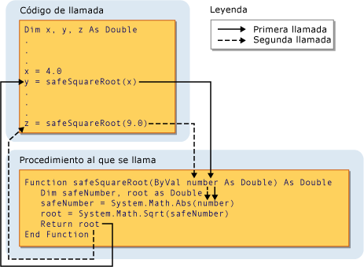

# Argumentos y parámetros de procedimiento (Visual Basic)Procedure Parameters and Arguments (Visual Basic)
En la mayoría de los casos, un procedimiento necesita cierta información sobre las circunstancias en que se ha llamado.In most cases, a procedure needs some information about the circumstances in which it has been called. Un procedimiento que realiza tareas repetitivas o compartidas utiliza información diferente para cada llamada.A procedure that performs repeated or shared tasks uses different information for each call. Esta información se compone de variables, constantes y expresiones que se pasan al procedimiento cuando se llama al método.This information consists of variables, constants, and expressions that you pass to the procedure when you call it.  
  
 Un *parámetro* representa un valor que el procedimiento espera que proporcione al llamarla.A *parameter* represents a value that the procedure expects you to supply when you call it. La declaración del procedimiento define sus parámetros.The procedure's declaration defines its parameters.  
  
 Puede definir un procedimiento sin parámetros, un parámetro o más de uno.You can define a procedure with no parameters, one parameter, or more than one. La parte de la definición del procedimiento que especifica los parámetros se denomina el *lista_de_parámetros*.The part of the procedure definition that specifies the parameters is called the *parameter list*.  
  
 Un *argumento* representa el valor que se proporciona a un parámetro de procedimiento cuando se llama al procedimiento.An *argument* represents the value you supply to a procedure parameter when you call the procedure. El código de llamada proporciona los argumentos cuando llama al procedimiento.The calling code supplies the arguments when it calls the procedure. La parte de la llamada de procedimiento que especifica los argumentos se denomina el *lista de argumentos*.The part of the procedure call that specifies the arguments is called the *argument list*.  
  
 La siguiente ilustración muestra el código que llama al procedimiento `safeSquareRoot` desde dos lugares diferentes.The following illustration shows code calling the procedure `safeSquareRoot` from two different places. La primera llamada pasa el valor de la variable `x` (4.0) al parámetro `number`y el valor devuelto en `root` (2.0) se asigna a la variable `y`.The first call passes the value of the variable `x` (4.0) to the parameter `number`, and the return value in `root` (2.0) is assigned to the variable `y`. La segunda llamada pasa el valor literal 9.0 a `number`y asigna el valor devuelto (3.0) a la variable `z`.The second call passes the literal value 9.0 to `number`, and assigns the return value (3.0) to variable `z`.  
  
   
Pasar un argumento a un parámetroPassing an argument to a parameter  
  
 Para obtener más información, consulte [diferencias entre parámetros y argumentos](./differences-between-parameters-and-arguments.md).For more information, see [Differences Between Parameters and Arguments](./differences-between-parameters-and-arguments.md).  
  
## Tipo de datos de parámetroParameter Data Type  
 Definir un tipo de datos para un parámetro mediante el `As` cláusula en su declaración.You define a data type for a parameter by using the `As` clause in its declaration. Por ejemplo, la función siguiente acepta una cadena y un entero.For example, the following function accepts a string and an integer.  
  
 [!code-vb[VbVbcnProcedures#32](./codesnippet/VisualBasic/procedure-parameters-and-arguments_1.vb)]  
  
 Si el modificador de comprobación de tipo ([Option Strict Statement](../../../../visual-basic/language-reference/statements/option-strict-statement.md)) es `Off,` el `As` cláusula es opcional, salvo que si lo utiliza un parámetro, todos los parámetros deben usarla.If the type checking switch ([Option Strict Statement](../../../../visual-basic/language-reference/statements/option-strict-statement.md)) is `Off,` the `As` clause is optional, except that if any one parameter uses it, all parameters must use it. Si la comprobación de tipos es `On`, el `As` cláusula es obligatoria para todos los parámetros de procedimiento.If type checking is `On`, the `As` clause is required for all procedure parameters.  
  
 Si espera que el código de llamada proporcionar un argumento con un tipo de datos diferente del parámetro correspondiente, como `Byte` a un `String` parámetro, debe hacer lo siguiente:If the calling code expects to supply an argument with a data type different from that of its corresponding parameter, such as `Byte` to a `String` parameter, it must do one of the following:  
  
-   Proporcionar sólo argumentos con tipos de datos que se convierten en el tipo de datos del parámetro;Supply only arguments with data types that widen to the parameter data type;  
  
-   Establecer `Option Strict Off` para permitir que las conversiones de restricción implícitas; oSet `Option Strict Off` to allow implicit narrowing conversions; or  
  
-   Utilizar una palabra clave de conversión para convertir explícitamente el tipo de datos.Use a conversion keyword to explicitly convert the data type.  
  
### Parámetros de tipoType Parameters  
 Un *procedimiento genérico* también define uno o más *parámetros de tipo* además de sus parámetros normales.A *generic procedure* also defines one or more *type parameters* in addition to its normal parameters. Un procedimiento genérico permite que el código de llamada pasar tipos de datos diferentes cada vez que llama al procedimiento, por lo que puede personalizar los tipos de datos a los requisitos de cada llamada individual.A generic procedure allows the calling code to pass different data types each time it calls the procedure, so it can tailor the data types to the requirements of each individual call. Vea [Generic Procedures in Visual Basic](../../../../visual-basic/programming-guide/language-features/data-types/generic-procedures.md).See [Generic Procedures in Visual Basic](../../../../visual-basic/programming-guide/language-features/data-types/generic-procedures.md).  
  
## Vea tambiénSee also
- [ProcedimientosProcedures](./index.md)
- [SubprocedimientosSub Procedures](./sub-procedures.md)
- [Procedimientos de funciónFunction Procedures](./function-procedures.md)
- [Procedimientos de propiedadesProperty Procedures](./property-procedures.md)
- [Procedimientos de operadoresOperator Procedures](./operator-procedures.md)
- [Cómo: Definir un parámetro para un procedimientoHow to: Define a Parameter for a Procedure](./how-to-define-a-parameter-for-a-procedure.md)
- [Cómo: Pasar argumentos a un procedimientoHow to: Pass Arguments to a Procedure](./how-to-pass-arguments-to-a-procedure.md)
- [Paso de argumentos por valor y por referenciaPassing Arguments by Value and by Reference](./passing-arguments-by-value-and-by-reference.md)
- [Sobrecarga de procedimientosProcedure Overloading](./procedure-overloading.md)
- [Conversiones de tipos en Visual BasicType Conversions in Visual Basic](../../../../visual-basic/programming-guide/language-features/data-types/type-conversions.md)
